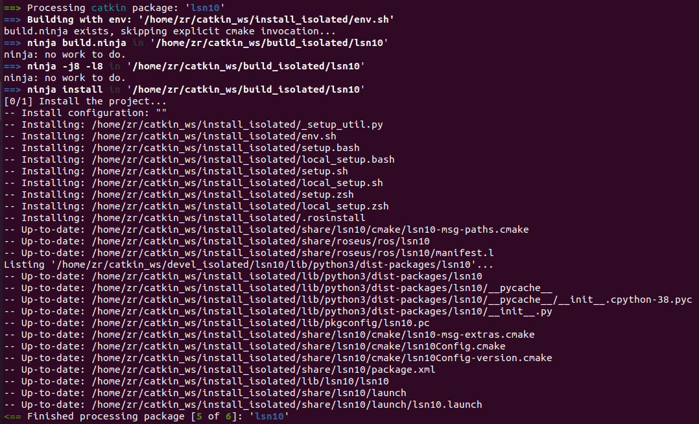

# Cartographer建图教程

这篇文章将介绍如何使用 Cartographer 来进行建图。

## 本地环境搭建

Cartographer 是一个独立的C++库，想要快速入门可以使用 [ROS](https://www.ros.org/) 集成。

因此，你需要：
- ROS
- Cartographer

### 安装 ROS

你可以在[这里](http://wiki.ros.org/cn/noetic/Installation/Ubuntu)查询 ROS 安装方法。

ROS 安装版本为**完整桌面版安装（Desktop-Full)**。

### 安装 Cartographer

你可以在[这里](https://google-Cartographer-ros.readthedocs.io/en/latest/compilation.html#building-installation)查询 Cartographer 安装方法。

Cartographer 的[**官方文档**](https://google-Cartographer-ros.readthedocs.io/en/latest/)地址。

## Cartographer 具体参数配置

### 创建 .lua 配置

每个机器人的配置必须从 Lua 脚本定义的数据结构读取的，所以你需要配置不同的 .lua 文件来对应不同的机器人。官方示例配置都在 `src/cartographer_ros/cartographer_ros/configuration_files` 和 `install_isolated/share/cartographer_ros/configuration_files/` 中。

如果想使用3D建图：

```bash
# 复制一份示例代码进行修改
cp install_isolated/share/cartographer_ros/configuration_files/backpack_3d.lua install_isolated/share/cartographer_ros/configuration_files/my_robot.lua
```

如果想使用2D建图：

```bash
# 复制一份示例代码进行修改
cp install_isolated/share/cartographer_ros/configuration_files/backpack_2d.lua install_isolated/share/cartographer_ros/configuration_files/my_robot.lua
```

具体配置可参考[ Lua 配置参考文档](https://google-cartographer-ros.readthedocs.io/en/latest/configuration.html)以及[Cartographer配置值](https://google-cartographer.readthedocs.io/en/latest/configuration.html)。

### 创建 .launch 配置

Cartographe r的推荐用法是为每个机器人都提供不同的 .launch 文件。官方示例 .launch 文件在`src/cartographer_ros/cartographer_ros/configuration_files` 和 `install_isolated/share/cartographer_ros/configuration_files/` 中。

可以先复制官方提供的示例之一：

```bash
cp install_isolated/share/cartographer_ros/launch/backpack_3d.launch install_isolated/share/cartographer_ros/launch/my_robot.launch
cp install_isolated/share/cartographer_ros/launch/demo_backpack_3d.launch install_isolated/share/cartographer_ros/launch/demo_my_robot.launch
cp install_isolated/share/cartographer_ros/launch/offline_backpack_3d.launch install_isolated/share/cartographer_ros/launch/offline_my_robot.launch
cp install_isolated/share/cartographer_ros/launch/demo_backpack_3d_localization.launch install_isolated/share/cartographer_ros/launch/demo_my_robot_localization.launch
cp install_isolated/share/cartographer_ros/launch/assets_writer_backpack_3d.launch install_isolated/share/cartographer_ros/launch/assets_writer_my_robot.launch
```

每个 .launch 文件的具体使用方法可查看[这里](https://google-cartographer-ros.readthedocs.io/en/latest/your_bag.html#create-launch-files-for-your-slam-scenarios)。

## 运行自己的 Cartographer ROS 

### ***温馨提示：请大家在接下来的操作中做好备份，以防文件丢失。*** ###

### ***默认大家的 Cartographer 的工作空间为 catkin_ws*** ###

### ***默认大家所使用的雷达为 lsn10，雷达的功能包为 lsn10*** ###

### 2D 建图 + 激光雷达

**1. 创建 .lua 配置文件**

运行下列命令，复制 **revo_lds.lua** 文件作为自己的新的 .lua 配置文件。

```bash
# 进入 Cartographer 工作空间
cd catkin_ws
# 复制2D建图 revo_lds.lua 文件  
cp install_isolated/share/cartographer_ros/configuration_files/revo_lds.lua install_isolated/share/cartographer_ros/configuration_files/my_robot_laser_only.lua
```

将下列参数 `tracking_frame` , `published_frame` 修改成雷达的**frame_id**，即 `laser`。

具体代码如下：

```bash
tracking_frame = "laser"
published_frame = "laser"
```

将下列参数 `TRAJECTORY_BUILDER_2D.min_range` , `TRAJECTORY_BUILDER_2D.max_range` 修改成你所用的雷达的具体扫描参数。

具体代码如下：

```bash
TRAJECTORY_BUILDER_2D.min_range = 0.3
TRAJECTORY_BUILDER_2D.max_range = 11.
```

**2. 创建 .launch 配置文件**

运行下列命令，复制 **demo_revo_lds.launch** 文件作为自己的新的 .launch 配置文件。

```bash
# 进入 Cartographer 工作空间
cd catkin_ws
# 复制2D建图 demo_revo_lds.launch 文件
cp install_isolated/share/cartographer_ros/launch/demo_revo_lds.launch install_isolated/share/cartographer_ros/launch/my_robot_laser_only.launch
```

修改 `cartographer_node` 节点，映射雷达的 **topic**，即 `/scan`。

将 `rviz` 节点切换至你所用的 .rviz 文件。

关闭运行 `bag` 的节点。

增加 `map` 与 `laser` 的 **tf** 关系节点。

具体代码如下：

```bash
<launch>
  <param name="/use_sim_time" value="true" />

  <node name="cartographer_node" pkg="cartographer_ros"
      type="cartographer_node" args="
          -configuration_directory $(find cartographer_ros)/configuration_files
          -configuration_basename my_robot_only_laser.lua"
      output="screen">
    <remap from="scan" to="/scan" />
  </node>

  <node name="cartographer_occupancy_grid_node" pkg="cartographer_ros"
      type="cartographer_occupancy_grid_node" args="-resolution 0.05" />

  <node pkg="tf2_ros" type="static_transform_publisher" name="laser_broadcaster" 
      args="0 0 0 0 0 0 map laser" />
      
  <node name="rviz" pkg="rviz" type="rviz" required="true"
      args="/home/zr/.ros/laser.rviz" />
</launch>
```

**<span id="lable">3. 合并雷达的功能包与 Cartographer ROS</span>**


(1) 在 Cartographer 的工作空间下编译 lsn10 功能包。

将**雷达的功能包**放至 `catkin_ws/src/cartographer_ros` 下, 。

运行以下命令，编译新的工作空间：

```bash
# 重新编译工作空间
catkin_make_isolated --install --use-ninja
```

看到 **Finish** 字眼说明编译成功。


(2) 将 lsn10 节点写进上述 .launch 文件。

节点代码如下：

```bash 
  <include file="$(find lsn10)/launch/lsn10.launch" />
```

整体 `my_robot_laser_only.launch` 代码如下：

```bash
<launch>
  <include file="$(find lsn10)/launch/lsn10.launch" />

  <param name="/use_sim_time" value="true" />

  <node name="cartographer_node" pkg="cartographer_ros"
      type="cartographer_node" args="
          -configuration_directory $(find cartographer_ros)/configuration_files
          -configuration_basename my_robot_only_laser.lua"
      output="screen">
    <remap from="scan" to="/scan" />
  </node>

  <node name="cartographer_occupancy_grid_node" pkg="cartographer_ros"
      type="cartographer_occupancy_grid_node" args="-resolution 0.05" />

  <node pkg="tf2_ros" type="static_transform_publisher" name="laser_broadcaster" 
      args="0 0 0 0 0 0 map laser" />
      
  <node name="rviz" pkg="rviz" type="rviz" required="true"
      args="/home/zr/.ros/laser.rviz" />
</launch>
```

**4. 运行建图程序**

运行以下命令，启动建图程序。

```bash
# 进入 Cartographer 工作空间
cd catkin_ws
# 编译工作空间
catkin_make_isolated --install --use-ninja
# source 工作空间环境，使用 zsh 的同学别忘了切换成 zsh
source install_isolated/setup.bash 
# 运行程序
roslaunch cartographer_ros my_robot_laser_only.launch
```

**5. 在 rviz 中添加 topic**

添加 `Submaps` 话题即可看到雷达建图。


其他 topic 可自行添加。

主要使用的 topic 为 `Map` 、`TF`、`LaserScan`。 

最终运行效果如下：


### 2D 建图 + 激光雷达 + 陀螺仪

**1. 创建 .lua 配置文件**

运行下列命令，复制 **revo_lds.lua** 文件作为自己的新的 .lua 配置文件。

```bash
# 进入 Cartographer 工作空间
cd catkin_ws
# 复制2D建图 revo_lds.lua 文件  
cp install_isolated/share/cartographer_ros/configuration_files/revo_lds.lua install_isolated/share/cartographer_ros/configuration_files/my_robot_laser_imu.lua
```

将参数 `tracking_frame` 修改成陀螺仪的 **frame_id**。我这里使用的陀螺仪的 frame_id 为 `imu_link`。

将参数 `publisher_frame` 修改成底盘的 **frame_id**。我这里使用的底盘的 frame_id 为 `base_link`。

具体代码如下：

```bash
tracking_frame = "imu_link"
published_frame = "base_link"
```

将下列参数 `TRAJECTORY_BUILDER_2D.min_range` , `TRAJECTORY_BUILDER_2D.max_range` 修改成你所用的雷达的具体扫描参数。

具体代码如下：

```bash
TRAJECTORY_BUILDER_2D.min_range = 0.3
TRAJECTORY_BUILDER_2D.max_range = 11.
```

**2. 创建 .urdf 配置文件**

URDF 是一种基于 XML 规范、用于描述机器人结构的格式。

所以你需要配置一个 .urdf 文件来适配不同的机器人。

你可以在[这里](http://wiki.ros.org/urdf/XML)查询 .urdf 文件的写法。

这里提供我所使用的 my_robot_laser_imu.urdf 配置文件：

```bash
<robot name="my_robot">
  <material name="orange">
    <color rgba="1.0 0.5 0.2 1" />
  </material>
  <material name="gray">
    <color rgba="0.2 0.2 0.2 1" />
  </material>

<link name="base_link" />

<link name="imu_link">
    <visual>
      <origin xyz="0.0 0.0 0.0" />
      <geometry>
        <box size="0.06 0.04 0.02" />
      </geometry>
      <material name="orange" />
    </visual>
</link>

<link name="laser">
    <visual>
      <origin xyz="0.0 0.0 0.0" />
      <geometry>
        <cylinder length="0.07" radius="0.3" />
      </geometry>
      <material name="gray" />
    </visual>
</link>

<joint name="imu_link_joint" type="fixed">
    <parent link="base_link" />
    <child link="imu_link" />
    <origin xyz="0.0 0. 0.0" />
</joint>

<joint name="laser_link_joint" type="fixed">
    <parent link="base_link" />
    <child link="laser" />
    <origin xyz="0.0 0. 0.0" />
</joint>

</robot>
```

**3. 创建 .launch 配置文件**

运行下列命令，复制 **demo_revo_lds.launch** 文件作为自己的新的 .launch 配置文件。

```bash
# 进入 Cartographer 工作空间
cd catkin_ws
# 复制2D建图 demo_revo_lds.launch 文件
cp install_isolated/share/cartographer_ros/launch/demo_revo_lds.launch install_isolated/share/cartographer_ros/launch/my_robot_laser_imu.launch
```

修改 `cartographer_node` 节点，映射雷达的 **topic**，即 `/scan`；映射陀螺仪的 **topic**，即 `/IMU_data`。

将 `rviz` 节点切换至你所用的 .rviz 文件。

关闭运行 `bag` 的节点。

具体代码如下：

```bash
<launch>
  <param name="/use_sim_time" value="true" />

  <node name="cartographer_node" pkg="cartographer_ros"
      type="cartographer_node" args="
          -configuration_directory $(find cartographer_ros)/configuration_files
          -configuration_basename my_robot_only_laser.lua"
      output="screen">
    <remap from="scan" to="/scan" />
    <remap from="imu" to="/IMU_data">
  </node>

  <node name="cartographer_occupancy_grid_node" pkg="cartographer_ros"
      type="cartographer_occupancy_grid_node" args="-resolution 0.05" />
      
  <node name="rviz" pkg="rviz" type="rviz" required="true"
      args="/home/zr/.ros/laser.rviz" />
</launch>
```

**4. 创建陀螺仪的节点文件**

你需要有一份**陀螺仪节点文件**，并且添加 `map` 与 `base_link` 的 tf 关系，`base_link` 与 `imu_link` 的 tf 关系，`base_link` 与 `laser`的 tf 关系。

然后像上述<a href="#lable">**合并雷达的功能包与 Cartographer ROS**</a> 合并陀螺仪功能与 Cartographer ROS 即可。

**5. 运行建图程序**

运行以下命令，启动建图程序。

```bash
# 进入 Cartographer 工作空间
cd catkin_ws
# 编译工作空间
catkin_make_isolated --install --use-ninja
# source 工作空间环境，使用 zsh 的同学别忘了切换成 zsh
source install_isolated/setup.bash 
# 运行程序
roslaunch cartographer_ros my_robot_laser_imu.launch
```

**6. 在 rviz 中添加 topic**

添加 `Submaps` 话题即可看到雷达建图。


其它 topic 可自行添加。

主要使用的 topic 为 `Map` 、`TF`、`LaserScan`。 

最终运行效果如下：
