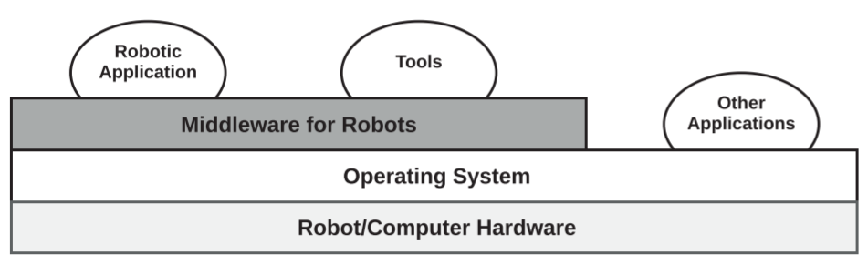
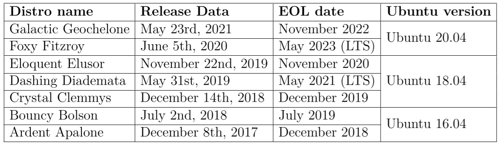
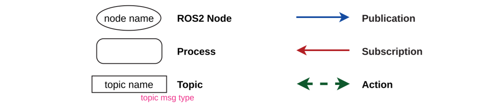
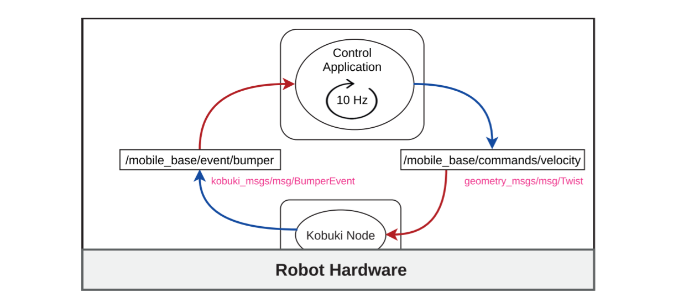
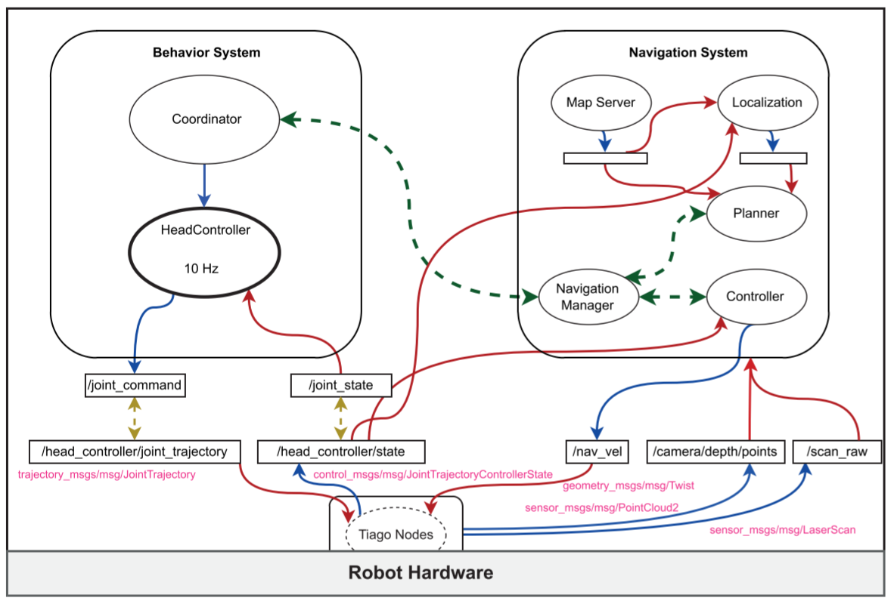
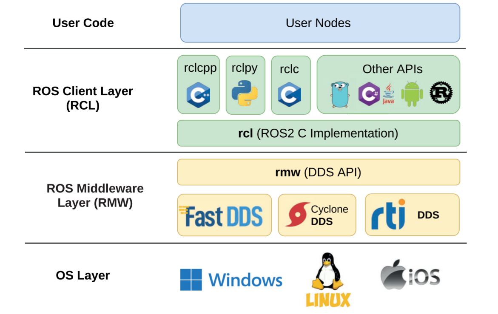

# 第1章-导言

 &emsp;&emsp;机器人必须经过编程才能发挥作用。如果没有软件来处理来自传感器的信息，并向执行器发送正确的指令，以完成机器人的使命，那么机器人再聪明也是白搭。本章将介绍用于机器人编程的中间件，特别是本书将使用的 ROS2[^1]。  
 &emsp;&emsp;首先，没有人会从零开始为机器人编程。机器人软件非常复杂，因为我们必须面对这样一个问题：机器人是在一个真实的、动态的，有时甚至是不可预测的世界中执行任务的。它还必须处理各种型号和类型的传感器和执行器。实施必要的驱动程序或适应新的硬件组件是一项注定要失败的艰巨工作。中间件是介于操作系统和用户应用程序之间的一层软件。  
 &emsp;&emsp;中间件是操作系统和用户应用程序之间的一层软件，用于执行某些领域的应用程序编程。中间件通常不只包含库，还包括开发和监控工具以及开发方法。图 1.1 显示了一个系统的示意图，其中包括中间件的系统示意图。  



 &emsp;&emsp;机器人编程中间件提供驱动程序、程序库和方法。它们通常还提供开发、集成、执行和监控工具。在机器人技术发展史上，出现了大量的机器人编程中间件。但很少有中间件能在为其设计的机器人上幸存下来，也很少有中间件能从实施它们的实验室中扩展开来。其中不乏著名的例子（Yarp[^2]、Carmen[^3]、Player/Stage[^4]等），但毫无疑问的是  ROS[^5]无疑是近十年来最成功的例子，它目前已被视为机器人编程领域的标准。从技术上讲，不同的中间件之间有相似之处：大多数都基于开源，许多都为分布式组件提供通信机制、编译系统、监控工具等。最大的不同之处在于世界各地的 ROS 开发者社区。在这个社区中，还有全球领先的公司、国际组织和大学，为几乎所有可能出现的问题提供了大量的软件、驱动程序、文档或已解决的问题。机器人技术可以被定义为 "集成的艺术"，而 ROS 提供了大量的软件以及实现集成的工具。  
 &emsp;&emsp;本书将提供在 ROS2（ROS 的新版本）中开展项目所需的技能。我们将从头开始介绍 ROS2 的概念、工具和方法，因此无需具备 ROS2 的经验。我们假定读者具备一般的 Linux 和编程技能。我们将使用 ROS2 正式支持的两种编程语言（C++ 和 Python），这两种语言与机器人技术中最常用的语言不谋而合。  

## 1.1 ROS2 概览

&emsp;&emsp;ROS 的缩写是 Robot Operating System（机器人操作系统）。它不是一个可以取代 Linux 或 Windows 的操作系统，而是一个中间件，可以增强系统开发机器人应用程序的能力。数字 2 表示这是第二代中间件。已经了解第一版 ROS（有时称为 ROS1）的读者会发现许多类似的概念，而且已经有一些教学资源[↻](https://github.com/fmrico/ros_to_ros2_talk_examples) 供学习 ROS2 的 ROS1 程序员使用。在本书中，我们假定读者之前不了解 ROS。这种情况会越来越常见，因为现在有越来越多的理由直接学习 ROS2 而不是先学习 ROS1。此外，已经有一些优秀的 ROS2 官方教程，因此本书的方法  
 &emsp;&emsp;因此，本书的目的就是要与众不同。从机器人工程师到机器人工程师，本书的描述将是完整的，并以开发机器人应用程序的方法论为导向，让机器人做一些 "聪明" 的事情，强调机器人软件开发经验中的基本问题。读者可以参考现有的教程来完成他们的培训，弥补本书中的不足：  

- 官方 ROS2 教程: <https://docs.ros.org/en/humble/Tutorials.html>
- 机器人后端教程：<https://roboticsbackend.com/category/ros2/>
- 面向 ROS 开发人员的 ROS2：<https://github.com/fmrico/ros_to_ros2_talk_examples>

&emsp;&emsp;起点是在一台采用 AMD64 位架构的计算机上安装 Linux Ubuntu 22.04 LTS 系统，这是个人笔记本电脑或台式电脑中最先进的架构。由于 ROS2 是以发行版的形式组织的，因此 Linux 发行版与此相关。发行版是库、工具和应用程序的集合，其版本经过验证，可以正确地协同工作。每个发行版都有一个名称，并与一个版本的 Ubuntu 相链接。发行版中的软件也被保证能与系统中的软件版本正确兼容。也可以使用其他 Linux 发行版（Ubuntu、Fedora、Red Hat......），但以 Ubuntu 为参考。ROS2 也可以在 Windows 和 Mac 上运行，但本文档的重点是 Linux 开发。我们将使用 Ubuntu 22.04 的 ROS2 Humble 版本。  
在本书中，我们将从三个不同但互补的维度来探讨 ROS2：  

- **社区**： ROS 社区是利用这一中间件为机器人开发应用程序的基本要素。除了提供技术文档外，还有一个庞大的开发者社区，他们通过公共存储库提供自己的应用程序和实用工具，其他开发者也可以为其提供帮助。社区的其他成员可能已经开发出了你所需要的东西。
- **计算图**： 计算图是一个正在运行的 ROS2 应用程序。该图由节点和弧线组成。节点是 ROS2 中的主要计算单元，它可以使用多种不同的通信范式与其他节点协作，从而组成一个 ROS2 应用程序。这个维度还涉及监控工具，它们也是插入该图中的节点。
- **工作空间**： 工作空间是指安装在机器人或计算机上的软件集，以及用户开发的程序。与具有动态性质的计算图相比，工作空间是静态的。这一维度还涉及用于构建计算图元素的开发工具。

## 1.1.1 ROS 社区

&emsp;&emsp;ROS2 需要考虑的第一个方面是 ROS 社区。开源机器人基金会[↻](https://www.openrobotics.org) 大大加强了用户和开发者社区。ROS2 不仅是一个机器人编程中间件，还是一种开发方法、一种既定的软件交付机制，以及一套提供给 ROS 社区成员的资源。  
 &emsp;&emsp;ROS2 从根本上说是开源的，这意味着它是在以下许可证下发布的软件用户有权使用、研究、更改和重新发布。许多开源许可证都对该软件的某些自由进行了调整，但从本质上讲，我们可以认为这些权利是开放的。ROS2 软件包最常见的许可证是 Apache 2 和 BSD，不过开发人员也可以自由使用其他许可证。  
 &emsp;&emsp;ROS2 按照联邦模式组织软件，提供使其成为可能的技术机制。每个开发者、公司或机构都可以自由开发自己的软件，并负责管理。此外，小项目周围普遍会形成一个社区，这个社区可以就发布问题组织决策。这些实体为 ROS2 创建的软件包可以在公共存储库中提供，也可以作为二进制文件成为 ROS2 发行版的一部分。没有人可以强迫这些实体将其软件迁移到新版本的 ROS2 上。不过，许多重要和流行软件包的惯性足以保证它们的连续性。  
 &emsp;&emsp;这种开发模式的重要性在于，它促进了 ROS 社区的发展。从实用角度来看，这是机器人编程中间件取得成功的关键。这类中间件的理想特性之一是支持多种传感器和执行器。如今，这些组件的许多制造商都正式支持 ROS2 驱动程序，因为他们知道有许多潜在客户，而且有许多开发人员会在购买前检查特定组件是否支持 ROS2。此外，这些公司通常在开放源中开发软件，在那里可以创建用户社区，报告错误，甚至发送补丁。如果你希望你的机器人库或工具被广泛使用，支持 ROS2 可能是个好办法。  
 &emsp;&emsp;ROS2 中的软件包以发行版的形式组织。一个 ROS2 发行版是由许多可以很好地协同工作的软件包组成的。通常情况下，这意味着它与特定版本的基础系统绑定。ROS2 使用 Ubuntu Linux 版本作为参考。这就保证了稳定性，否则，不同版本的软件包和库的依赖关系会让 ROS2 变得一团糟。当一个实体发布特定的软件时，它会针对特定的发行版。通常每个发行版都有多个开发分支。  
 &emsp;&emsp;迄今为止（22 年 1 月），ROS2 共发布了七个发行版，如表 1.2 所示。每个发行版都有一个名字，名字的首字母会增加，并且有不同的标识（T恤衫的款式也不一样！）。第八个发行版有点特别，名为 "Rolling Ridley"，是未来稳定版 和最新开发版本的集合。  



如果你想为发行版贡献你的软件，你应该访问 rosdistro 软件源 (<https://github.com/ros/rosdistro>) 和一些有用的链接：  

- 作出贡献: <https://github.com/ros/rosdistro/blob/master/CONTRIBUTING.md>
- 发布软件包贡献: <https://docs.ros.org/en/rolling/How-To-Guides/Releasing/Releasing-a-Package.html>


开源机器人基金会向社区提供了许多资源，我们重点介绍其中的一些：  

- ROS 官方页面. <http://ros.org>
- ROS2 文档页面：<https://docs.ros.org/>。每个发行版都有自己的文档。例如，在 <https://docs.ros.org/en/humble/> 上可以找到安装指南、教程和指南等。
- ROS 问答 (<https://answers.ros.org/>)。一个提出有关 ROS 问题和困难的地方。
- ROS Discourse (<https://discourse.ros.org/>)。这是 ROS 社区的一个讨论论坛，您可以在这里了解社区的最新动态、查看发布公告或讨论设计问题。他们还拥有多种语言的 ROS2 用户组。

## 1.1.2 计算图

 &emsp;&emsp;在第二个维度中，我们将分析机器人软件在执行过程中的样子。这一愿景将使我们对目标有一个大致的了解，并能更好地理解后面许多内容的原因。这个维度就是我们所说的 "计算图"。  
 &emsp;&emsp;计算图包含相互通信的 ROS2 节点以便机器人执行某些任务。应用程序的逻辑在 节点，它们是 ROS2 的主要执行元素。  
 &emsp;&emsp;ROS2 大量使用了面向对象编程。无论是用 C++ 还是 Python 编写，节点一般都是 Node 类的对象。  
节点可以访问计算图，并通过三种范式与其他节点进行通信：  

- **发布/订阅**： 这是一种异步通信，由 N 个节点向一个话题发布信息，然后由该话题向 M 个订阅者发布信息。一个话题就像一个通信通道，接受唯一类型的信息。这种通信方式在 ROS2 中最为常见。一个很有代表性的例子就是包含相机驱动程序的节点，它可以在话题中发布图像。系统中的所有节点都需要相机提供的图像来实现自己的功能，因此都会订阅该话题。
- **服务**： 这是一种同步通信，其中一个节点请求另一个节点并等待响应。这种通信通常需要立即响应，以免影响调用服务的节点的控制周期。例如，向映射服务发出重置映射的请求，并等待是否成功调用的响应。
- **动作**： 这是一种异步通信，其中一个节点向另一个节点发出请求。这些请求通常需要一段时间才能完成，调用节点可能会定期收到反馈或通知，说明请求已成功完成或出现了一些错误。导航请求就是这类通信的一个例子。这种请求可能很耗时，因此请求机器人导航的的节点在完成请求时不应被阻塞。

计算图中节点的功能是执行处理或控制。因此，它们被视为活动元素，在执行模式方面有一些选择：

- **迭代执行**： 在控制软件中，节点以特定频率执行其控制循环是很流行的。这种方法可以控制节点需要多少计算资源，而输出流量保持不变。例如，节点根据执行器的状态，以 20 Hz 的频率计算执行器的运动指令。
- **面向事件的执行**： 这些节点的执行取决于某些事件发生的频率，在这种情况下，就是信息到达该节点的频率。例如，一个节点每接收到一幅图像，就会对其进行检测并产生输出。输出发生的频率取决于图像到达的频率。如果没有图像到达该节点、 则不产生输出。

接下来，我们将展示几个计算图表的示例。图 1.3 的图例显示了这些示例中使用的元素。  



第一个计算图如图 1.4 所示，是一个与 Kobuki[↻](http://kobuki.yujinrobot.com/about2) 机器人交互的简单程序示例。



Kobuki 机器人驱动程序是一个与机器人硬件通信的节点，可能使用的是本地驱动程序。其功能通过各种话题向用户展示。在本例中，我们只展示了两个话题：

- `/mobile_base/event/bumper`： 这是一个话题，每次有一个bumper改变状态（无论是否按下），kobuki 驱动程序都会在其中发布一条 kobuki msgs/msg/BumperEvent 消息。系统中所有对检测与该传感器碰撞感兴趣的节点都会订阅该话题。
- `/mobile_base/commands/velocity`： 这是 kobuki 驱动器为调整速度而订阅的话题。如果一秒钟内没有收到任何命令，它就会停止。该话题的类型为`geometry_msgs/msg/Twist`。几乎所有机器人都会接收这类信息来控制速度。

<details><summary><b>深入探讨： ROS2 中的命名规则</b></summary>

ROS2 中的资源名称与 Unix 中的文件系统非常相似。在创建资源（例如发布者）时，我们可以指定其相对名称、绝对名称（以"/"开头）或私人名称（以"~"开头）。此外，我们还可以定义一个命名空间（`namespace` `ns`），其目的是将资源与其他命名空间隔离开来，方法是将工作空间的名称添加为名称的第一个组成部分。例如，命名空间在多机器人应用程序中非常有用。下面我们来看一个例子，说明根据节点名称和命名空间得出的话题名称：

|名称|结果: (node: my_node / ns: none)|结果: (node: my_node / ns: my_ns)|
|---|---|---|
|my_topic|/my_topic|/my_ns/my_topic|
|/my_topic|/my_topic|/my_topic|
|~my_topic|/my_node/my_topic|/my_ns/my_node/my_topic|

**更多信息:**

- <http://wiki.ros.org/Names>
- <https://design.ros2.org/articles/topic_and_service_names.html>

</details>

&emsp;&emsp;该节点在一个单独的进程中运行。计算图显示的是另一个订阅bumper话题的进程，它根据收到的信息发布机器人的移动速度。我们将节点的执行频率设定为 10 Hz，表示无论是否收到有关bumper状态的信息，它都会做出控制决策。  
 &emsp;&emsp;这个计算图包括两个节点和两个话题，以及它们各自的发布/订阅连接。让我们对机器人和应用程序进行演化。  
 &emsp;&emsp;让我们添加一个激光器和一个 3D 摄像头（也称为 RGBD 摄像头）。对于每个传感器，节点都必须访问传感器，并为其提供 ROS2 接口。正如我们之前所说，发布传感器数据是在计算图中提供这些数据的最便捷方式。  


&emsp;&emsp;现在，应用程序可以让机器人朝着从 RGB 3D 图像中检测到的人或物体移动。从 RGBD 摄像机的 3D 图像中检测到的人或物体。在移动过程中，激光传感器可避免碰撞。图 1.5 所示的计算图概括了该应用：  

- 控制节点以 20 Hz 的频率运行，向机器人基地发送控制指令。它订阅话题`/scan`，以检查周围的障碍物。
- 该过程包含两个节点，分别检测人和物体。这两个节点都需要摄像头提供的图像和深度信息来确定检测到的物体的位置。每次检测都会使用专为 3D 检测设计的标准信息发布到两个不同的话题中。
- 控制节点订阅这些话题以执行任务。

&emsp;&emsp;在上一个示例中，使用的机器人是 Tiago[↻](https://pal-robotics.com/es/robots/tiago/)。假设只有一个节点提供其功能。在本例中，我们使用了两个用户（移动底座的速度指令和移动颈部的轨迹指令）和两个发布者（激光信息和来自 RGBD 摄像机的 3D 图像）。  



&emsp;&emsp;应用程序（图 1.6）分为两个子系统，每个子系统都在不同的进程中，进程中包含每个子系统的节点（我们省略了每个子系统话题的细节）：  

- **行为子系统**： 它由两个节点组成，共同协作生成机器人的行为。其中一个是行为协调器（`Coordinator`），另一个是实现主动视觉系统的节点（`HeadController`）。`协调器`决定机器人应在地图上看哪里以及访问哪些点。
- **导航子系统**： 本例中的导航子系统由多个节点组成。导航管理器负责协调规划器（负责创建从机器人位置到目的地的路线）和控制器（使机器人按照创建的路线行进）。规划器需要一个节点提供的地图，该节点加载环境地图和机器人的位置，从而计算出一个位置节点。
- 两个子系统之间的通信是通过 ROS2 操作完成的。导航行为会设定一个目标，并在目标完成后收到通知。它还会定期接收向目的地前进的进度。动作还用于协调导航系统内的规划器和控制器。

&emsp;&emsp;在本小节中，我们展示了计算图。每次在 ROS2 中实施一个应用时，我们都要设计一个计算图。我们需要确定哪些节点以及它们之间的交互。我们必须确定节点是以特定频率执行，还是由某些事件（请求或消息）导致其执行。我们可以开发所有节点，也可以将第三方开发的节点纳入计算图中。由第三方开发。  
 &emsp;&emsp;虽然我们可以在应用程序中定义新的信息类型，但 ROS2 已经定义了一套标准信息类型，以方便不同开发人员的节点进行交互。例如，为图像定义一种新的消息类型是没有意义的，因为有很多第三方软件、处理和监控工具都在使用和生成被视为图像标准的消息类型（`sensor_msgs/msg/Image`）。尽可能使用现有的标准信息。  

## 1.1.3 工作空间

 &emsp;&emsp;工作空间是从静态的角度来看待 ROS2 软件的。它指的是 ROS2 软件的安装位置、组织结构，以及允许我们启动计算图形的所有工具和流程。这包括构建系统和节点启动工具。  
 &emsp;&emsp;这个维度的基本要素是软件包（package）。软件包包含具有共同目的的可执行文件、库或消息定义。通常，软件包的运行或构建依赖于（depends）其他软件包。  
 &emsp;&emsp;这个维度的另一个要素是工作空间本身。工作空间是一个包含软件包的目录。该工作空间必须激活，这样它所包含的内容才能被使用。  
 &emsp;&emsp;可以同时激活多个工作空间。这个激活过程是累加的。我们可以激活一个初始工作空间，我们称之为底层（underlay）工作空间。之后，我们可以激活另一个工作空间，我们称之为覆盖（overlay）工作空间，因为它覆盖了之前的底层工作空间。覆盖工作空间中的软件包依赖关系应在底层工作空间中得到满足。如果叠加工作空间中的软件包已经存在于底层工作空间中，则叠加软件包会隐藏底层工作空间中的软件包。  
 &emsp;&emsp;通常，包含 ROS2 基本安装的工作空间会被激活。这是 ROS2 系统中最常见的底层。然后，激活用户开发自己软件包的工作空间。  
 &emsp;&emsp;在本书参考的 Ubuntu Linux 22.04 上，可以使用 apt 等工具安装 deb 软件包。每个 ROS2 软件包都打包在一个 deb 软件包中。发行版中 deb 软件包的名称以 `ros-<发行版本>-<软件包名称>` 开头，因此很容易识别。为了访问这些软件包，请配置 APT ROS2 软件仓库：  

```shell
# ---设置软件源---
# 您需要在系统中添加 ROS 2 apt 仓库。
# 首先确保 Ubuntu Universe 仓库已启用。
sudo apt install software-properties-common
sudo add-apt-repository universe
# 现在用 apt 添加 ROS 2 GPG 密钥。
sudo apt update && sudo apt install curl gnupg2 lsb-release  -y
sudo curl -sSL https://raw.githubusercontent.com/ros/rosdistro/master/ros.key -o /usr/share/keyrings/ros-archive-keyring.gpg
# 然后将版本库添加到来源列表中。
echo "deb [arch=$(dpkg --print-architecture) signed-by=/usr/share/keyrings/ros-archive-keyring.gpg] http://packages.ros.org/ros2/ubuntu $(. /etc/os-release && echo $UBUNTU_CODENAME) main" | sudo tee /etc/apt/sources.list.d/ros2.list > /dev/null
sudo apt-get update
```

**译者注**:如果你无法访问raw.githubusercontent.com，你可以尝试这个解决方案[↻](https://learnku.com/articles/43426)  

当然，Deb 软件包的安装依赖于 ROS2 软件包。以下命令显示了可供安装的 ROS2 软件包：  

```shell
apt-cache search ros-humble
```

&emsp;&emsp;ROS2 Humble 安装。安装说明位于 <https://docs.ros.org/en/humble/Installation/Ubuntu-Install-Debians.html>。基本上，ROS2 Humble只需键入以下内容即可安装：  

```shell
# ---安装 ROS 2 软件包---
# 设置软件源后，更新 apt 软件源缓存。
sudo apt update
# ROS 2 软件包基于经常更新的 Ubuntu 系统。我们建议您在安装新软件包之前确保您的系统是最新的。
sudo apt upgrade
# 桌面安装（推荐）： ROS、RViz、演示、教程。
sudo apt install ros-humble-desktop
```

**注意**：确保你的本地语言支持 UTF-8。如果使用的是最小环境（如 docker 容器），locale 可能是 POSIX 这样的最小环境。我们使用以下设置进行测试。不过，如果你使用的是其他支持 UTF-8 的 locale，也不会有问题。  

```shell
locale  # 检测 UTF-8 支持性

sudo apt update && sudo apt install locales
sudo locale-gen en_US en_US.UTF-8
sudo update-locale LC_ALL=en_US.UTF-8 LANG=en_US.UTF-8
export LANG=en_US.UTF-8

locale  # 确认设置完成
```

&emsp;&emsp;所有通过 apt 安装的 ROS2 软件都在 `/opt/ros/humble` 中。在 Ubuntu 22.04 系统上，也可以安装 ROS2 Galactic 版本或 ROS Noetic Ninjemys 版本。如果这两个版本都已安装，它们分别位于 `/opt/ros/galactic` 和 `/opt/ros/noetic`。我们甚至可以通过在其他位置编译源代码来安装其中一个 ROS 发行版。正因为如此，而且不建议（除非你知道自己在做什么）混合安装 ROS 发行版，安装发行版并不能 "激活 "它。激活需要在终端执行：  

```shell
# 如果不使用 bash，请将".bash "替换为您的 shell
# 可能的值：setup.bash、setup.sh、setup.zsh
source /opt/ros/humble/setup.bash
```

该命令 "激活" `/opt/ros/humble` 中的软件。在 ROS2 中，通常会在 `$HOME/.bashrc` 中加入这一行，以便在打开终端时默认激活它：  

```shell
echo "source /opt/ros/humble/setup.bash" >> ~/.bashrc
```

&emsp;&emsp;安装和配置 rosdep[↻](http://wiki.ros.org/rosdep) 工具也很方便。该工具能发现源代码软件包中未满足的依赖项，并将其安装为 deb 包。安装后，我们只需运行一次这些命令：  

```shell
sudo apt install python3-rosdep
sudo rosdep init
rosdep update
```

&emsp;&emsp;通常，用户会在自己的 `$HOME` 目录中创建一个目录，其中包含他正在开发的软件包的源代码。让我们只创建一个工作空间，在其中创建一个包含 `src` 目录的目录。然后，添加我们将在本书中使用的示例软件包。  

```shell
cd 
mkdir -p bookros2_ws/src 
cd bookros2_ws/src
git clone -b humble-devel git@github.com:iowqi/book_ros2.git
```

如果我们浏览一下 `src` 目录下添加的内容，就会看到一系列目录。软件包的根目录中包含 `package.xml` 文件。  
&emsp;&emsp;在这个工作空间中，有许多软件包都依赖于其他软件包不属于 ROS2 Humble 发行版的软件包。为了将这些软件包的源代码添加到工作空间，我们将使用 vcstool[↻](https://github.com/dirk-thomas/vcstool)：  

```shell
sudo apt-get install python3-vcstool # 安装 vcstool

cd ~/bookros2_ws/src 
vcs import . < book_ros2/third_parties.repos
```

&emsp;&emsp;命令 `vcs` 会从 `.repos` 文件中读取软件源列表，并将其克隆到指定目录中。在构建之前，我们先使用 `rosdep` 安装构建整个工作空间所需的软件包：

```shell
cd ~/bookros2_ws 
rosdep install --from-paths src --ignore-src -r -y
```

一旦示例软件包的源代码及其依赖包都在工作空间中，就可以使用 `colcon`[↻](https://colcon.readthedocs.io/en/released/index.html) 命令构建工作空间（始终从根目录开始）：  

```shell
sudo apt install python3-colcon-common-extensions # 安装 colcon

cd ~/bookros2_ws 
colcon build --symlink-install # 提示警告一般可以忽略
```

检查是否已在 worspace 根目录下创建了三个目录：

- **build**： 它包含编译的中间文件、测试和临时文件。
- **install**： 它包含编译结果以及执行这些结果所需的所有文件（特定配置文件、节点启动脚本、地图......）。使用`--symlink-install` 选项构建工作空间时，会创建一个指向其原始位置（在 `src` 或 `build` 中）的符号链接，而不是复制。这样可以节省空间，并直接在 `src` 中修改某些配置文件。
- **log**： 包含编译或测试过程的日志。

<details><summary><b>深入探讨：colcon</b></summary>

`colcon`（集体构建）是一种命令行工具，用于构建、测试和使用多个软件包。使用 colcon，你可以编译 ROS1、ROS2 甚至是普通的 cmake 软件包。它能自动完成软件包的构建和使用环境设置。

**更多信息**：

- <https://design.ros2.org/articles/build_tool.html>
- <https://colcon.readthedocs.io/>
- <https://vimeopro.com/osrfoundation/roscon-2019/video/379127725>

</details>

要清理/重置工作空间，只需删除这三个目录即可。新的编译将重新生成它们。  
要使用工作空间的内容，请将其作为覆盖层激活，方法与激活底层的方法类似：  

```shell
source ~/bookros2_ws/install/setup.bash
```

通常会在 `$HOME/.bashrc` 中加入这一行以及底层代码，以便在打开终端时默认激活：  

```shell
echo "source ~/bookros2_ws/install/setup.bash" >> ~/.bashrc
```

## 1.2 ROS2 的设计

 &emsp;&emsp;图 1.7 显示了构成 ROS2 设计的各层。紧接着用户开发的节点层为程序员提供了与 ROS2 交互的应用程序接口。用 C++ 实现节点和程序的软件包使用 C++ 客户端库 rclcpp。用 python 编写的软件包则使用 rclpy。  

 

 &emsp;&emsp;Rclcpp 和 rclpy 并不是完全独立的 ROS2 实现。如果是这样，Python 中的节点的行为可能会与用 C++ 编写的节点不同。rclcpp 和 rclpy 都使用 rcl，它实现了所有 ROS2 元素的基本功能。Rclcpp 和 rclpy 根据每种语言的特殊性，以及必须在该级别完成的某些工作（如线程模型），对该功能进行了调整。  
 &emsp;&emsp;任何其他语言（Rust[↻](https://github.com/ros2-rust/ros2_rust)、Go[↻](https://github.com/tiiuae/rclgo)、Java[↻](https://github.com/ros2-java/ros2_java)、.NET[↻](https://github.com/ros2-dotnet/ros2_dotnet)......）的客户端库都应建立在 rcl 的基础之上。  
 &emsp;&emsp;Rcl 是 ROS2 的核心。没有人直接在程序中使用它。如果用户想开发 C 节点，ROS2 有一个名为 rclc 的 C 客户端库。虽然它是用与 rcl 相同的语言编写的，但它仍然需要完成一些功能，并使 ROS2 的编程比直接使用 rcl 的编程更简单。  
 &emsp;&emsp;ROS2 的一个重要组成部分是通信。ROS2 是一个分布式系统，其计算图中的节点可以分布在多台机器上。即使所有软件都运行在一个机器人上，操作员的个人电脑上也会运行节点，以监测和控制机器人的运行。  
 &emsp;&emsp;ROS2 的通信层选择了数据分发服务（DDS）[↻](https://www.omg.org/omg-dds-portal/)，这是一种通过 UDP 实现的下一代通信中间件。它允许在具有实时特性、安全功能和自定义服务质量的各连接进程之间交换信息。DDS 提供了一种发布/订阅通信范例，提供了一种无需集中服务即可自动发现发布者和订阅者的机制。尽管随后的连接是单播的，但这种发现是通过多播进行的。  
 &emsp;&emsp;目前有几家 DDS 供应商，包括 FastDDS[↻](https://github.com/eProsima/Fast-DDS)、CycloneDDS[↻](https://github.com/eclipse-cyclonedds/cyclonedds) 或 RTI[↻](https://www.rti.com/products/dds-standard) Connext。它们都完全或部分执行了 OMG[↻](https://www.omg.org/) 定义的 DDS 标准。ROS2 可以使用所有这些 DDS 实现。很少有 ROS2 开发人员会注意到使用其中之一。不过，当我们开始要求在延迟、数据量或使用的资源方面具有高性能时，我们还是会发现一些差异，从而根据客观标准选择其中一种。  
 &emsp;&emsp;这些 DDS 实现的 API 不一定相同。事实上，它们并不相同。因此，为了简化 rcl 层，我们实现了一个名为 rmw 的底层，它为 rcl 程序员提供了一个统一的 API，用于访问每个支持的 DDS 实现的功能。选择使用哪种 DDS 非常简单，只需修改环境变量 `RMW_IMPLEMENTATION` 即可。  
 &emsp;&emsp;在 Foxy 发行版中，DDS 的官方版本是 FastDDS，而在 Galactic 中则是 CycloneDDS。这两家厂商为成为主要的 DDS 实现而展开了竞争（具有讽刺意味的是，这场竞争被称为 DDS 大战）。希望这场竞争的主要受益者 是 ROS2 社区。  

## 1.3 关于此书

 &emsp;&emsp;本书旨在通过 ROS2 机器人编程之旅，介绍几个应用 ROS2 主要概念的项目。读者不需要事先了解 ROS/ROS2 的知识。我们将看到的许多概念对于 ROS1 程序员来说并不陌生。他们会发现 ROS2 与前一版本相比发生了有趣的变化。  
 &emsp;&emsp;我们将使用 C++ 作为载体语言，尽管我们会在第一个示例中使用 Python。我们可以用 Python 开发复杂而强大的项目，但根据我使用机器人的经验，我更喜欢使用编译型语言，而不是解释型语言。同样，用 C++ 解释的概念同样适用于 Python。另一个决定是使用 Linux（特别是 Ubuntu GNU / Linux 20.04 LTS）而不是 Windows 或 Mac，因为它是 ROS2 的参考平台，也是我认为在机器人技术中占主导地位的平台。  
 &emsp;&emsp;我假定读者是一名积极进取的工科学生或有经验的工程师/专业人士。我们将使用 C++ 17 的许多功能，包括智能指针（`shared_ptr`和`unique_ptr`）、容器（vector, list, map）、泛型编程等。我将尝试从语言的角度解释复杂的代码部分，但水平较低的读者可能需要参考一些参考文献[↻](https://en.cppreference.com/w/)[↻](https://www.cplusplus.com/)。我还希望读者了解 CMake、Git、gdb 和其他开发人员在 Linux 环境中常用的工具。如果你不了解这些工具，现在正是学习的大好时机，因为本书中使用的所有工具都是机器人程序员应该了解的。  
 &emsp;&emsp;本书主要按顺序阅读。如果跳过章节，ROS2 的初学者将很难理解其中的概念。在某些地方，我会加入这样一个文本框：  

<details><summary><b>深入探讨：某个主题</b></summary>

一些解释。

</details>

&emsp;&emsp;这个方框表示在初读时可以跳过，以后再返回来加深某些概念。  
 &emsp;&emsp;在整本书中，我都会输入 shell 命令。ROS2 主要通过 shell 使用，因此用户必须掌握这些命令。我将在终端中使用这些文本框来输入命令：  

```shell
ls /usr/lib
```

&emsp;&emsp;本书并不打算成为一本新的 ROS2 教程。官方网站上的教程非常棒！事实上，许多概念（服务和操作）最好从这些教程中学习。本书希望通过将概念应用到模拟机器人执行任务的示例中来教授 ROS2。此外，我们不仅要讲授 ROS2，还要讲授机器人学中的一些一般概念，以及这些概念在 ROS2 中的应用。  
 &emsp;&emsp;因此，在本书中，我们将分析许多代码。我准备了一个包含所有代码的资源库，我们将在其中使用这些代码：  

<https://github.com/fmrico/book_ros2>  

 &emsp;&emsp;在每一章的结尾，我都会提出一些练习或改进建议，以加深对这一主题的理解。如果你设法解决了这些问题，可以将其上传到本书的官方资源库中，在一个单独的分支中进行描述，并注明你的作者身份。为此，请向官方图书库提出拉取请求。如果我有时间（希望如此），  
 &emsp;&emsp;我很乐意与您一起审查和讨论。即使有这个资源库，为了使本书自成一体，我还是在附件 A 中添加了所有这些软件的源代码。在说明软件包的结构时，我将使用这个方框：  

```txt
<-- Package my_package -->
my_package/
├─CMakeLists.txt
└─src
  └─hello_ros.cpp
```

为了显示源代码，我将使用另一个方框：  

```cpp
//<-- src/hello ros.cpp -->
#include <iostream>
int main(int argc, char * argv[]) {
    std::cout << "hello ROS2" << std::endl;
    
    return 0;
}
```

此外，如果只是代码片段，我会使用这种无编号的方框：  
`std::cout << "hello ROS2" << std::endl;`  
希望你喜欢这本书。让我们开始用 ROS2 编程机器人的旅程吧。  

[^1]: Dirk Thomas, William Woodall, and Esteve Fernandez. Next-generation ros: Building on dds. In OSRF, editor, ROSCon 2014, 2014.

[^2]: Giorgio Metta, Paul Fitzpatrick, and Lorenzo Natale. Yarp: Yet another robot platform. International Journal of Advanced Robotic Systems, 3(1):8, 2006.

[^3]: Michael Montemerlo, Nicholas Roy, and Sebastian Thrun. Perspectives on standardization in mobile robot programming: The carnegie mellon navigation (carmen) toolkit. In Proceedings 2003 IEEE/RSJ International Conference on Intelligent Robots and Systems (IROS 2003)(Cat. No. 03CH37453), volume 3, pages 2436–2441. IEEE, 2003.

[^4]: Brian Gerkey, Richard T Vaughan, Andrew Howard, et al. The player/stage project: Tools for multi-robot and distributed sensor systems. In Proceedings of the 11th international conference on advanced robotics, volume 1, pages 317–323. Citeseer, 2003.

[^5]: Morgan Quigley, Brian Gerkey, Ken Conley, Josh Faust, Tully Foote, Jeremy Leibs, Eric Berger, Rob Wheeler, and Andrew Ng. Ros: an open-source robot operating system. In Proc. of the IEEE Intl. Conf. on Robotics and Automation (ICRA) Workshop on Open Source Robotics, Kobe, Japan, May 2009.
