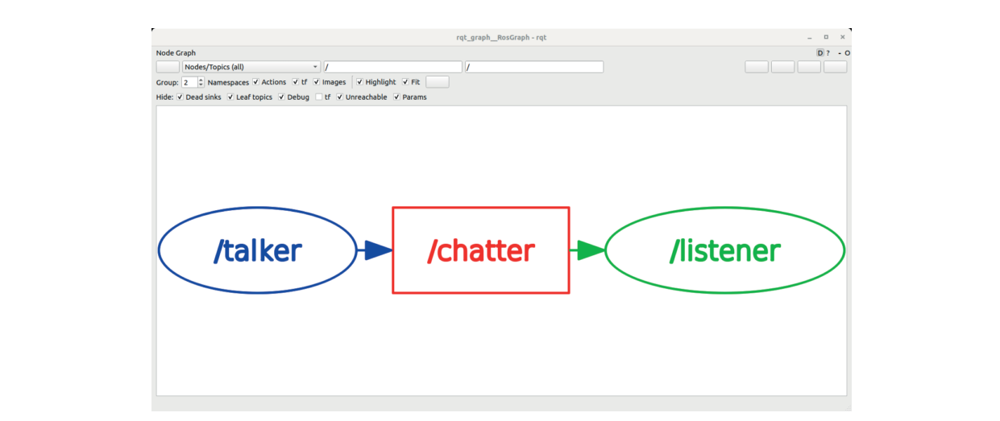
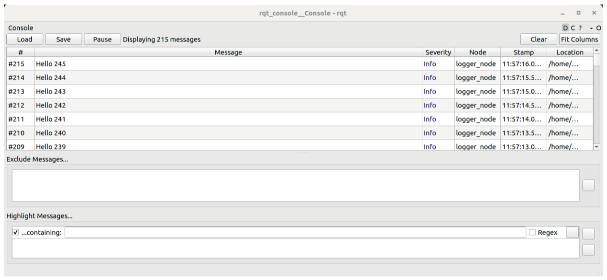
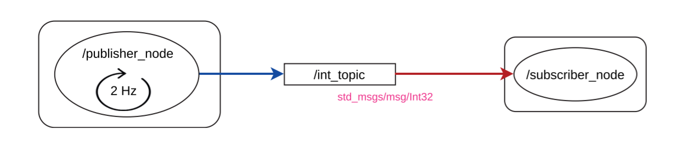
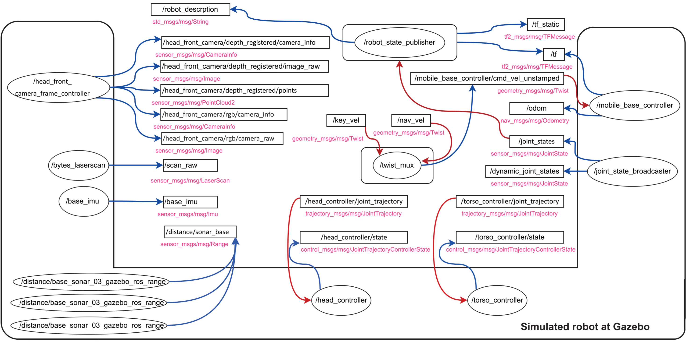
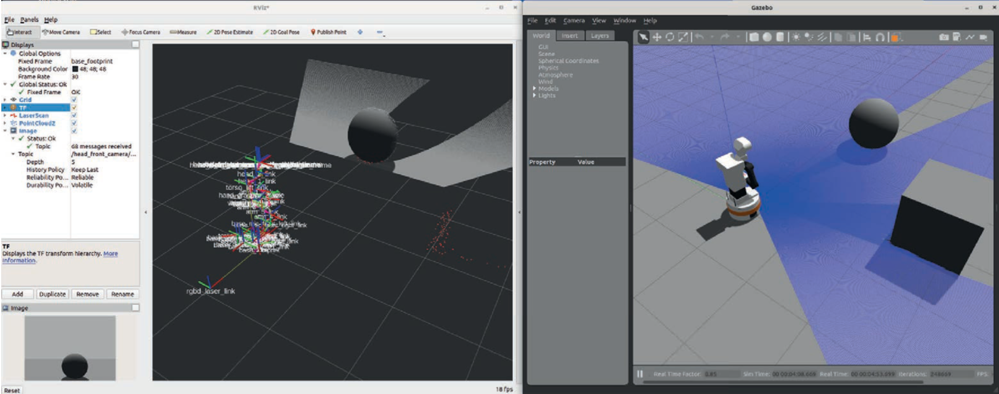

# 第2章-ROS2 的第一步

 &emsp;&emsp;上一章介绍了 ROS2 的基本理论概念，以及 ROS2 的安装。在本章中，我们将开始使用 ROS2 进行实践，并学习 ROS2 的第一个概念。  

## 2.1 ROS2 的第一步

&emsp;&emsp;ROS2 已经安装，并通过在 ∼/.bashrc 中添加源代码指令激活了底层（/opt/ros/humble）和覆盖层（∼/bookros2_ws）。请输入'ros2'命令检查是否正确。  

```shell
$ ros2
用法： ros2 [-h] [--use-python-default-buffering] 调用 `ros2 <命令> -h` 获取更详细的用法。
...
ros2 是 ROS 2 的可扩展命令行工具。
...
```

`ros2` 是 ROS2 的主要命令。通过它可以与 ROS2 系统交互，获取信息或执行操作。  

```shell
ros2 <命令> <操作> [<参数>|<选项>]*
```

要获取可用软件包列表，请输入：

```shell
$ ros2 pkg list
ackermann_msgs
action_msgs
action_tutorials_cpp
...
```

&emsp;&emsp;在这种情况下，`pkg` 负责管理 ROS2 软件包。`list` 操作可获取底层或任何覆盖层中的软件包列表。  

<details> <summary><b>深入探讨：roscli</b></summary>

`ros2cli` 是 ROS2 命令行界面工具。它是模块化和可扩展的，因此可以通过添加新的操作来增加更多功能。目前的标准操作有：  
`action` 　　 `extension_points`　`node`　　　 `test`  
`bag` 　　　　`extensions`　　　　`param`　　　`topic`  
`component`　`interface` 　　　　 `pkg`　　　　`wtf`  
`launch` 　　 `run` 　　　　　　　 `daemon` 　　 `lifecycle`  
`security` 　 `doctor`　　　　　　`multicast`　`service`  
进一步阅读：

- <https://github.com/ros2/ros2cli>
- <https://github.com/ubuntu-robotics/ros2_cheats_sheet/blob/master/cli/cli_cheats_sheet.pdf>

</details>

&emsp;&emsp;`ros2` 命令支持 tab 键自动补全。键入 `ros2`，然后按两次 tab 键，就能看到可输入的操作。操作的参数也可以用 tab 键查找。  
 &emsp;&emsp;还可以获取特定软件包的信息。例如，从 `demo_nodes_cpp` 软件包中获取可执行程序：  

```shell
$ ros2 pkg executables demo_nodes_cpp
demo_nodes_cpp add_two_ints_client
demo_nodes_cpp add_two_ints_client_async
demo_nodes_cpp add_two_ints_server
demo_nodes_cpp allocator_tutorial
...
demo_nodes_cpp talker
...
```

 &emsp;&emsp;使用 `run` 操作命令执行其中一个程序，该命令需要两个参数：可执行程序所在的软件包和可执行程序的名称： 这个软件包的名称表明它包含的所有程序都是用 C++ 编写的。  

```shell
$ ros2 run demo_nodes_cpp_talker
[INFO] [1643218362.316869744] [talker]: Publishing: 'Hello World: 1'
[INFO] [1643218363.316915225] [talker]: Publishing: 'Hello World: 2'
[INFO] [1643218364.316907053] [talker]: Publishing: 'Hello World: 3'
...
```

 &emsp;&emsp;可以看出，用软件包名称和可执行程序名称指定要执行的程序时，并不需要知道程序的确切位置，也不需要在任何特定位置执行它们。  
 &emsp;&emsp;如果一切顺利，"Hello world "信息就会出现在终端中。继续运行该命令，并打开另一个终端查看该可执行文件的运行情况。在 ROS2 中，同时打开多个终端是很常见的，因此必须在屏幕上将它们组织好，以免丢失。创建的小型计算图如图 2.1 所示。  


 &emsp;&emsp;使用 `node` 节点操作及其 `list` 列表参数检查当前正在运行的节点，并在另一个终端中执行：  

```shell
$ ros2 node list
/talker
```

 &emsp;&emsp;该命令确认只有一个名为 `/talker` 的节点。ROS2 中的资源名称和节点名称与 Linux 系统中的文件格式类似。  
 &emsp;&emsp;节点 `/talker` 不仅仅是通过终端打印信息，它还发布话题信息。它还发布话题信息。
 &emsp;&emsp;当节点 `/talker` 运行时，请检查系统中有哪些话题。为此，请使用带有 `list` 列表参数的 `topic` 话题操作。  

```shell
$ ros2 topic list
/chatter
/parameter_events
/rosout
```

 &emsp;&emsp;系统中有多个话题，其中包括发布 `/talker` 的 `/chatter`。使用 `node` 节点操作的 `info` 参数可获得更多信息：  

```shell
$ ros2 node info /talker
/talker
  Subscribers:
        /parameter_events: rcl_interfaces/msg/ParameterEvent
    Publishers:
        /chatter: std_msgs/msg/String
        /parameter_events: rcl_interfaces/msg/ParameterEvent
        /rosout: rcl_interfaces/msg/Log
    Service Servers:

...
```

 &emsp;&emsp;输出结果显示了几个发布者，它们与上一条命令显示的话题一致，因为系统中已经没有节点了。  
 &emsp;&emsp;如前所述，每个话题只支持一种类型的信息。前面的命令已经显示了这种类型，不过可以通过直接向 `topic` 动作询问特定话题的信息来验证：  

```shell
$ ros2 topic info /chatter
Type: std_msgs/msg/String
Publisher count: 1
Subscription count: 0
```

 &emsp;&emsp;`std_msgs/msg/String` 是在 `std_msgs` 包中定义的 `String` 字符串消息，以 `_msgs` 结尾。要检查系统中哪些消息有效，可使用 `interface` 接口操作及其 `list` 列表参数。  

```shell
$ ros2 interface list
Messages:
    ackermann_msgs/msg/AckermannDrive
    ackermann_msgs/msg/AckermannDriveStamped
    ...
    visualization_msgs/msg/MenuEntry
Services:
    action_msgs/srv/CancelGoal
    ...
    visualization_msgs/srv/GetInteractiveMarkers
Actions:
    action_tutorials_interfaces/action/Fibonacci
...
```

 &emsp;&emsp;输出结果将显示 ROS2 中节点可以通信的所有接口类型。添加 `-m` 选项后，可以只过滤信息。需要注意的是，除了信息之外，还有更多的接口。服务和操作也有自己的格式，我们也可以用 `ros2 interface`接口来查看。  
检查消息格式可获得消息中包含的字段及其类型：  

```shell
$ ros2 interface show std msgs/msg/String
... comments
string data
```

该信息格式只有一个字段，名为 `data`，属于 `String` 字符串类型。  

<details> <summary><b>深入探讨：interfaces 接口</b></summary>

消息由字段组成。每个字段都有不同的类型，可以是基本类型（bool、string、float64），也可以是消息类型。通过这种方式，通常可以从较简单的消息创建更复杂的消息。加盖邮戳的消息就是一个例子。  
一系列名称以 `Stamped` 结尾的消息会在已有消息的基础上添加消息头。查看这两条消息的区别：  
`geometry_msgs/msg/Point`  
`geometry_msgs/msg/PointStamped`  
进一步阅读：  

- <https://docs.ros.org/en/foxy/Concepts/About-ROS-Interfaces.htmlCheck>

</details>

 &emsp;&emsp;在话题中键入当前正在发布的消息（`/talker` 应仍在另一个终端中运行）：  

```shell
$ ros2 topic echo /chatter
data: 'Hello World: 1578'
---
data: 'Hello World: 1579'
...
```

 &emsp;&emsp;接下来，执行一个包含节点的程序，该节点订阅话题 `/chatter`，并将收到的消息显示在屏幕上。为了执行该程序，在不停止包含 `/talker` 节点的程序的情况下，我们运行同名程序中的 `/listener` 节点。虽然在 `demo_nodes_cpp` 软件包中也有一个 `listener` 节点，但为了多样化起见，我们可以用 Python软件包节点中运行 `listener`：  

```shell
$ ros2 run demo nodes py listener
[INFO] [1643220136.232617223] [listener]: I heard: [Hello World: 1670]
[INFO] [1643220137.197551366] [listener]: I heard: [Hello World: 1671]
[INFO] [1643220138.198640098] [listener]: I heard: [Hello World: 1672]
...
```

 &emsp;&emsp;现在，计算图由两个通过话题 `/chatter` 进行通信的节点组成。计算图的外观如图 2.2 所示。  


 &emsp;&emsp;运行 `rqt_graph` 包中的 `rqt_graph` 工具（图 2.3），也可以将计算图可视化：

```shell
ros2 run rqt_graph rqt_graph
```



现在，只需在运行程序的终端按下 Ctrl+C 键，即可停止所有程序。  

## 2.2 创建第一个节点

 &emsp;&emsp;到目前为止，我们只使用了 ROS2 基本安装包中的软件。在本节中，我们将创建一个软件包来创建第一个节点。  
 &emsp;&emsp;新软件包将在覆盖层（`cd ∼/bookros2_ws`）中创建，以练习从头开始创建软件包。  
 &emsp;&emsp;所有软件包都必须位于 `src` 目录中。这次，我们使用 `ros2` 命令和带有 `create` 创建选项的 `pkg` 包操作。在 ROS2 软件包中，有必要声明它们依赖于本工作空间或其他工作空间中的哪些其他软件包，以便编译工具知道它们的编译顺序。进入 `src` 目录并运行：  

```shell
cd ∼/bookros2_ws/src
ros2 pkg create my_package --dependencies rclcpp std_msgs
```

 &emsp;&emsp;该命令将创建基础软件包的骨架，并包含一些空目录，用于存放我们的程序和库的源文件。ROS2 能识别包含软件包的目录，是因为其中有一个名为 `package.xml` 的 XML 文件。通过 `--dependencies` 选项，可以添加该软件包的依赖关系。现在，我们将使用 rclcpp，它是 C++ 客户端库。  

```xml
<!-- package.xml -->
<?xml version="1.0"?>
<?xml-model href="http://download.ros.org/schema/package_format3.xsd" schematypens="http://www.w3.org/2001/XMLSchema"?>
<package format="3">
    <name>my_package</name>
    <version>0.0.0</version>
    <description>TODO: Package description</description>
    <maintainer email="john.doe@evilrobot.com">johndoe</maintainer>
    <license>TODO: License declaration</license>

    <buildtool_depend>ament_cmake</buildtool_depend>

    <depend>rclcpp</depend>
    <depend>std_msgs</depend>

    <test_depend>ament_lint_auto</test_depend>
    <test_depend>ament_lint_common</test_depend>

    <export>
        <build_type>ament_cmake</build_type>
    </export>
</package>
```

 &emsp;&emsp;虽然 `ros2 pkg create` 是创建新软件包的良好起点，但在实际操作中，通常是通过复制现有软件包，立即更改软件包名称，然后再根据用途进行调整。  
 &emsp;&emsp;由于示例是一个 C++ 软件包，我们已经指出它依赖于 rclcpp，因此在它的根目录下还创建了一个 `CMakeLists.txt` 文件，该文件规定了编译它的规则。我们将在添加编译内容后立即分析其内容。  
 &emsp;&emsp;首先，在 ROS2 中创建尽可能简单的程序，并将其命名为 `src/simple.cpp`。下一个方框包含软件包结构和 `src/simple.cpp` 的源代码：  

```txt
<-- Package my_package -->
my_package/
├─CMakeLists.txt
├─include
│ └─my_package
├─package.xml
└─src
  └─simple.cpp
```

```cpp
//<-- src/simple.cpp -->
#include "rclcpp/rclcpp.hpp"
int main(int argc, char * argv[]) {
    rclcpp::init(argc, argv);

    auto node = rclcpp::Node::make_shared("simple_node");

    rclcpp::spin(node);

    rclcpp::shutdown();

    return 0;
}
```

- `#include "rclcpp/rclcpp.hpp` "允许使用 C++ 访问大多数 ROS2 类型和函数。
- `rclcpp::init(argc, argv)` 从启动进程时的参数中提取 ROS2 应该考虑的选项。
- 第 6 行创建了一个 ROS2 节点。`node` 是一个 ROS2 节点的 `std::shared ptr`，其名称是 `simple_node`。  
`rclcpp::Node` 类配备了许多别名和静态函数来简化代码。`SharedPtr` 是 `std::shared_ptr<rclcpp::Node>` 的别名，而 `make_shared` 是 `std::make_shared<rclcpp::Node>` 的静态方法，以下几行是等价的，从纯 C++ 语句转换为利用 ROS2 设施的语句：

```cpp
1. std::shared_ptr<rclcpp::Node> node = std::shared_ptr<rclcpp::Node>( new rclcpp::Node("simple_node"));
2. std::shared_ptr<rclcpp::Node> node = std::make_shared<rclcpp::Node>( "simple_node");
3. rclcpp::Node::SharedPtr node = std::make_shared<rclcpp::Node>( "simple_node");
4. auto node = std::make_shared<rclcpp::Node>("simple_node");
5. auto node = rclcpp::Node::make_shared("simple_node");
```

- 在这段代码中，`spin` 会阻止程序的执行，使其不会立即终止。其重要功能将在下面的示例中解释。
- shutdown 在下一行程序结束之前管理节点的关闭。

 &emsp;&emsp;检查为编译程序而准备的 `CMakeLists.txt` 文件。为了清晰起见，一些与现在无关的部分已被删除：  

```js
<!-- CMakeLists.txt -->
cmake_minimum_required(VERSION 3.5)
project(basics)

find_package(ament_cmake REQUIRED)
find_package(rclcpp REQUIRED)

set(dependencies
    rclcpp
)

add_executable(simple src/simple.cpp)
ament_target_dependencies(simple ${dependencies})

install(TARGETS
    simple
    ARCHIVE DESTINATION lib
    LIBRARY DESTINATION lib
    RUNTIME DESTINATION lib/${PROJECT_NAME}
)

if(BUILD_TESTING)
    find_package(ament_lint_auto REQUIRED)
    ament_lint_auto_find_test_dependencies()
endif()

ament_export_dependencies(${dependencies})
ament_package()
```

 找出该文件中的几个部分：

- 在第一部分中，用 `find_package` 指定了所需的软件包。除了 `colcon` 一直需要的 `ament_cmake`，只指定了 `rclcpp`。一个好的习惯是创建一个依赖变量 `dependencies`，列出该软件包所依赖的软件包，因为我们需要多次使用这个列表
- 对于每个可执行文件：  
  - 编译： 使用 `add_executable`，指明结果的名称及其源代码。此外，使用 `ament_target_dependencies` 可以让当前目标访问其他软件包的头文件和库。没有额外库的依赖关系，所以只使用 `ament_target_dependencies` 就可以了。  
  - 安装： 指明所生成程序的安装位置，一般不会改变。单个安装 `install` 指令对软件包中的程序和库都有效。  
    一般来说，安装部署和运行程序所需的所有内容。如果未安装，则表示程序不存在。  

编译工作空间：  

```shell
cd ∼/bookros2_ws
colcon build --symlink-install
```

 &emsp;&emsp;如前所述，由于我们创建了一个新程序，目前必须重新为工作空间提供源代码，因此我们打开一个新的终端并执行：  

```shell
ros2 run my_package simple
```

 &emsp;&emsp;看看会发生什么：什么都没有（图 2.4）  

 

 &emsp;&emsp;在内部，我们的程序处于 `spin` 状态中，被阻塞，等待我们按 Ctrl+C 完成程序。在此之前，请检查节点是否已在另一个终端中创建执行：  

```shell
$ ros2 node list
/simple_node
```

 &emsp;&emsp;曾经介绍过如何从头开始创建程序包。从现在起，我们将使用上一章中从本书资源库下载的软件包。这样可以加快进度，而不会在创建软件包时因小错误而受阻，而这些小错误在此时可能是无法克服的。

## 2.3 分析 BR2_BASICS 软件包

 &emsp;&emsp;详细了解这一过程后，继续分析 br2 基础知识包的内容，其中包含更多有趣的节点。该软件包的结构如下图所示，完整的源代码可在附件和书籍库中找到：  

```txt
<-- Package br2_basics -->

br2_basics
├─CMakeLists.txt
├─config
│ └─package.xml
├─launch
│ ├─includer_launch.py
│ ├─param_node_v1_launch.py
│ ├─param_node_v2_launch.py
│ ├─pub_sub_v1_launch.py
│ └─pub_sub_v2_launch.py
├─package.xml
└─src
  ├─executors.cpp
  ├─logger_class.cpp
  ├─logger.cpp
  ├─param_reader.cpp
  ├─publisher_class.cpp
  ├─publisher.cpp
  └─subscriber_class.cpp
```

### 2.3.1 控制迭代执行

 &emsp;&emsp;上一节描述了一个包含一个节点的程序，该节点除了存在之外没有什么其他功能。程序 `src/logger.cpp` 更有意思，因为它显示了更多的活动：  

```cpp
//<-- src/logger.cpp -->
auto node = rclcpp::Node::make_shared("logger_node");

rclcpp::Rate loop_rate(500ms);
int counter = 0;

while (rclcpp::ok()) {
    RCLCPP_INFO(node->get_logger(), "Hello %d", counter++);

    rclcpp::spin_some(node);
    loop_rate.sleep();
}
```

 &emsp;&emsp;这段代码展示了以固定频率执行任务的第一种典型策略，这在任何执行某种控制的程序中都很常见。控制循环是在一个 while 循环中完成的，通过一个 `rclcpp::Rate` 对象来控制速率，该对象会让控制循环停止足够长的时间，以适应所选的速率。  
 &emsp;&emsp;这段代码使用 `spin_some` 代替目前使用的 `spin`。两者都是为了管理到达节点的消息，调用处理这些消息的函数。`spin` 会阻塞等待新信息，而 `spin_some` 则会在没有信息需要处理时返回。  
 &emsp;&emsp;至于代码的其他部分，则使用 `RCLCPP_INFO`，这是一个打印信息的宏。它与 `printf` 非常相似，第一个参数是节点的日志记录器（节点内部的日志记录对象，通过 `get_logger` 方法获取）。这些信息会显示在屏幕上，同时也会发布在话题 `/rosout` 中。  
 &emsp;&emsp;运行该程序，键入:

```shell
$ ros2 run br2 basics logger
[INFO] [1643264508.056814169] [logger node]: Hello 0
[INFO] [1643264508.556910295] [logger node]: Hello 1
...
```

 &emsp;&emsp;程序就会开始显示信息，其中包含信息的严重性级别、时间戳、产生信息的节点以及信息内容。  
 &emsp;&emsp;如前所述，`RCLCPP_INFO` 也会在话题 `/rosout` 中发布 `rcl_interfaces/msg/Log` 类型的消息，如图 2.5 所示。所有节点都有一个发布者，将我们生成的输出发送到该节点。当我们没有控制台来查看这些信息时，这就非常有用了。  

 

 &emsp;&emsp;借此机会，您可以了解如何查看在话题上发布的消息：  

```shell
$ ros2 topic echo /rosout 
stamp:
    sec: 1643264511 
    nanosec: 556908791
level: 20 
name: logger_node 
msg: Hello 7 
file: /home/fmrico/ros/ros2/bookros2_ws/src/book_ros2/br2_basics/src/logger.cpp 
function: main 
line: 27 
---
stamp:
    sec: 1643264512 
    nanosec: 57037520
level: 20
...
```

 &emsp;&emsp;查看 `rcl_interfaces/msg/Log` 消息的定义，确认所显示的字段就是此类消息的字段。在行字段中，有我们的消息：  

```shell
ros2 interface show rcl_interfaces/msg/Log
```

 &emsp;&emsp;最后，使用 `rqt_console` 工具查看发布在 `/rosout` 中的消息，如图 2.6 所示。如图 2.7 所示，当许多节点都在向 `/rosout` 生成消息时，这个工具就非常有用了，它可以按节点、关键程度等进行过滤。  

```shell
ros2 run rqt_console rqt_console
```




&emsp;&emsp;通过改变对象 `loop_rate` 的创建时间来测试不同的频率，将其改为 100 ms 或 1 s，使控制环分别以 10 Hz 或 1 Hz 的频率运行。  
 &emsp;&emsp;每次更改后不要忘记编译。使用选项 `--packages-select`，只编译已更改的软件包，这样可以节省一些时间：  

```shell
cd ∼/bookros2_ws 
colcon build --symlink-install --packages-select br2_basics
```

&emsp;&emsp;从现在起，`cd` 命令将被省略。由此可见，工作空间的所有编译都必须从根目录开始。  

<details> <summary><b>深入探讨：日志 logging</b></summary>

ROS2 有一个日志系统，可以生成严重级别依次递增的日志信息： `DEBUG`、`INFO`、`WARN`、`ERROR` 或 `FATAL`。为此，可使用宏 `RCLCPP_[级别]` 或 `RCLCPP_[级别]_STREAM` 来使用文本流。  
默认情况下，除了发送到 `/rosout 之外`，`INFO` 或更高级别的严重性级别将显示在标准输出上。您可以对日志记录器进行配置，以确定在标准输出中显示的另一个最低严重性级别：

```shell
ros2 run br2_basics_logger --ros-args --log-level debug
```

当应用程序中有许多节点时，建议使用 `rqt_console` 等工具来选择节点和严重性。  
进一步阅读：  

- <https://docs.ros.org/en/foxy/Tutorials/Logging-and-logger-configuration.html>  
- <https://docs.ros.org/en/foxy/Concepts/About-Logging.html>  

</details>

&emsp;&emsp;在 `src/logger_class.cpp` 程序中可以看到迭代执行任务的第二种策略。此外，我们还展示了一些在 ROS2 中广泛使用的方法，即通过继承 `rclcpp::Node` 来实现节点。这种方法使代码更加简洁，并为后面将要展示的多种可能性打开了大门：  

```cpp
//<-- src/logger_class.cpp -->
class LoggerNode : public rclcpp::Node
{
public:
  LoggerNode()
  : Node("logger_node")
  {
    counter_ = 0;
    timer_ = create_wall_timer(
      500ms, std::bind(&LoggerNode::timer_callback, this));
  }

  void timer_callback()
  {
    RCLCPP_INFO(get_logger(), "Hello %d", counter_++);
  }

private:
  rclcpp::TimerBase::SharedPtr timer_;
  int counter_;
};

int main(int argc, char * argv[])
{
  rclcpp::init(argc, argv);

  auto node = std::make_shared<LoggerNode>();

  rclcpp::spin(node);

  rclcpp::shutdown();
  return 0;
}
```

&emsp;&emsp;定时器控制控制循环。该定时器以所需的频率产生一个事件。当事件发生时，它会调用处理该事件的回调。这样做的好处是，节点可在内部调整执行频率，而无需将这一决定权委托给外部代码。对节点进行调度，以了解它们的运行频率。  
 &emsp;&emsp;要编译这些程序，`CMakeLists.txt` 中的相关行是：

- 为每个可执行文件添加 `add_executable` 及其相应的 `ament_target_dependencies`
- 包含所有可执行文件的 `install` 安装指令。

```js
<!-- CMakeLists.txt -->
add_executable(logger_class src/logger.cpp)
ament_target_dependencies(logger ${dependencies})

add_executable(logger_class src/logger_class.cpp)
ament_target_dependencies(logger_class ${dependencies})

install(TARGETS
    logger
    logger_class
    ...
    ARCHIVE DESTINATION lib
    LIBRARY DESTINATION lib
    RUNTIME DESTINATION lib/${PROJECT_NAME}
)
```

```shell
ros2 run br2_basics logger_class
```

&emsp;&emsp;编译软件包并运行该程序，看看效果是否与前一个程序相同。尝试修改频率，在 `create_wall_timer` 中创建计时器时设置不同的时间。

### 2.3.2 发布和订阅

&emsp;&emsp;现在扩展该节点，使其不再在屏幕上写消息，而是在话题上发布消息（图 2.8），在名为 `/counter` 的话题中发布连续的数字。使用带有 `list` 和 `show` 选项的 `ros2 interface` 命令进行探索，可以找到最适合这项任务的信息：`std_msgs/msg/Int32`。  


 &emsp;&emsp;有必要在定义使用消息的地方加入头文件。由于要使用的消息类型是 `std_msgs/msg/Int32`，请注意，从消息的名称中，我们可以很容易地提取出要包含的头信息。只需键入它，在任何已有的大写字母前插入一个空格，并将所有字母转换为小写即可。类型的名称也很简单：  

```cpp
// For std_msgs/msg/Int32 
#include "std_msgs/msg/int32.hpp"

std_msgs::msg::Int32 msg_int32;

// For sensor_msgs/msg/LaserScan 
#include "sensor_msgs/msg/laser_scan.hpp"

sensor_msgs::msg::LaserScan msg_laserscan;
```

 &emsp;&emsp;请关注 `PublisherNode` 的源代码：

```cpp
//<-- src/publisher_class.cpp -->
class PublisherNode : public rclcpp::Node
{
public:
  PublisherNode()
  : Node("publisher_node")
  {
    publisher_ = create_publisher<std_msgs::msg::Int32>("int_topic", 10);
    timer_ = create_wall_timer(
      500ms, std::bind(&PublisherNode::timer_callback, this));
  }

  void timer_callback()
  {
    message_.data += 1;
    publisher_->publish(message_);
  }

private:
  rclcpp::Publisher<std_msgs::msg::Int32>::SharedPtr publisher_;
  rclcpp::TimerBase::SharedPtr timer_;
  std_msgs::msg::Int32 message_;
};
```

&emsp;&emsp;让我们讨论一下重要的方面：

- 我们将使用 `std_msgs/msg/Int32` 消息。从这个名称，我们可以推断出：
  - 它的头文件是 `std_msgs/msg/int32.hpp`。-
  - 数据类型是 `std_msgs::msg::Int32`。
- 创建一个发布者，即负责创建话题（如果不存在）和发布消息的对象。通过该对象可以获取更多信息，例如话题上有多少订阅者。我们使用 `create_publisher`，这是 `rclcpp::Node` 的一个公共方法，它返回一个 `rclcpp::Publisher` 对象的 `shared_ptr`。参数包括话题名称和一个 `rclcpp::QoS` 对象。该类有一个构造函数，可以接收一个整数，即该话题的输出消息队列的大小，这样我们就可以直接输入这个大小，C++ 编译器就会发挥它的魔力，稍后我们将看到，在这里我们可以选择不同的 QoS。
- 我们创建了一个 `std_msgs::msg::Int32` 消息，可以确认它只有一个数据字段。每隔 500 毫秒，我们会在定时器回调中递增消息字段，并调用发布者的 `publish` 方法来发布消息。

<details> <summary><b>深入探讨： ROS2 中的 QoS</b></summary>

ROS2 中的 QoS 是 ROS2 必不可少的宝贵功能，也是一个故障点（SPOF），因此必须对其有充分的了解。在本表底部的参考资料中，您可以看到可以建立哪些 QoS 策略及其含义。下面以 C++ 为例说明如何设置 QoS 策略：  

```cpp
publisher = node->create_publisher<std_msgs::msg::String>(
    "chatter", rclcpp::QoS(100).transient_local().best_effort());
```

<table>
    <tr>
        <td><b>默认Default</b></td>
        <td>Reliable</td>
        <td>Volatile</td>
        <td>保留最后一条消息</td>
    </tr>
    <tr>
        <td><b>服务Services</b></td>
        <td>Reliable</td>
        <td>Volatile</td>
        <td>正常队列</td>
    </tr>
    <tr>
        <td><b>传感器Sensor</b></td>
        <td>Best Effort</td>
        <td>Volatile</td>
        <td>小队列</td>
    </tr>
    <tr>
        <td><b>DParameters</b></td>
        <td>Reliable</td>
        <td>Volatile</td>
        <td>大队列</td>
    </tr>
</table>

> **译者注**：
> `Volatile`（易变性） 可意为 “直接存取原始内存地址”。  
> `Transient Local`（瞬态本地）发布者节点负责为“后期加入”或“迟到的”订阅者节点保留样本。  
> `Best Effort`（尽力服务）发布者节点不保留样本，但会尽力传递消息。

每个发布者指定自己的 QoS，每个发布者也可以指定自己的 QoS。问题在于，有些 QoS 是不兼容的，这会导致订阅者收不到信息：

<table>
    <tr>
        <td colspan="2" rowspan="2">QoS <b>稳定性</b>配置文件的兼容性</td>
        <td colspan="2"><b>订阅者</b></td>
    </tr>
    <tr>
        <td><b>Volatile</b></td>
        <td><b>Transient Local</b></td>
    </tr>
    <tr>
        <td rowspan="2"><b>发布者</b></td>
        <td><b>Volatile</b></td>
        <td><font color="DarkSeaGreen">Volatile</font></td>
        <td><font color="Red">无关联</font></td>
    </tr>
    <tr>
        <td><b>Transient Local</b></td>
        <td><font color="Gold">Volatile</font></td>
        <td><font color="DarkSeaGreen">Transient Local</font></td>
    </tr>
</table>

<table>
    <tr>
        <td colspan="2" rowspan="2">QoS <b>可靠性</b>配置文件的兼容性</td>
        <td colspan="2"><b>订阅者</b></td>
    </tr>
    <tr>
        <td><b>Best Effort</b></td>
        <td><b>Reliable</b></td>
    </tr>
    <tr>
        <td rowspan="2"><b>发布者</b></td>
        <td><b>Best Effort</b></td>
        <td><font color="DarkSeaGreen">Best Effort</font></td>
        <td><font color="Red">无关联</font></td>
    </tr>
    <tr>
        <td><b>Reliable</b></td>
        <td><font color="Gold">Best Effort</font></td>
        <td><font color="DarkSeaGreen">Reliable</font></td>
    </tr>
</table>

真正的标准应该是，发布者的 QoS 策略限制应少于订阅者。例如，传感器的驱动程序应以可靠的 QoS 策略发布其读数。订户则决定是希望通信有效可靠，还是希望通信尽力服务。在这种情况下，这些发布者可以是：

```cpp
publisher_ = create_publisher<sensor_msgs::msg::LaserScan>(
    "scan", rclcpp::SensorDataQoS().reliable());
```

用户可以使用相同的服务质量，也可以删除可靠的部分。  
进一步阅读：

- <https://docs.ros.org/en/foxy/Concepts/About-Quality-of-Service-Settings.html>
- <https://design.ros2.org/articles/qos.html>
- <https://discourse.ros.org/t/about-qos-of-images/18744/16>

</details>

运行程序：

```shell
ros2 run br2_basics publisher_class
```

看看我们在该话题中发布了哪些内容：

```shell
$ ros2 topic echo /int_topic
data: 16 ---
data: 17 ---
data: 18
...
```

我们应该能看到数据字段不断增加的 `std_msgs/msg/Int32` 消息。  
现在实现订阅此消息节点的代码：  

```cpp
//<-- src/subscriber_class.cpp -->
class SubscriberNode : public rclcpp::Node
{
public:
  SubscriberNode()
  : Node("subscriber_node")
  {
    subscriber_ = create_subscription<std_msgs::msg::Int32>(
      "int_topic", 10,
      std::bind(&SubscriberNode::callback, this, _1));
  }

  void callback(const std_msgs::msg::Int32::SharedPtr msg)
  {
    RCLCPP_INFO(get_logger(), "Hello %d", msg->data);
  }

private:
  rclcpp::Subscription<std_msgs::msg::Int32>::SharedPtr subscriber_;
};
```

&emsp;&emsp;在这段代码中，我们为同一话题创建了一个 `rclcpp::Subscription`，其中包含相同类型的消息。在创建它时，我们已经说明，在此话题上发布的每条消息都会调用回调函数，该函数的 `msg` 参数接收作为 `shared_ptr` 的消息。  
 &emsp;&emsp;将此程序添加到 `CMakeLists.txt`，编译并在一个终端运行 `publisher_class`，在另一个终端运行此程序，组成图 2.9 所示的计算图。我们将看到屏幕上如何显示你收到的话题信息。  

```shell
ros2 run br2_basics subscriber_class
```



### 2.3.3 启动器

&emsp;&emsp;到此为止，我们已经了解了运行程序的方法，即使用 `ros2 run`。在 ROS2 中，还有另一种运行程序的方法，那就是通过命令 `ros2 launch`，并使用一个名为 `launch` 的文件来指定应该运行哪些程序。
 &emsp;&emsp;启动器文件是用 Python[^1] 编写的，其功能是声明使用哪些选项或参数执行哪些程序。反过来，一个启动器可以包含另一个启动器，允许你重复使用现有的启动器。  
 &emsp;&emsp;之所以需要启动器，是因为机器人应用程序有许多节点，而这些节点都应同时启动。逐个启动并调整每个节点的特定参数以使其相互配合可能会很繁琐。  
 &emsp;&emsp;软件包的启动器位于软件包的 `launch` 目录中，其名称通常以 `_launch.py` 结尾。就像 `ros2 run` 完成了软件包中可用程序的运行一样，`ros2 launch` 也完成了可用启动器的运行。  
 &emsp;&emsp;从实现的角度来看，启动器是一个包含 `generate_launch_description()` 函数的 python 程序，该函数会返回一个 `LaunchDescription` 对象。`LaunchDescription` 对象包含一些操作，其中我们重点强调的是：  

- Node 操作：运行程序。
- IncludeLaunchDescription 操作：包含另一个启动器。
- DeclareLaunchArgument 操作：声明启动器参数。
- SetEnvironmentVariable 操作：设置环境变量。

&emsp;&emsp;看看我们如何同时启动发布者和订阅者。分析 `basics` 包中的第一个启动器：  

```python
# <-- launch/pub_sub_v1_launch.py -->
from launch import LaunchDescription
from launch_ros.actions import Node


def generate_launch_description():

    param_reader_cmd = Node(
        package='br2_basics',
        executable='param_reader',
        parameters=[{
            'number_particles': 300,
            'topics': ['scan', 'image'],
            'topic_types': ['sensor_msgs/msg/LaserScan', 'sensor_msgs/msg/Image']
        }],
        output='screen'
    )

    ld = LaunchDescription()
    ld.add_action(param_reader_cmd)

    return ld
```

&emsp;&emsp;在 launch/pub_sub_v2_launch.py 文件中还有另一种实现方式，其行为是相同的。请查看其不同之处。要使用启动器，我们必须安装启动器目录：  

```js
<!-- CMakeLists.txt -->
install(DIRECTORY launch DESTINATION share/${PROJECT_NAME})
```

生成并启动该文件：

```shell
ros2 launch br2_basics pub_sub_v2_launch.py
```

&emsp;&emsp;在本节中，我们看到的启动器非常简单，选项也很少。随着时间的推移，我们将在越来越复杂的启动器中看到更多的选项。  

### 2.3.4 参数

&emsp;&emsp;节点使用参数配置其运行。当程序需要配置文件时，请使用参数。这些参数可以是布尔型、整数型、字符串型或任何这些类型的数组。参数在运行时读取，通常是在节点启动时，其运行取决于这些值。  
 &emsp;&emsp;假设一个节点负责使用粒子过滤器（Particle Filter[^2]）定位机器人，需要几个参数，如粒子的最大数量或接收感知信息的话题。这不应该写在源代码中，因为如果我们改变机器人或环境，这些参数值可能会有所不同。  
 &emsp;&emsp;查看一个在启动时读取这些参数的节点。在基础知识包中创建一个 `param_reader.cpp` 文件：  

```cpp
//<-- src/param_reader.cpp -->
class LocalizationNode : public rclcpp::Node
{
public:
  LocalizationNode()
  : Node("localization_node")
  {
    declare_parameter("number_particles", 200);
    declare_parameter("topics", std::vector<std::string>());
    declare_parameter("topic_types", std::vector<std::string>());

    get_parameter("number_particles", num_particles_);
    RCLCPP_INFO_STREAM(get_logger(), "Number of particles: " << num_particles_);

    get_parameter("topics", topics_);
    get_parameter("topic_types", topic_types_);

    if (topics_.size() != topic_types_.size()) {
      RCLCPP_ERROR(
        get_logger(), "Number of topics (%zu) != number of types (%zu)",
        topics_.size(), topic_types_.size());
    } else {
      RCLCPP_INFO_STREAM(get_logger(), "Number of topics: " << topics_.size());
      for (size_t i = 0; i < topics_.size(); i++) {
        RCLCPP_INFO_STREAM(get_logger(), "\t" << topics_[i] << "\t - " << topic_types_[i]);
      }
    }
  }

private:
  int num_particles_;
  std::vector<std::string> topics_;
  std::vector<std::string> topic_types_;
};
```

- 必须使用 `declare_parameter` 等方法声明节点的所有参数。
- 我们可以使用 `get_parameter` 等函数获取参数值，指定参数名称和存储参数值的位置。
- 有一些方法可以分块进行。
- 参数可以随时读取，甚至可以订阅实时修改。不过，在启动时读取参数会使代码更可预测。

&emsp;&emsp;如果我们在不给参数赋值的情况下运行程序，就会看到默认值是如何取值的：

```shell
ros2 run_br2 basics_param_reader
```

停止执行程序，然后为其中一个参数赋值，再执行我们的程序。我们可以在设置参数时这样做，以 `--ros-args` 开头，`-p` 表示设置一个参数：

```shell
ros2 run br2_basics param_reader --ros-args -p number_particles:=300
```

现在输入其余参数的值。在本例中，是两个字符串数组：

```shell
ros2 run br2_basics param_reader --ros-args -p number_particles:=300 -p topics:= '[scan, image]' -p topic types:='[sensor_msgs/msg/LaserScan,sensor_msgs/msg/Image]'
```

如果我们想在启动程序中设置参数值，可以按如下方法操作：

```python
# <-- launch/pub_sub_v1_launch.py -->
from launch import LaunchDescription
from launch_ros.actions import Node


def generate_launch_description():

    param_reader_cmd = Node(
        package='br2_basics',
        executable='param_reader',
        parameters=[{
            'number_particles': 300,
            'topics': ['scan', 'image'],
            'topic_types': ['sensor_msgs/msg/LaserScan', 'sensor_msgs/msg/Image']
        }],
        output='screen'
    )

    ld = LaunchDescription()
    ld.add_action(param_reader_cmd)

    return ld
```

&emsp;&emsp;虽然这种方法适用于为几个参数赋值，但通常情况下，使用一个包含参数值的文件来执行节点更为方便。这就是 ROS2 中的配置文件。我们选择的格式是 YAML。通常，这些配置文件存储在软件包的 config 目录中，而且必须在 `CMakeLists.txt` 中标记安装，就像在启动目录中一样：

```js
<!-- CMakeLists.txt -->
install(DIRECTORY launch config DESTINATION share/${PROJECT_NAME})
```

&emsp;&emsp;让我们讨论一个重要的问题：是什么阻止了别人在他们的软件包中使用不同的组织？为什么是 config 目录而不是 set up 或 startup 目录，而不是 launch 目录？为什么要把源文件放在另一种结构中？为什么使用 YAML/参数，而不是文本文件或 XML 和自定义配置阅读器？为什么使用启动器而不是 bash 脚本？为什么不使用一个应用程序来启动所有必要的节点？  
 &emsp;&emsp;当然，ROS2 的开发者还可以做出其他决定，但在做事方面已经达成了普遍共识。这种约定的好处是，当其他开发者试图使用你的代码时，可以更容易地找到并识别关键元素。我的建议是遵循这些约定。这样，您的代码就能被更多人使用，长期维护性也会更强，并能获得更多合作。公司会将此作为更关键的因素，因为在合并或更换开发人员时，软件会更容易继承。
 &emsp;&emsp;继续我们的例子。带有我们节点参数的文件可以是这样的：

```yaml
# <-- config/params.yaml -->
localization_node:
  ros__parameters:
    number_particles: 300
    topics: [scan, image]
    topic_types: [sensor_msgs/msg/LaserScan, sensor_msgs/msg/Image]
```

并执行指定我们文件的位置。如果我们已经安装并编译了配置目录，就可以执行：

```shell
ros2 run br2_basics param_reader --ros-args --params-file install/basics/share/basics/config/params.yaml
```

如果我们希望在启动器中读取它，我们将使用：

```python
# <-- launch/pub_sub_v1_launch.py -->
def generate_launch_description():
    ...
    param_reader_cmd = Node(
        package='br2_basics',
        executable='param_reader',
        parameters=[param_file],
        output='screen'
    )
```

[^1]: 最新的 ROS2 发行版允许创建用 Yaml 和 XML 编写的启动器。
[^2]: Sebastian Thrun, Dieter Fox, Wolfram Burgard, and Frank Dellaert. Robust monte carlo localization for mobile robots. Artificial Intelligence, 128(1):99–141, 2001.

### 2.3.5 线程池

&emsp;&emsp;由于 ROS2 中的节点是 C ++ 对象，因此一个进程可以有多个节点。事实上，在许多情况下，这样做是非常有益的，因为在同一进程内使用共享内存策略可以加快通信速度。另一个好处是，如果节点都在同一个程序中，可以简化节点的部署。缺点是，一个节点的故障可能会导致同一进程的所有节点终止。  
 &emsp;&emsp;  ROS2 提供了几种在同一进程中运行多个节点的方法。最推荐的是使用执行器。执行器（Executor）是一个对象，节点被添加到执行器中，以便一起执行。请看示例：

```cpp
// 单线程执行器
int main(int argc, char * argv[]) {
    rclcpp::init(argc, argv);

    auto node_pub = std::make_shared<PublisherNode>();
    auto node_sub = std::make_shared<SubscriberNode>();

    rclcpp::executors::SingleThreadedExecutor executor;

    executor.add_node(node_pub);
    executor.add_node(node_sub);

    executor.spin();

    rclcpp::shutdown();
    return 0;
}
```

```cpp
// 多线程执行器
auto node_pub = std::make_shared<PublisherNode>();
auto node_sub = std::make_shared<SubscriberNode>();

rclcpp::executors::MultiThreadedExecutor executor(
    rclcpp::executor::ExecutorArgs(), 8);

executor.add_node(node_pub);
executor.add_node(node_sub);

executor.spin();
```

&emsp;&emsp;在这两个代码中，我们都创建了一个执行器，并将两个节点添加到执行器中（图 2.10），这样 spin 调用就能同时处理两个节点。两者的区别在于使用一个线程进行管理，还是使用八个线程来优化处理器性能。

 

## 2.4 仿真机器人配置

&emsp;&emsp;到目前为止，我们已经看到了基础知识包，它向我们展示了 ROS2 的基本元素，以及如何创建节点、发布者和订阅者。ROS2 不是通信中间件，而是机器人编程中间件，而本书试图为机器人创建行为。因此，我们需要一个机器人。机器人相对昂贵。我们可以用1000欧元左右的价格买到一个真正的机器人，比如配备激光和 RGBD 彩色深度摄像头的 Kobuki（turtlebot 2）。专业机器人的价格可达数万欧元。由于并非所有读者都计划购买一个机器人来运行 ROS2，我们将在模拟器中使用 Tiago 机器人。  
 &emsp;&emsp;Pal Robotics 公司生产的 Tiago 机器人（"iron" 模型）由一个带距离传感器的差分底座、一个带手臂的躯干和一个位于头部的 RGBD 摄像头组成。  
 &emsp;&emsp;在我们已经添加到工作空间的软件包中，已经包含了在 Gazebo（ROS2 的参考模拟器之一）中模拟 Tiago 机器人所需的软件包。因此，我们只需使用在 br2_tiago 软件包中创建的启动器即可：

```shell
ros2 launch br2_tiago sim.launch.py
```


&emsp;&emsp;有几个可用的世界（可浏览 `ThirdParty/pal_gazebo_worlds/worlds`）。默认情况下，加载的世界是 `home.world`。如果想使用其他世界，可以修改启动器的 `world` 参数，如以下示例所示：  

```shell
ros2 launch br2_tiago sim.launch.py world:=factory
ros2 launch br2_tiago sim.launch.py world:=featured
ros2 launch br2_tiago sim.launch.py world:=pal_office
ros2 launch br2_tiago sim.launch.py world:=small_factory
ros2 launch br2_tiago sim.launch.py world:=small_office
ros2 launch br2_tiago sim.launch.py world:=willow_garage
```

&emsp;&emsp;首次使用机器人并启动其驱动程序或模拟程序时，您可以做的第一件事就是查看它作为发布者或订阅者提供了哪些话题。这将是我们用来接收机器人信息和发送指令的界面。打开一个新终端并执行：  

```shell
ros2 topic list
```

&emsp;&emsp;这将是连接机器人传感器和执行器的主要界面。图 2.14 以非详尽的方式显示了程序员可用于与模拟机器人交互的节点和话题：  



- 几乎所有节点都在 Gazebo 模拟器进程内。外部只有两个：  
`/twist_mux` 为接收机器人速度的话题创建多个订阅者，但来源不同（手机、平板电脑、按键、导航等）。  
`/robot_state_publisher` 这是 ROS2 中的一个标准节点，可从 URDF 文件中读取机器人的描述，并订阅机器人各关节的状态。除了在 URDF 文件中发布机器人描述外，它还在 TFs 系统中创建和更新机器人s系（我们将在接下来的章节中介绍 TFs 系统），该系统用于表示和连接机器人的不同几何参考轴。  
- 左边的节点负责管理传感器。它们发布来自机器人摄像头、IMU、激光和声纳的信息。最复杂的节点是摄像头节点，它是一个 RGBD 传感器，因为它会分别发布深度和 RGB 图像。每幅图像都有一个相关的话题 `camera_info`，其中包含机器人摄像头的固有值。每个传感器提供的信息都使用标准信息类型。
- 底部的节点使用相同的接口来移动头部和躯干。它们都使用了 `ros2_control` 软件包中的 `joint_trajectory_controller`。
- 右侧的节点负责以下工作：  
`/joint_state_broadcaster` 发布机器人各关节的状态。  
`/mobile_base_controller` 根据接收到的速度指令使机器人底座移动。此外，它还会发布底座的预计位移。  

&emsp;&emsp;首先，遥控机器人移动。为此，ROS2 提供了多个软件包，可接收来自键盘、PS 或 XBox 控制器或手机的指令，并在话题中发布 `geometry_msgs/msg/Twist` 信息。在本例中，我们将使用 `teleop_twist_keyboard`。该程序通过 stdin 接收击键信息，并发布 `/cmd_vel` 运动指令。  
 &emsp;&emsp;由于 `teleop_twist_keyboard` 的 `/cmd_vel` 话题与机器人的任何输入话题都不匹配，因此我们必须进行重新映射。重映射（图 2.12）允许在执行时（部署时）更改其中一个话题的名称。在本例中，我们将执行 `teleop_twist_keyboard`，表示不在 `/cmd_vel` 中发布，而是在机器人的 `/key_vel` 话题中发布：  

```shell
ros2 run teleop_twist_keyboard teleop_twist_keyboard --ros-args -r cmd_vel:=key_vel
```

 &emsp;&emsp;现在，我们可以使用 `teleop_twist_keyboard` 所指示的按键来移动机器人。  
 &emsp;&emsp;重新映射话题是 ROS2 的一项重要功能，它允许来自其他开发者的不同 ROS2 程序协同工作。

 

 &emsp;&emsp;现在是查看机器人传感器信息的时候了。在此之前，我们可以使用 `ros2 topic`，通过其中一条命令查看摄像头或激光器的话题：  

```shell
ros2 topic echo /scan_raw 
ros2 topic echo /head_front_camera/rgb/image_raw
```

 &emsp;&emsp;但要显示传感器信息并不容易，尤其是在信息非常复杂的情况下。使用 `--no-arr` 选项，这样就不会显示数据数组的内容。  

```shell
ros2 topic echo --no-arr /scan_raw 
ros2 topic echo --no-arr /head_front_camera/rgb/image_raw
```

 &emsp;&emsp;分析它所显示的信息。两条信息中都有一个共同的字段，这在包含感知信息的信息中很常见，而且在许多类型的信息中都会重复出现，尤其是那些以形容词 "*Stamped"（戳）结尾的信息。它的标题类型是 `std_msgs/msg/Header`。正如我们刚才看到的，信息可以通过组合基本类型（int32、Float64、String）或已有信息（如本例）来定义。  
 &emsp;&emsp;头信息对 ROS2 处理传感信息大有帮助。当传感器驱动程序发布带有数据的信息时，它会使用标头来标记读取的信息：  

- 数据捕获时间戳（timestamp）。即使信息接收或处理的时间较晚，读数也可以放在相应的捕获时刻，以支持某些延迟。
- 拍摄的帧（frame）。帧是一个参考轴，信息中包含的空间信息（坐标、距离等）在其中才有意义。通常，每个传感器都有自己的坐标系（甚至多个）。

&emsp;&emsp;机器人的几何模型是一棵树，树的节点就是机器人的坐标系。按照惯例，一个坐标系应该有一个父坐标系和所有必要的子坐标系。父子帧之间的关系是通过几何变换实现的，其中包括平移和旋转。坐标系通常出现在机器人上可能发生变化的点上，例如连接机器人部件的电机。  
 &emsp;&emsp;ROS2 有一个名为 TF 的系统，我们将在接下来的章节中介绍它，它通过两个话题 `/tf` 和 `/tf_static` 来维持这些关联，前者适用于变化的几何变换，后者适用于固定的几何变换。  
 &emsp;&emsp;ROS2 有多种工具可以帮助我们显示传感器和几何信息，其中最常用的可能是 RViz2。首先在终端键入运行它：  

```shell
ros2 run rviz2 rviz2
```

&emsp;&emsp;RViz2 是一个查看器，可以显示话题中包含的信息。如果这是你第一次打开 RViz2，它可能会显得非常空洞；只有一个网格，我们可以通过按键和鼠标进行导航。如图 2.13 所示，我们将逐步了解机器人的相关信息：  

1. 在图左侧的 显示（Displays）面板中，RViz2 提供了一些全局选项，我们必须在其中指定 固定坐标系（Fixed Frame），也就是右侧显示的三维可视化坐标轴。现在，我们将选择 `base_footprint`。根据 ROS2 的惯例，该坐标系位于机器人的中心位置，也就是地面上，是我们探索的良好起点。
2. 在 显示 面板中，我们将添加不同的可视化效果。首先是查看机器人的坐标系。按下添加按钮，在 "按显示类型"（By display type） 选项卡中查找 TF元素（TF element）。所有机器人坐标系都会立即显示出来。如果您觉得坐标系太多，请在 显示 面板中显示 TF组件（TF component），取消选中 "全部启用"（All Enabled） 复选框，然后开始添加或删除您想要的坐标系。
3. 在 Gazebo 中添加几个元素，如下图所示。如果没有，我们也不会感知太多。
4. 添加机器人的激光信息。再次按下 "添加"（Add）键，在 "按话题"（By Topic）选项卡中选择话题 `/scan_raw`，该话题已表明它是激光扫描（LaserScan）。在 显示 面板中添加的 激光扫描 元素中，我们可以查看信息并更改显示选项。显示该元素的选项：

    - "状态"（Status）应该显示 "正常"（ok），并且有一个随着接收信息而上升的计数器。如果显示错误（error），通常会包含一些信息，可以帮助我们找出修复方法。
    - 话题与要显示的话题以及 RViz2 订阅该话题的 QoS 有关。如果什么都看不到，可能是因为我们没有选择兼容的 QoS。
    - 从这里开始，其余的选项都是针对这类信息的。我们可以更改代表激光读数的点的大小、颜色，甚至是使用的视觉元素。

5. 与激光一样，添加包含 PointCloud2 (`head_front_camera` → `depth_registered` → `points`) 的可视化话题。



&emsp;&emsp;使用远程操作器移动机器人。在 RViz2 中，我们无法看到机器人的移动，只能看到坐标系的移动。这是因为可视化的中心始终是固定坐标系，即 `base_footprint`。将 固定坐标系 改为 `odom`，即代表机器人开始时位置的坐标系。现在，我们可以欣赏到机器人在周围环境中的移动。根据 ROS2 中的惯例，`odom` → `base_footprint` 变换收集了机器人驱动程序从起点开始计算的平移和旋转。  
 &emsp;&emsp;至此，我们已经探索了模拟机器人和各种管理机器人工具的功能。
