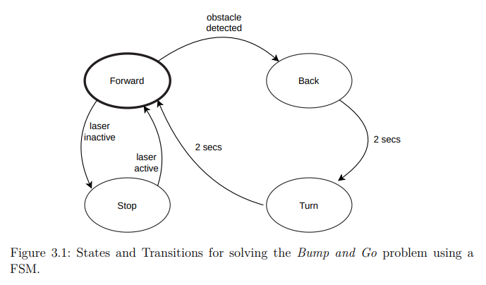
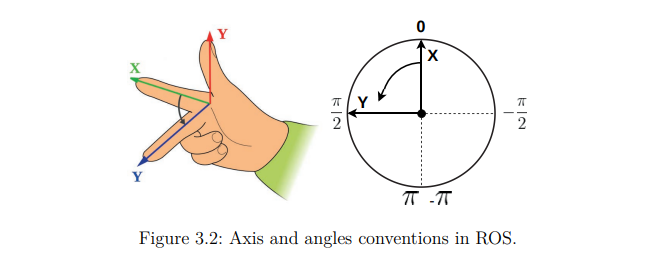
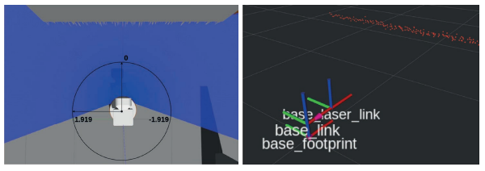
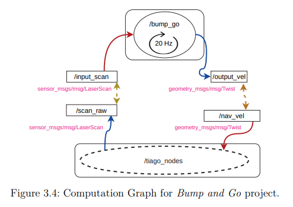

# 第3章 第一个行为：使用有限状态机避开障碍

&emsp;&emsp;本节旨在应用到目前为止所展示的所有内容来创建看似“智能”的行为。 本练习将汇总我们所介绍的许多内容，并展示使用 ROS2 对机器人进行编程的有效性。 此外，我们还将解决机器人编程中的一些问题。  
 &emsp;&emsp;“Bump and Go”行为使用机器人的传感器来检测机器人前方附近的障碍物。 机器人向前移动，当它检测到障碍物时，它会返回并转动固定时间以再次向前移动。 虽然这是一个简单的行为，但建议采用一些决策方法，因为我们的代码即使很简单，在我们解决可能出现的问题时也可能开始变得无序。 在本例中，我们将使用有限状态机 (FSM)。  
 &emsp;&emsp;FSM 是一种数学计算模型，我们可以用它来定义机器人的行为。 它由状态和转换组成。 机器人在一种状态下不断产生输出，直到满足传出转换的条件并转换到该转换的目标状态。  
 &emsp;&emsp;当我们实现简单的行为时，应用 FSM 可以显着降低解决问题的复杂性。 暂时尝试考虑如何使用循环、if、临时变量、计数器、计时器来解决 Bump and Go 问题。 理解并遵循其逻辑将是一个复杂的程序。 一旦完成，添加一些额外的条件可能会让我们放弃已经做过的事情并重新开始。  
 &emsp;&emsp;将基于 FSM 的解决方案应用于 Bump and Go 问题非常简单。考虑机器人必须产生的不同输出（停止、前进、后退和转弯）。每个动作都有自己的状态。现在考虑状态之间的转换（连接和条件），我们将获得如图 3.1 所示的 FSM。



## 3.1 感知和驱动模型
&emsp;&emsp;本节分析我们用什么观念来解决问题以及我们可以采取什么行动。 
 &emsp;&emsp;在这两个模型中，首先，我们必须定义所使用的几何约定：
 
- ROS2 使用公制国际测量系统(SI)。 对于不同的维度，我们会考虑米、秒、弧度等单位。 线速度应为 $m/s$、旋转速度 $rad/s$、线性加速度 $m/s^2$ 等。
- 在ROS2 中，我们遵循右手原则（图3.2 的左侧部分）：$x$ 向前增长，$y$ 向左增长，$z$ 向上增长。 如果在我们肩膀处建立参考原点，则 $x$ 为负的坐标将在我们身后，而 $z$ 为正的坐标将是在我们之上。
- 角度定义为绕轴的旋转。绕 $x$ 的旋转有时称为 roll(横滚)，$y$ 称为 pitch(俯仰)，$z$称为yaw(偏航)。
- 向左转动角度会增大（图3.2 的右侧部分）。角度0代表向前，$π$代表向后，$π/2$代表向左。

&emsp;&emsp;在这个问题中，我们将使用激光传感器的信息，我们在上一章的主题`/scan_raw`中看到了该信息，其类型为`sensor_msgs/msg/LaserScan`。通过键入以下内容检查此消息格式：



```shell
$ ros2 interface show /sensor msgs/msg/LaserScan
# Single scan from a planar laser range-finder
#
# If you have another ranging device with different behavior (e.g. a sonar
# array), please find or create a different message, since applications
# will make fairly laser-specific assumptions about this data
std_msgs/Header_header # timestamp in the header is the acquisition time of
# the first ray in the scan.
#
# in frame frame id, angles are measured around
# the positive Z axis (counterclockwise, if Z is up)
# with zero angle being forward along the x axis
float32 angle_min # start angle of the scan [rad]
float32 angle_max # end angle of the scan [rad]
float32 angle_increment # angular distance between measurements [rad]
float32 time_increment # time between measurements [seconds] - if your scanner
# is moving, this will be used in interpolating pos
# of 3d points
float32 scan_time # time between scans [seconds]
float32 range_min # minimum range value [m]
float32 range_max # maximum range value [m]
float32[] ranges # range data [m]
# (Note: values < range_min or > range max should be
# discarded)
float32[] intensities # intensity data [device-specific units]. If your
# device does not provide intensities, please leave
# the array empty.

```
&emsp;&emsp;要查看这些激光消息之一（不显示读数内容），请启动终端并输入：

```shell
$ ros2 topic echo /scan_raw --no-arr
---
header:
  stamp:
    sec: 11071
    nanosec: 445000000
  frame_id: base_laser_link
angle_min: -1.9198600053787231
angle_max: 1.9198600053787231
angle_increment: 0.005774015095084906
time_increment: 0.0
scan_time: 0.0
range_min: 0.05000000074505806
range_max: 25.0
ranges: ’<sequence type: float, length: 666>’
intensities: ’<sequence type: float, length: 666>’
---
```

&emsp;&emsp;在图3.3中我们可以看到这条消息的解释。 `ranges`中与障碍物的距离是多少，这是其中的关键。这个 `std::vector`（消息中的数组在C++中表示为 `std::vector`）的位置0对应于角度-1.9198，位置1是这个角度加上增量，直到这个向量完成。 很容易检查，如果我们将范围（最大角度减去最小角度）除以增量，我们会得到这 666 个读数，这就是范围向量的大小。  
 &emsp;&emsp;大多数消息，尤其是包含空间可解释信息的消息，都有一个包含时间戳和传感器帧的标头。 请注意，传感器可以安装在机器人上的任何位置和任何方向，甚至可以安装在某些移动部件中。 传感器框架必须与其余部分具有几何连接（旋转和平移）。 在许多情况下，我们需要将感官信息的坐标转换到同一坐标系以进行融合，这通常是 `base_footprint`（机器人的中心，在地面上，指向前方）。 这些几何操作将在下一章中解释。



&emsp;&emsp;在我们的问题中，我们只关心机器人前面（即角度0时）是否有障碍物，这恰好对应于范围向量的中间位置的内容。 我们可以使用传感器的原始框架，因为它与底座足迹对齐，稍微向前和向上。  
 &emsp;&emsp;*ROS的一个重要特征是标准化。*一旦社区就激光传感器产生的信息的编码格式达成共识，所有激光驱动器开发人员都应该使用这种格式。这一共识意味着消息格式必须足够通用以支持任何激光传感器。同样，应用程序开发人员必须利用此消息中的信息，使其程序能够正确运行，而不管产生传感读数的传感器的特性如何。这种方法的巨大优势在于，我们可以使任何 ROS 程序与任何ROS支持的激光器一起工作，从而使软件能够真正在机器人之间移植。此外，经验丰富的ROS开发人员不必学习新的、制造商定义的格式。最后，使用这种格式可以让您使用各种实用程序来过滤或监控激光信息。这种方法适用于ROS中所有类型的传感器和执行器，这可能是该框架成功的原因之一。  
 &emsp;&emsp;关于此问题中的**动作模型**，我们将机器人平移和旋转速度发送到主题 `/nav_vel`，其类型为 `Geometry_msgs/msg/Twist`。  
 &emsp;&emsp;我们来看看这个消息格式：  

```shell
$ ros2 interface show geometry msgs/msg/Twist
Vector3 linear
Vector3 angular
$ ros2 interface show geometry msgs/msg/Vector3
float64 x
float64 y
float64 z
```

&emsp;&emsp;所有机器人都使用这种消息格式来接收速度，从而允许通用远程操作程序（使用键盘、操纵杆、手机等）和 ROS 中的导航。我们再次谈论标准化。  
 &emsp;&emsp;`geometry msgs/msg/Twist`消息比我们的机器人支持的更通用。我们无法仅用两个轮子使其沿 Z 轴移动（它无法飞行）或横向移动。它是一个差动机器人。如果我们有四轴飞行器，我们可能可以做更多的平移和旋转。我们只能让它前进或后退、旋转或将两者结合起来。因此，我们只能使用线性.x和角度.z字段（向Z轴旋转，向左正速度，如图3.2所示）

## 3.2 计算图

&emsp;&emsp;该应用程序的计算图非常简单：订阅激光主题的单个节点向机器人发布速度命令。  
 &emsp;&emsp;控制逻辑解释输入的感官信息并产生控制命令。 这个逻辑就是我们将用 FSM 来实现的。逻辑控制将以20Hz迭代运行。执行频率取决于控制命令的发布。如果不发布到20Hz以上，一些机器人就会停止，这非常方便，这样实验室里就不会有不受控制的机器人了。  



&emsp;&emsp;通常，我们接收信息的频率与我们必须发布信息的频率不同。 你必须处理这个问题。 *工程师不会抱怨问题情况*——他们会解决问题。  
 &emsp;&emsp;如果我们希望我们的软件在不同的机器人上运行，我们就不能为机器人指定特定的主题。 在我们的例子中，它订阅的主题是 `/input_scan`，并在 `/output_vel` 中发布。 这些主题不存在或与我们的模拟机器人的主题相对应。 执行它时（在部署时），我们将重新映射端口以将它们连接到特定机器人的真实主题。  
 &emsp;&emsp;这里我们讨论一个点。 为什么我们使用重新映射而不是将主题名称作为参数传递？ 嗯，这是许多 ROS2 开发人员提倡的替代方案。 当节点并不总是具有相同的订阅者/发布者时，这种替代方案可能更方便，并且只能在配置参数的 YAML 文件中指定。  
 &emsp;&emsp;一个好的方法是，如果节点中的发布者和订阅者的数量已知，则使用通用主题名称（如本示例中使用的名称）并执行重新映射。 使用通用主题名称可能会更好（`/cmd_vel` 是许多机器人的通用主题）。 经验丰富的 ROS2 程序员会在文档中阅读它使用的主题，找出 `ros2 节点` 信息，并快速使其与重新映射一起工作，而不是在配置文件中寻找要设置的正确参数。  
 &emsp;&emsp;虽然本书主要使用 C++，但在本章中我们将提供两种类似的实现，一个用 C++ 实现，另一个用 Python 实现，每个实现都在不同的包中：`br2_fsm_bumpgo_cpp` 和 `br2_fsm_bumpgo_py`。两者都已存在于前几章和本书附件中创建的工作区中。让我们从C++开始。

## 3.3 Bump and Go 与 C++

&emsp;&emsp;'br2_fsm_Bumpgo_cpp' 包具有以下结构：

```txt
<-- Package  br2_fsm_bumpgo_cpp -->
br2_fsm_bumpgo_cpp/
├─CMakeLists.txt
├─include
│ └─br2_fsm_bumpgo_cpp
│   └─BumpGoNode.hpp
├─launch
│ └─bump_and_go.launch.py
├─package.xml
└─src
  ├─br2_fsm_bumpgo_cpp
  │ └─BumpGoNode.cpp
  └─bumpgo_main.cpp
```

&emsp;&emsp;将节点实现为继承自 `rclcpp::Node` 的类的常用方法，在与包名称匹配的命名空间内分离声明和定义。在我们的例子中，定义 (`BumpGoNode.cpp`) 将位于 `src/br2_fsm_buggo_cpp` 中，头文件 (`BumpGoNode.hpp`) 将位于 `include/br2_fsm_buggo_cpp` 中。 这样，我们将程序的实现与节点的实现分开。 该策略允许多个程序采用不同的策略来创建节点。 主程序位于`src/bumpgo_main.cpp`中，其功能是实例化节点并调用`spin()`函数。 我们还包含了一个启动器（`launch/bump_and_go.launch.py`）以方便其执行。  
 &emsp;&emsp;在本书中，我们将分析包的部分代码，重点关注不同的具体方面来教授有趣的概念。 我们不会详尽地展示所有代码，因为读者可以在他的工作区、存储库和附件中找到这些代码。

### 3.3.1 执行控制

&emsp;&emsp;节点执行模型包括以 20 Hz 的频率调用控制循环(`control_cycle`)方法。 为此，我们声明一个计时器并在构造函数中启动它，每 50 毫秒调用一次控制循环方法。 使用 FSM 实现的控制逻辑将以一定速度发布命令

```cpp
// <-- include/bump go cpp/BumpGoNode.hpp-->
class BumpGoNode : public rclcpp::Node
{
  ...
private:
    void scan_callba(sensor_msgs::msg::LaserScan::UniquePtr msg);
    void control_cycle();
    rclcpp::Publisher<geometry_msgs::msg::Twist>::SharedPtr vel_pub_;
    rclcpp::Subscription<sensor_msgs::msg::LaserScan>::SharedPtr scan_sub_;
    rclcpp::TimerBase::SharedPtr timer_;
    sensor_msgs::msg::LaserScan::UniquePtr last_scan_;
};
```
&emsp;&emsp;查看激光回调标头的详细信息。 正如我们到目前为止所看到的，我们使用了 `UniquePtr`（`std::unique_ptr` 的别名）而不是 `SharedPtr`。 根据需要，ROS2 中的回调可以有不同的签名。 这些是回调的不同替代方案:

```cpp
1. void scan_callback(const sensor_msgs::msg::LaserScan & msg);
2. void scan_callback(sensor_msgs::msg::LaserScan::UniquePtr msg);
3. void scan_callback(sensor_msgs::msg::LaserScan::SharedConstPtr msg);
4. void scan_callback(const sensor_msgs::msg::LaserScan::SharedConstPtr & msg);
5. void scan_callback(sensor_msgs::msg::LaserScan::SharedPtr msg);

```

&emsp;&emsp;其他一些签名允许获取有关消息的信息（来源和目的地的时间戳以及发送者的标识符）甚至序列化消息，但这仅在非常特殊的情况下使用。  
 &emsp;&emsp;到目前为止，我们使用了签名 1，但现在我们使用签名 2。检查扫描回调中`scan_callback`的实现。 我们将在属性中获取此消息，而不是复制消息（对于大型消息来说，这在计算上可能会很昂贵）或共享指针，并且我们将在上次扫描（`last_scan_`）中存储对数据的引用。 这样，rclcpp 队列将不再需要管理其生命周期，从而节省时间。 我们建议尽可能使用 `UniquePtr` 来提高节点的性能。


```cpp
// <-- src/bump go cpp/BumpGoNode.cpp-->
BumpGoNode::BumpGoNode()
: Node("bump_go")
{
scan_sub_ = create_subscription<sensor_msgs::msg::LaserScan>(
"input_scan", rclcpp::SensorDataQoS(),
std::bind(&BumpGoNode::scan_callback, this, _1));
vel_pub_ = create_publisher<geometry_msgs::msg::Twist>("output_vel", 10);
timer_ = create_wall_timer(50ms, std::bind(&BumpGoNode::control_cycle, this));
}
void
BumpGoNode::scan_callback(sensor_msgs::msg::LaserScan::UniquePtr msg)
{
last_scan_ = std::move(msg);
}
void
BumpGoNode::control_cycle()
{
// Do nothing until the first sensor read
if (last_scan_ == nullptr)
return;
vel_pub_->publish(...);
}
```

&emsp;&emsp;关于此构造函数的另一个值得注意的细节是，该发布使用默认的 QoS，即可靠 + 易失性。在订阅的情况下，我们将使用 `rclcpp::SensorDataQoS()`（使用尽力而为、易失且适当的传感器队列大小的打包 QoS 定义）。  
 &emsp;&emsp;作为一般规则，为了使通信兼容，发布者的服务质量应该是可靠的，并且订阅者可以选择尽最大努力缓解服务质量。创建传感器驱动程序时，使用 `rclcpp::SensorDataQoS()` 发布其读数并不是一个好主意，因为如果订阅者需要可靠的 QoS 并且发布者尽力而为，则通信将会失败。  
 &emsp;&emsp;最后，控制周期中要做的第一件事是检查上次扫描是否有效。 该方法可以在利用激光扫描的第一消息到达之前执行。 在这种情况下，它将跳过本次迭代。

### 3.3.2 实现 FSM

&emsp;&emsp;在 C++ 类中实现 FSM 并不复杂。 有一个存储当前状态的成员变量 `state_` 就足够了，我们可以将其编码为常量或枚举。 此外，有一个变量 `state_ts` 指示转换到当前状态的时间，允许使用超时从状态转换，这是有帮助的。

```cpp
// <-- include/bump_go_cpp/BumpGoNode.hpp -->
class BumpGoNode : public rclcpp::Node
{
...
private:
void control_cycle();
static const int FORWARD = 0;
static const int BACK = 1;
static const int TURN = 2;
static const int STOP = 3;
int state_;
rclcpp::Time state_ts_;
};
```

&emsp;&emsp;请记住，控制逻辑处于方法控制周期中，其运行频率为 20 Hz。 该方法中不能有无限循环或长时间等待。 它必须设计为迭代调用此方法来完成其任务。  
 &emsp;&emsp;控制逻辑通常使用 `switch` 语句来实现，每种情况都有一个状态。 在下面的代码中，我们仅显示了 `FORWARD` 状态的情况。这种情况下还有一个结构：首先，当前状态下的输出计算（设置发布速度），然后检查每个转换条件。如果有任何返回true（满足条件），则 `state_` 被设置为新状态并且 `state_ts` 被更新。  
 &emsp;&emsp;声明消息类型变量时，其所有字段都默认设置为默认值，或者根据其类型设置为0或空。这就是为什么在完整的代码中，我们只分配非0的字段。

```cpp
// <-- src/bump_go_cpp/BumpGoNode.cpp-->
BumpGoNode::BumpGoNode()
: Node("bump_go"),
state_(FORWARD)
{
...
state_ts_ = now();
}
void
BumpGoNode::control_cycle()
{
switch (state_) {
case FORWARD:
// Do whatever you should do in this state.
// In this case, set the output speed.
// Checking the condition to go to another state in the next iteration
if (check_forward_2_stop())
go_state(STOP);
if (check_forward_2_back())
go_state(BACK);
break;
...
}
}
void
BumpGoNode::go_state(int new_state)
{
state_ = new_state;
state_ts_ = now();
}
```
&emsp;&emsp;从实现的角度看一下这个有趣代码的三个方法。第一个是`forward→back`转换的代码，用于检查机器人前面是否有障碍物。正如我们之前所说，这是通过访问包含激光读数中的距离的向量的中心元素来完成的：
```cpp
// <-- src/bump_go_cpp/BumpGoNode.cpp -->
bool
BumpGoNode::check_forward_2_back()
{
// going forward when deteting an obstacle
// at 0.5 meters with the front laser read
size_t pos = last_scan_->ranges.size() / 2;
return last_scan_->ranges[pos] < OBSTACLE_DISTANCE;
}
```
&emsp;&emsp;第二个有趣的片段是当最后一次激光读取被认为太旧时从`forward→back`的转变。`rclcpp::Node` 的 `now`方法以 `rclcpp::Time` 形式返回当前时间。 从上次读取的标题中的时间开始，我们可以创建另一个 `rclcpp::Time`。 它的区别是 `rclcpp::Duration`。  为了进行比较，我们可以使用它的秒(`seconds`)方法，该方法以双精度形式返回以`秒`为单位的时间，或者我们可以像我们所做的那样，直接将它与另一个 `rclcpp::Duration` 进行比较。

```cpp
// <-- src/bump_go_cpp/BumpGoNode.cpp-->
bool
BumpGoNode::check_forward_2_stop()
{
// Stop if no sensor readings for 1 second
auto elapsed = now() - rclcpp::Time(last_scan_->header.stamp);
return elapsed > SCAN_TIMEOUT;
}
```

&emsp;&emsp;最后一个片段与前一个片段类似，但现在我们利用 `state_ts_` 变量更新的优势，我们可以在 2 秒后从 `back → Turn` 转换

```cpp
src/bump_go_cpp/BumpGoNode.cpp
bool
BumpGoNode::check_back_2_turn()
{
// Going back for 2 seconds
return (now() - state_ts_) > BACKING_TIME;
}
```

### 3.3.3 运行代码

&emsp;&emsp;到目前为止，我们仅限于实现 `BumpGoNode` 节点的类。
现在我们必须看看在哪里创建此类的对象来执行它。我们在主程序中执行此操作，创建一个节点并将其传递给对 `rclcpp::spin` 的阻塞调用，该调用将管理调用其回调的消息和计时器事件

```cpp
// <-- src/bumpgo_main.cpp-->
int main(int argc, char * argv[])
{
rclcpp::init(argc, argv);
auto bumpgo_node = std::make_shared<br2_fsm_bumpgo_cpp::BumpGoNode>();
rclcpp::spin(bumpgo_node);
rclcpp::shutdown();
return 0;
}
```

&emsp;&emsp;现在运行程序，打开终端来运行模拟器：

```shell
$ ros2 launch br2_tiago sim.launch.py
```

&emsp;&emsp;接下来，打开另一个终端并运行程序，同时考虑到命令行中需要指定的参数：

- 将 `input_scan` 重新映射到 `/scan_raw`，将 `ouput_vel` 重新映射到 `/nav_vel` （`-r` 选项）。
- 使用模拟器时，请将 `use_sim_time` 参数设置为 `true`。 这会导致从模拟器发布的主题 `/clock` 获取时间，而不是从计算机获取当前时间。

```shell
$ ros2 run br2_fsm_bumpgo_cpp bumpgo --ros-args -r output_vel:=/nav vel -r
input_scan:=/scan_raw -p use_sim_time:=true
```

&emsp;&emsp;查看机器人如何向前移动，直到检测到障碍物，然后进行躲避操作。  
&emsp;&emsp;由于在命令行中放置如此多的重新映射参数非常繁琐，因此我们创建了一个启动器来指定必要的参数并重新映射到节点

```py
# <--launch/bump_and_go.launch.py-->

bumpgo_cmd = Node(package='br2_fsm_bumpgo_cpp',
    executable='bumpgo',
    output='screen',
    parameters=[{
      'use_sim_time': True
    }],
    remappings=[
      ('input_scan', '/scan_raw'),
      ('output_vel', '/nav_vel')
    ])

```

&emsp;&emsp;使用此启动器而不是上次运行的 ros2，只需键入：
```shell
$ ros2 launch br2_fsm_bumpgo_cpp bump_and_go.launch.py
```

## 3.4 Python 中的 BUMP AND GO 行为

&emsp;&emsp;除了 C++ 之外，Python 也是ROS2通过rclpy客户端库正式支持的语言之一。 本节将重现我们在上一节中所做的事情，但使用的是 Python，可以比较验证两种语言发展的异同。此外，一旦在前面的章节中解释了 ROS2 的原理，读者就会在 Python 代码中识别ROS2的元素，因为原理是相同的。  
 &emsp;&emsp;虽然我们提供了完整的包，但如果我们想从头开始创建一个包，我们可以使用 `ros2 pkg` 命令来创建一个框架。

```shell
$ ros2 pkg create --build-type ament_python br2_fsm_bumpgo py --dependencies
sensor_msgs geometry_msgs
```

&emsp;&emsp;由于它是 ROS2 包，仍然有一个类似于 C++ 版本的 `package.xml`，但不再有 `CMakeLists.txt`，而是 `setup.cfg` 和 `setup.py`，这是使用 distutils<sup>1</sup> 的典型 Python 包。
（ <sup>1</sup>https://docs.python.org/3/library/distutils.html ）  
 &emsp;&emsp;在这个包的根目录下，有一个同名目录，只有一个文件 `__init__.py` ，这表明将有Python代码的文件。 让我们在那里创建文件 `bump_go_main.py` 。 而在 C++ 中，将源代码分成多个文件是常见且方便的。 在这种情况下，所有内容都在同一个文件中。

### 3.4.1  执行控制

&emsp;&emsp;与前面的示例一样，我们将首先显示忽略行为细节的代码，仅处理与 ROS2 概念相关的那些：

```py
# <-- bump_go_py/bump_go_main.py -->
import rclpy

from rclpy.duration import Duration
from rclpy.node import Node
from rclpy.qos import qos_profile_sensor_data
from rclpy.time import Time

from geometry_msgs.msg import Twist
from sensor_msgs.msg import LaserScan

class BumpGoNode(Node):
  def __init__(self):
    super().__init__('bump_go')

    ...

    self.last_scan = None
    self.scan_sub = self.create_subscription(
      LaserScan,
      'input_scan',
      self.scan_callback,
      qos_profile_sensor_data)

    self.vel_pub = self.create_publisher(Twist, 'output_vel', 10)
    self.timer = self.create_timer(0.05, self.control_cycle)

  def scan_callback(self, msg):
    self.last_scan = msg

  def control_cycle(self):
    if self.last_scan is None:
    return

    out_vel = Twist()

    # FSM

    self.vel_pub.publish(out_vel)

  def main(args=None):
    rclpy.init(args=args)

    bump_go_node = BumpGoNode()

    rclpy.spin(bump_go_node)

    bump_go_node.destroy_node()
    rclpy.shutdown()

  if __name__ == '__main__':
    main()
```

&emsp;&emsp;回想一下，目标是创建一个订阅激光读数并发出速度命令的节点。 控制周期以 20 Hz 执行，根据最后收到的读数计算机器人控制。 因此，我们的代码将有一个订阅者、一个发布者和一个计时器。  
&emsp;&emsp;这段代码和C++开发的类似：定义一个继承自Node的类，在main中实例化它并用它调用spin。 我们来看看一些细节:

- 继承自Node，我们调用基类构造函数来分配节点名称。 Node 类和所有关联的数据类型（时间、持续时间、QoS，...）都在 rclpy 中，在启动时导入，并且这些项是单独的。
- 消息类型也会被导入，如初始部分所示。
- 我们在构造函数中创建发布者、订阅者和计时器。 请注意，该 API 实际上与 C++ 类似。 此外，在 Python 中，我们可以访问预定义的服务质量（`qos_profile_sensor_data`）。
- 在激光消息的回调中，我们将收到的最后一条消息存储在变量 `self.last_scan` 中，该变量在构造函数中初始化为 `None` 。 这样，在控制周期（`control_cycle`）中验证没有激光读数到达我们这里。

### 3.4.2 实施 FSM

&emsp;&emsp;将上一节中的 C++ 中的 FSM 直接翻译为 Python 并没有什么有趣的。 唯一的细节是，要获取当前时间，我们必须首先通过 `get_clock` 方法请求时钟：

```py
# <--bump go py/bump go main.py-->
class BumpGoNode(Node):
  def __init__(self):
    super().__init__('bump_go')

    self.FORWARD = 0
    self.BACK = 1
    self.TURN = 2
    self.STOP = 3
    self.state = self.FORWARD
    self.state_ts = self.get_clock().now()

  def control_cycle(self):
    if self.state == self.FORWARD:
      out_vel.linear.x = self.SPEED_LINEAR

      if self.check_forward_2_stop():
        self.go_state(self.STOP)
      if self.check_forward_2_back():
        self.go_state(self.BACK)

    self.vel_pub.publish(out_vel)

  def go_state(self, new_state):

    self.state = new_state
    self.state_ts = self.get_clock().now()
```

&emsp;&emsp;也许此代码中最引人注目的方面（类似于 C++ 中的版本）是对时间和持续时间的处理：

```py
# <-- bump_go_py/bump_go_main.py-->
def check_forward_2_back(self):
  pos = round(len(self.last_scan.ranges) / 2)
  return self.last_scan.ranges[pos] < self.OBSTACLE_DISTANCE
  
def check_forward_2_stop(self):
  elapsed = self.get_clock().now() - Time.from_msg(self.last_scan.header.stamp)
  return elapsed > Duration(seconds=self.SCAN_TIMEOUT)

def check_back_2_turn(self):
  elapsed = self.get_clock().now() - self.state_ts
  return elapsed > Duration(seconds=self.BACKING_TIME)
```

- `Time.from msg` 函数允许根据消息的时间戳创建 `Time` 对象。
- 当前时间是通过 `Node` 的 `getclock().now()` 方法获取的。
- 时间之间的操作会得到一个 `Duration` 类型的对象，它可以与另一个 `Duration` 类型的对象进行比较，例如代表 2 秒持续时间的 `Duration(seconds = self.BACKING_TIME)`。


### 3.4.3 运行代码

&emsp;&emsp;让我们看看如何在工作区中构建和安装代码。 首先，修改我们的新程序的`setup.py`：

```py
import os
from glob import glob

from setuptools import setup

package_name = 'br2_fsm_bumpgo_py'

setup(
  name=package_name,
  version='0.0.0',
  packages=[package_name],
  data_files=[
    ('share/ament_index/resource_index/packages',
      ['resource/' + package_name]),
    ('share/' + package_name, ['package.xml']),
    (os.path.join('share', package_name, 'launch'), glob('launch/*.launch.py'))
  ],
  install_requires=['setuptools'],
  zip_safe=True,
  maintainer='johndoe',
  maintainer_email='john.doe@evilrobot.com',
  description='BumpGo in Python package',
  license='Apache 2.0',
  tests_require=['pytest'],
  entry_points={
    'console_scripts': [
      'bump_go_main = br2_fsm_bumpgo_py.bump_go_main:main'
    ],
  },
)
```

&emsp;&emsp;现在重要的部分是 `entry_points` 论证。 如上面的代码所示，添加之前显示的新程序。 有了这个，我们就可以构建我们的包了。

```shell
$ colcon build --symlink-install
```

&emsp;&emsp;为了运行该程序，首先通过在终端中键入以下内容来启动模拟器：
```shell
$ ros2 launch br2_tiago sim.launch.py
```

&emsp;&emsp;打开另一个终端，然后运行程序：

```shell
$ ros2 run br2_fsm_bumpgo_py bump_go_main --ros-args -r output_vel:=/nav_vel -r
input scan:=/scan_raw -p use_sim_time:=true
```

&emsp;&emsp;我们还可以使用类似于 C++ 版本中的启动器，只需输入：
```shell
$ ros2 launch br2_fsm_bumpgo_py bump_and_go.launch.py
```


## 建议的练习：

1. 修改 Bump and Go 项目，使机器人感知前方左右对角线上的障碍物。 它不再总是转向同一侧，而是转向没有障碍物的一侧。
2. 修改Bump and Go 项目，使机器人精确转向没有障碍物或较远感知障碍物的角度。 尝试两种方法：
   - 开环：在转弯前计算转弯时间和速度。
   - 闭环：转动直至检测到前方有空闲空间。


