- [URDF模型的建立与使用](#URDF模型制作)
  - [SolidWorks的配置](#SolidWorks的配置)
  - [模型坐标系的建立(tf)](#模型坐标系的建立)
  - [模型旋转轴的设定(axis)](#模型旋转轴的设定))
  - [URDF插件的使用](#URDF插件的使用)
  - [通过ros打开模型](#通过ros打开模型)
# URDF模型制作
- 首先安装好需要的环境和软件：SolidWorks2021及以上版本、ROS。
## SolidWorks的配置
---
  1. 插件的安装

   首先下载[URDF导出插件](../../static/img/URDF模型的建立/plugs/sw2urdfSetup.exe)，下载完成后打开后程序后直接点击 install 即可。
  
  如果不是使用 21 及以上 SolidWorks版本 也可以在[这里](https://github.com/ros/solidworks_urdf_exporter/releases)的官方地址上下载对应版本的插件。

  2. 插件的设置
  
  打开 SolidWork 点击 **工具(T)->插件(D)** ，打开 SolidWorks的插件管理器

  

  3. 完成设置

  若勾选完毕则可以看到 **工具(T)-> Tools -> Export as URDF** ：

  

  **——若出现这个选项则代表插件的安装以及成功，可以进行下一步——**
---    
## 模型坐标系的建立
---
  ***以FJUT苍侠战队23赛季步兵机器人进行URDF的模型生成***

  **整体机器人如下**

  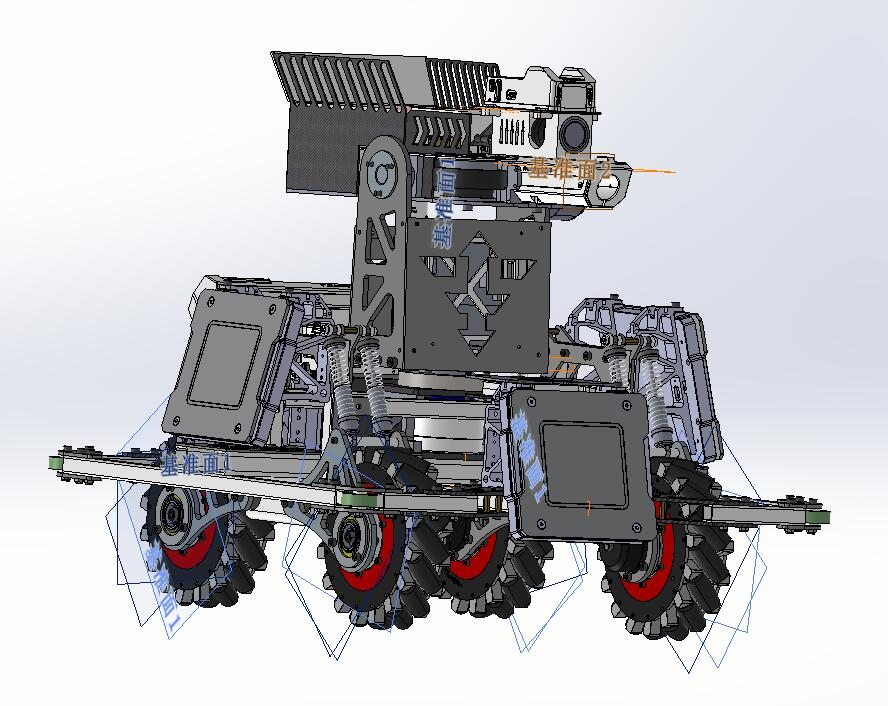
  
  1. 确定好需要进行控制的部位

    对机器人的图像进行分析，可以将机器人的部分结构分为。
 
    | 结构 | 数量 |
    |:--:|:--:|
    | 车轮 | 4 |
    | 云台 | 1 |
    | 底盘 | 1 |
    | 小陀螺结构 | 1 | 
    | 陀螺仪(imu) | 1 |
    | 工业相机 | 1 |
    | ----- | ∞ |
    确定完所需要建立的坐标系的部位，就可以开始设定坐标系了
 
  2. 建立坐标系

  ***以车轮作为示例，各个部分的坐标轴都设置在该部分的物体中心***
    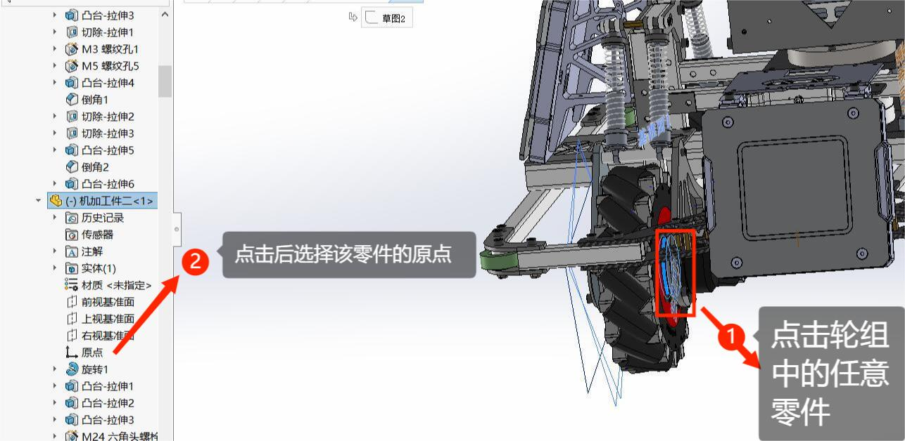
    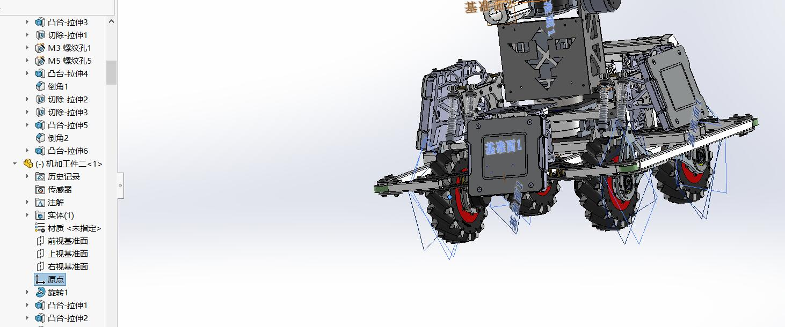

    **这时可以看到原点出现在轮组中心，确定坐标轴原点位置正确**

    
    
    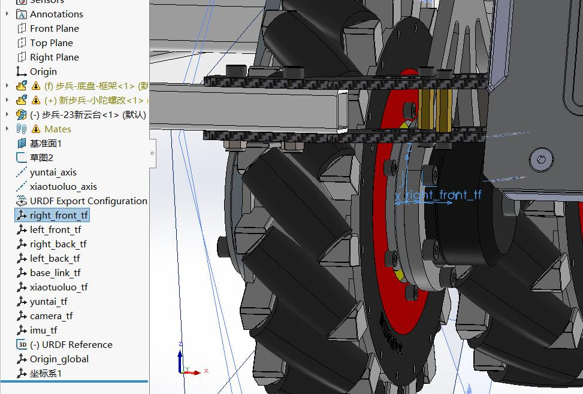
    P.S.：命名最好如图格式，方便在URDF导出的时候进行选取
  
  3. 最终效果

  ***使用相同的方法，将上述需要设定的部位的坐标轴都设定好***

  ***并且确认每个坐标轴的位置以及方向***

  最终效果如下
  

## 模型旋转轴的设定
---
  1. 确定部位的旋转方向

  确定电机的数量以及朝向，就可以确定出旋转轴的方向以及旋转轴的数量
  
    | 结构 | 数量 |
    |:--:|:--:|
    | 车轮 | 4 |
    | 云台 | 1 |
    | 底盘 | 1 |
    | ----- | ∞ |
    通过机械结构图，可以确定出六个旋转轴的位置
  
  2. 设定旋转轴

  ***相较于设定坐标轴，这一步会更加简单，通过SolidWorks中旋转轴的设定，即可完成***

  
  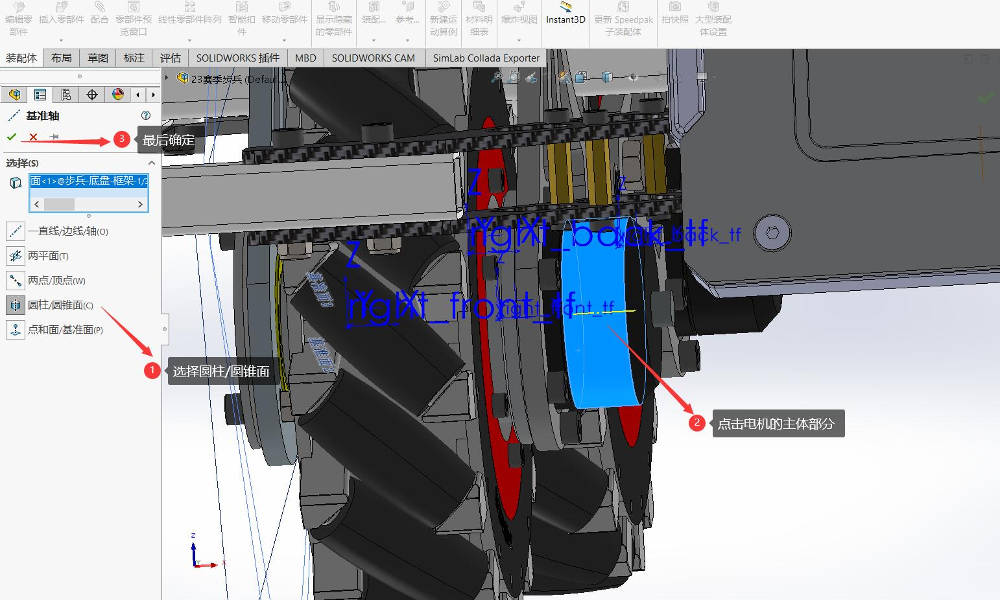
  
  3. 最终效果

  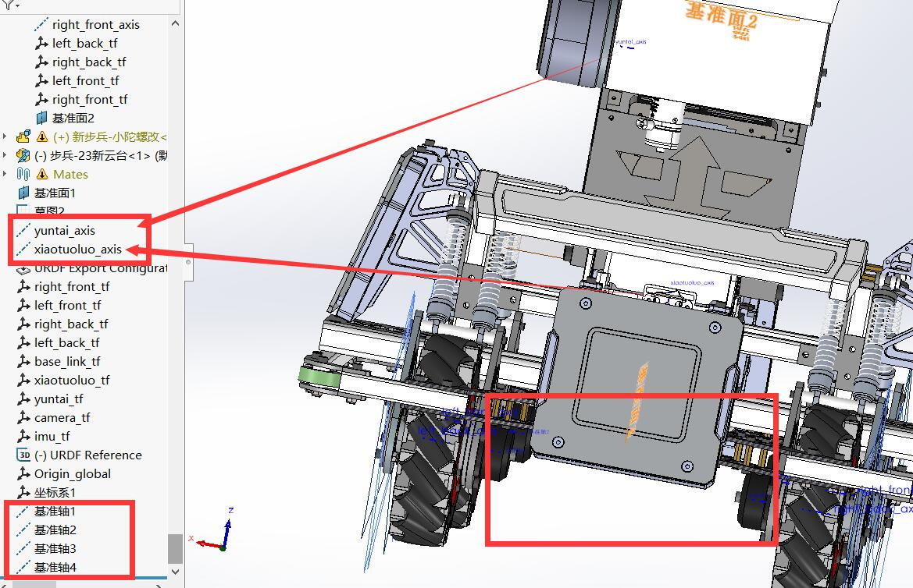
  P.S.：命名最好统一格式，方便在URDF导出的时候进行选取

## URDF插件的使用
---
  
  1. 检查各个位置的坐标系以及旋转轴是否正确

  **确定9个坐标轴的方向以及位置是否正确**

  **确定6个基准轴是否设定正确**

  **确认完毕后可以进行URDF的导出,点击 Export as URDF**

  
  
  URDF Exoprter

  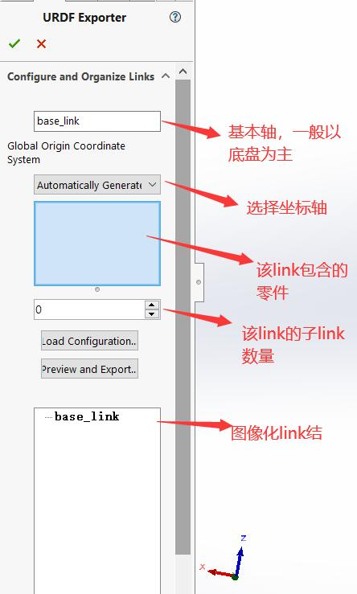
  
  2. 确定好每一个 Link 之间的关系

  确定好整个模型的结构,以底盘为base_link

  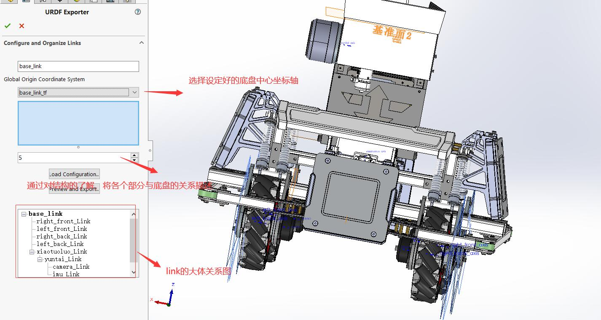
  3. 设定每一个link的坐标轴，以及基准轴

  ***以车轮为例子***

  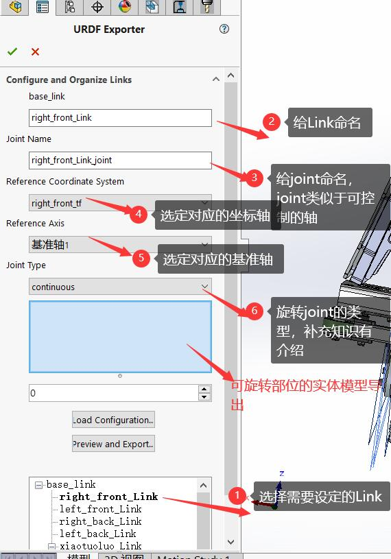

  用相同的办法将所有的 Link 设定完成后即可导出。
  
  4. 导出前的检查

  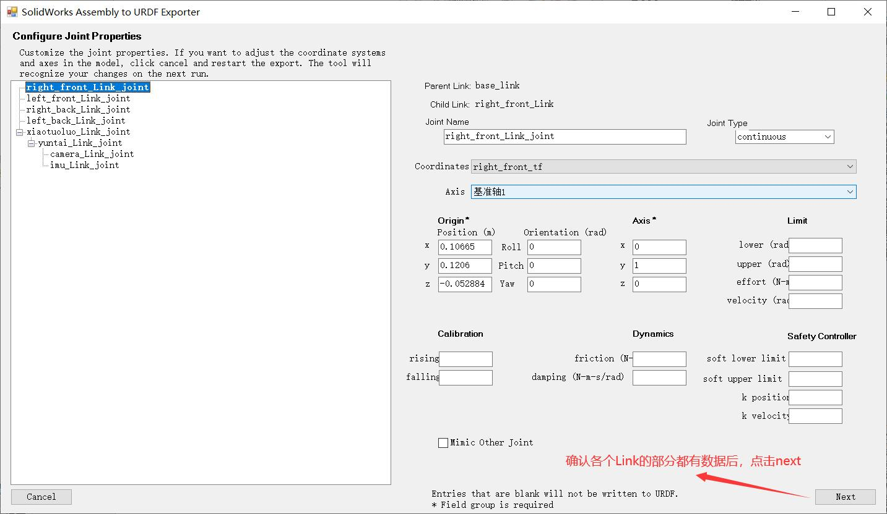
  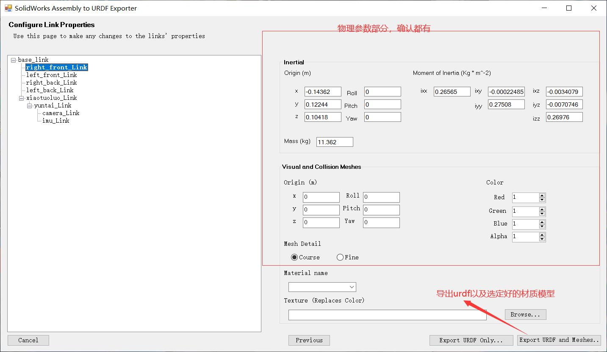
  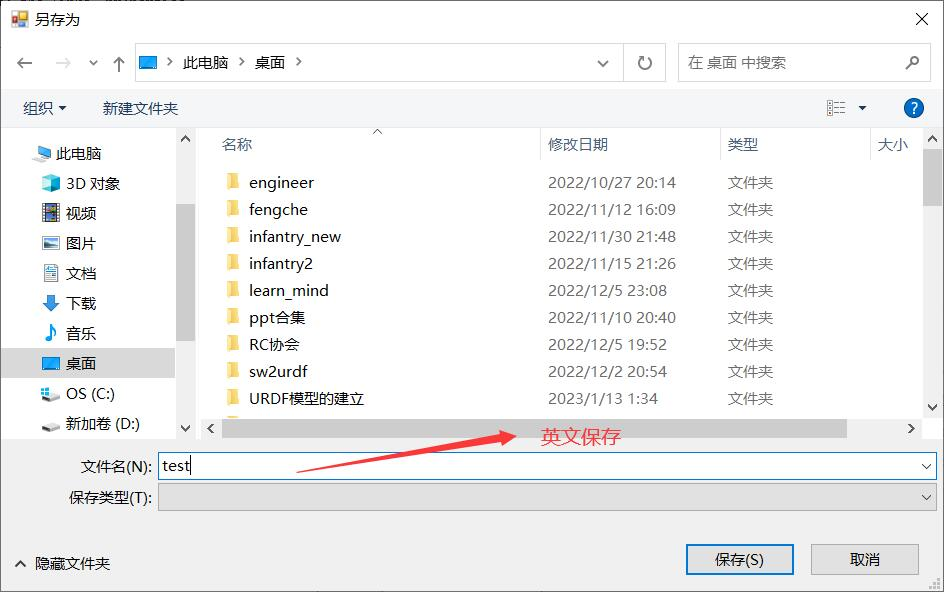
  
  5. 最终生成文件夹 **(其实是 ROS 的 package)**
  
  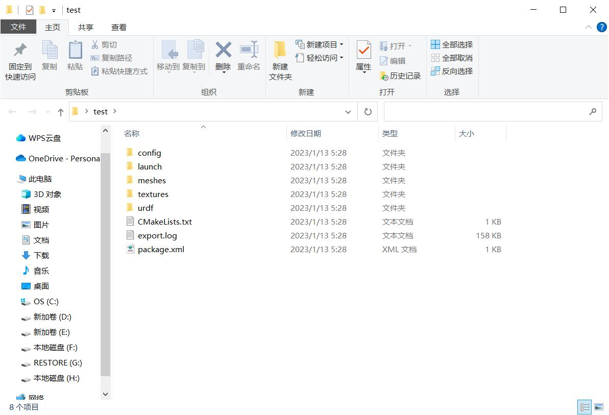
  **知识补充(joint type)**
  
  | 类型 | 解释 |
  |:--:|:--:|
  |continuous|一个没有角度限制的，绕着一根轴转动的关节类型|
  |revolute|一个有角度限制的，绕着一根轴转动的关节类型|
  |prismatic|一个沿着一根轴平移的关节，有限位|
  |fixed|固定关节|
  |floating|一个允许六自由度的浮动关节|
  |planar|该关节允许在垂直于轴的一个平面内进行运动|

## 通过ros打开模型

  1. 将导出的文件夹复制到工作空间中

  ***最终工作空间的文件夹结构如下***

  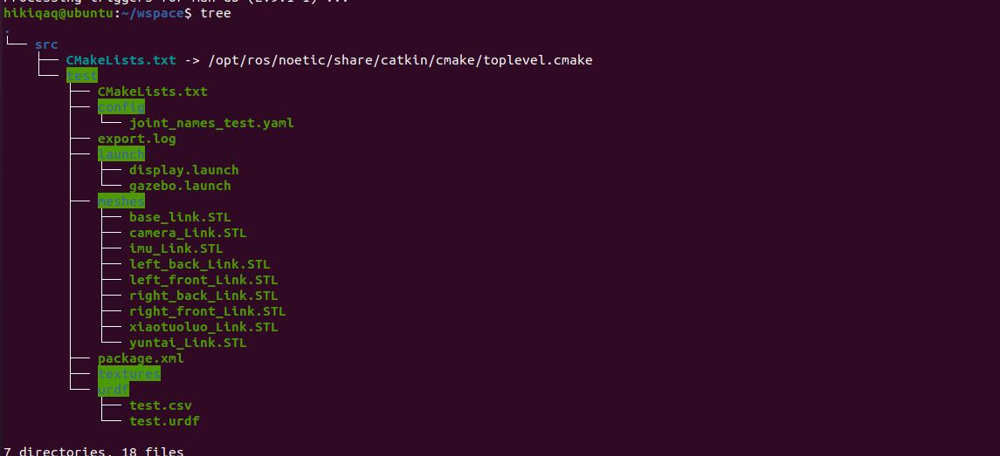
  
  2. rviz,gazebo打开模型

  ***进入工作空间的路径下,输入命令***
  ```shell
  catkin_make
  source devel/setup.bash  or source devel/setup.zsh
  ```
  如果想要打开rviz查看URDF的效果
  ```shell
  roslaunch (package-name) display.launch
  ```
  如果想要用gazebo查看URDF的效果
  ```shell
  roslaunch (package-name) gazebo.launch
  ```
  3. 最终效果，实现了URDF模型的建立
  - rviz画面
  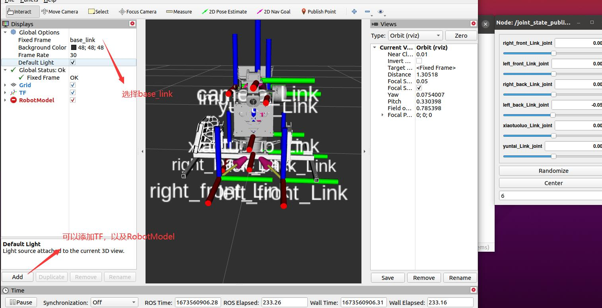
  4. 优化后的模型演示

  ***在制作教程之前所做的模型***

  ***将轮组以及车的各个部分都细致选中的版本***

- rviz演示
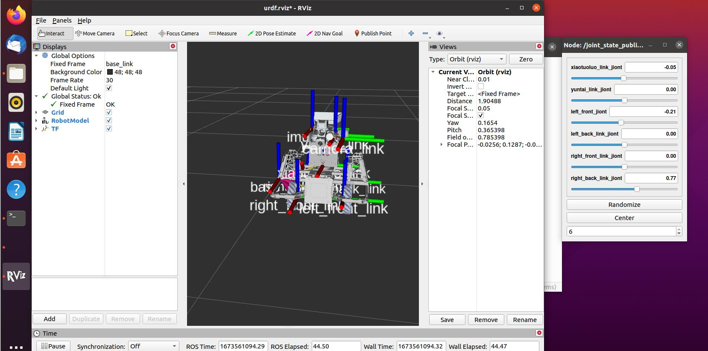
- gazebo演示
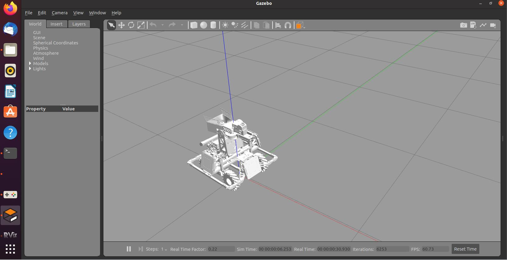
---
## 结束
后续必然会将视频一起更新上的(QWQ）
# **___To Be continued!!___**