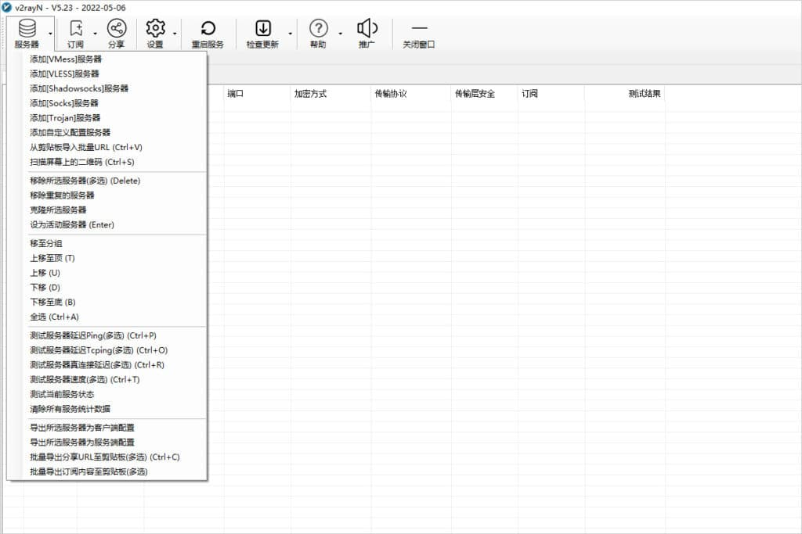
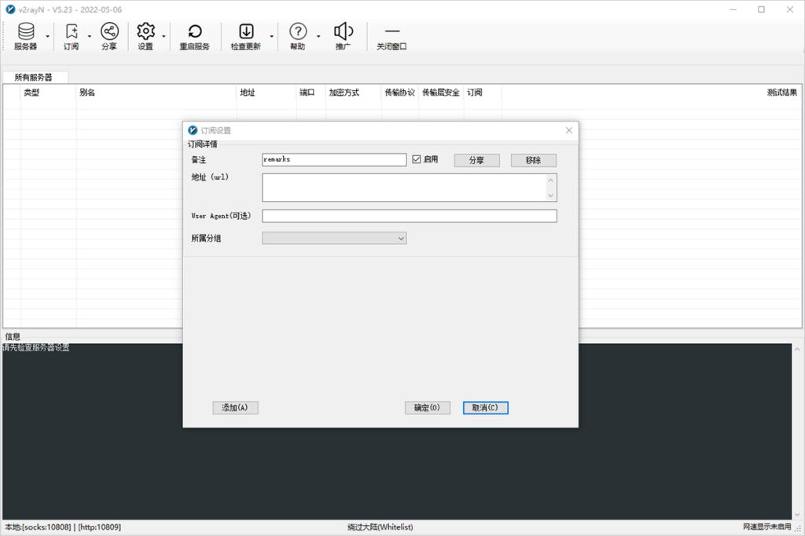
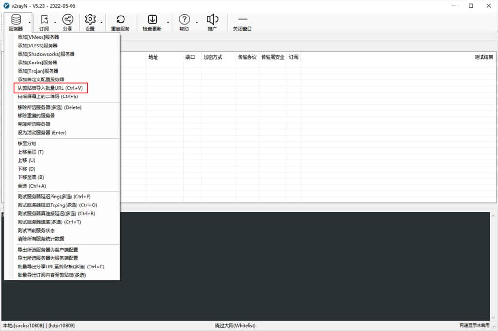
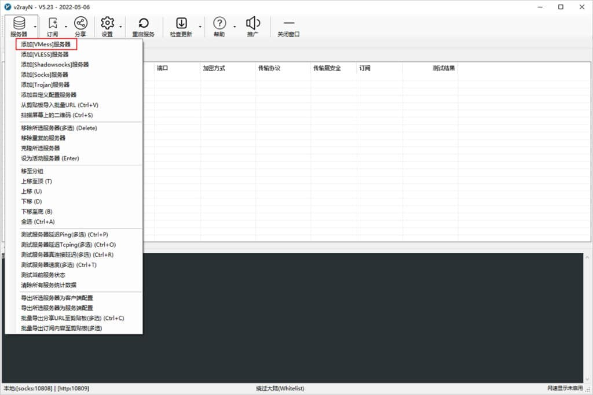
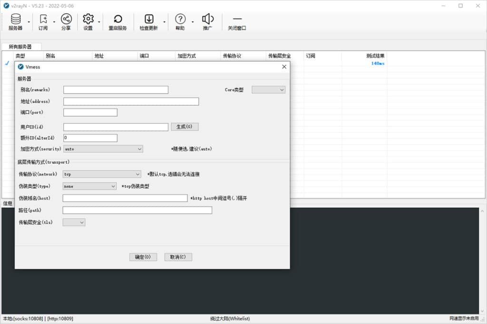
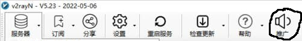

# 科学上网方法

在查询资料或下载文件的时候，我们经常会遇到下载速度很慢、甚至是无法连接的情况。    

这篇文章将介绍如何科学上网，来解决这些问题。  

本文包括**使用代理**和**设置开发镜像**部分。

## 1. 代理

本章节将介绍如何搭建代理、使用代理和让你的软件使用代理。  

代理软件的工作原理就好像上课时我们在传纸条，  

假如 A 想和 B 通信，但他们中间有阻碍，A 不能直接把纸条递给 B。  

那么， A 可以选择将纸条递给一个能做到这件事的人 C， 由 C 代替 A 将纸条交给 B， C 在这里就起到了代理的作用。

在计算机中，代理也是这样起作用的。  

  

代理软件一般分为**客户端**和**服务端**两个部分，他们之间通过某种协议互相通信。

**客户端** 安装在你的电脑上，**服务端**安装在代理服务器上。  

我们可以选择自己搭建**服务端**，也可以选择使用别人提供的**服务器**（机场）。

> 注：代理服务器可以看见客户端发过来的数据，所以在选择代理服务器的时候需要小心谨慎。  

### 1.1 自建代理

这篇文章使用 V2Ray 来搭建代理。

#### 1.1.1 服务端配置

首先，你需要准备一台**不受访问限制的 VPS**，它一般是在境外的 VPS，你可以在一些云服务商租到这样的服务器，如 [Vultr](https://www.vultrcn.com/1.html)、[RackNerd](https://walixz.com/racknerd-buy-tutorial.html) 等。

当你登录了 VPS 之后，使用一键脚本安装 V2Ray：

```sh
bash <(curl -L https://raw.githubusercontent.com/v2fly/fhs-install-v2ray/master/install-release.sh)
```

安装完成之后，配置文件的位置位于 `/usr/local/etc/v2ray/config.json`。

以下是一个最简单的服务器配置，可以使用 nano 或 vim 来编辑配置文件。

```json
{
  "inbounds": [
    {
      "port": 16823, // 服务器监听端口
      "protocol": "vmess",    // 主传入协议
      "settings": {
        "clients": [
          {
            "id": "b831381d-6324-4d53-ad4f-8cda48b30811",  // 用户 ID，客户端与服务器必须相同
            "alterId": 64
          }
        ]
      }
    }
  ],
  "outbounds": [
    {
      "protocol": "freedom",  // 主传出协议
      "settings": {}
    }
  ]
}
```

客户端和服务端的 id 必须相同，可以使用命令`uuidgen`或`cat /proc/sys/kernel/random/uuid`来随机生成uuid。

修改完成后要重启 V2Ray 才会使修改的配置生效。

重启 V2Ray 服务：

```sh
systemctl restart v2ray.service
```

也可以使用 [V2ray 配置在线生成器](https://intmainreturn0.com/v2ray-config-gen/) 来生成较为复杂的配置。

#### 1.1.2 客户端配置

##### 1.1.2.1 Linux

安装步骤与服务器相同，以下为配置文件。

```json
{
    "inbounds": [
        {
            "port": 1080, // SOCKS 代理端口，在浏览器中需配置代理并指向这个端口
            "listen": "127.0.0.1",
            "protocol": "socks",
            "settings": {
                "udp": true
            }
        }
    ],
    "outbounds": [
        {
            "protocol": "vmess",
            "settings": {
                "vnext": [
                    {
                        "address": "server", // 服务器地址，请修改为你自己的服务器 ip 或域名
                        "port": 10086, // 服务器端口
                        "users": [
                            {
                                "id": "b831381d-6324-4d53-ad4f-8cda48b30811"
                            }
                        ]
                    }
                ]
            }
        },
        {
            "protocol": "freedom",
            "tag": "direct"
        }
    ],
    "routing": {
        "domainStrategy": "IPOnDemand",
        "rules": [
            {
                "type": "field",
                "ip": [
                    "geoip:private"
                ],
                "outboundTag": "direct"
            }
        ]
    }
}
```

Linux 下也有支持图形界面的代理工具，如 [V2RayA](https://v2raya.org/)、[V2RayL](https://github.com/jiangxufeng/v2rayL) 和 [QV2Ray](https://github.com/Qv2ray/Qv2ray)。

##### 1.1.2.2 Windows

本章节中，我们介绍 v2rayN 的使用方法。

其他软件(如 Clash 等)的使用教程，请自行搜索。

下载地址: https://github.com/2dust/v2rayN/releases

下载完成后，找到合适的目录，推荐安装在非系统盘，解压压缩包，解压后的目录如下图所示。

[](https://v2rayn.org/wp-content/uploads/2022/06/1656267589-v2rayN-setup-folder.jpg)安装目录

单击鼠标右键以管理员身份运行 `v2rayN.exe` 即可开始使用，程序启动后会最小化到任务右小角的托盘，鼠标双击蓝色的 `V` 字小图标，即可打开软件的主界面。

**图标说明**

不同状态下软件的图标颜色是不一样的，参考下表图标颜色说明。

| 图标                                                         | 软件状态         | 说明                                                         |
| ------------------------------------------------------------ | ---------------- | ------------------------------------------------------------ |
|  | 清除系统代理     | 每次启动/重启服务的时候，强制把windows系统(IE)的代理清除掉。 |
|  | 自动配置系统代理 | 每次启动/重启服务的时候，强制设定windows系统(IE)的代理。     |
|  | 不改变系统代理   | 每次启动/重启服务的时候，什么都不做。作用就是保留其他软件设定的代理。 |

**添加服务器**

获取节点服务器信息后，就可以开始添加服务器了，点击软件主界面的服务器，根据不同的节点添加不同的节点服务器。

[](https://v2rayn.org/wp-content/uploads/2022/06/1656267592-v2rayN-main.jpg)服务器设置

**订阅设置教程**

一些代理机场往往会提供一个订阅地址，就可以使用订阅方式导入节点信息，点击软件主界面的`订阅`，`订阅设置`，在`地址（url）部分`粘贴订阅地址，点击添加，然后点击确定。

[](https://v2rayn.org/wp-content/uploads/2022/06/1656267574-v2rayN-add-subscription.jpg)订阅设置

添加完成后，点击软件主界面的`订阅`，更新订阅即可成功使用订阅地址添加节点信息。

**剪贴板导入教程**

首先复制节点服务器的连接地址，不同协议的地址如下所示。

- VMESS 服务器即 v2Ray 节点地址：`vmess://`
- VLESS 服务器即 Xray 节点地址：`vless://`
- Shadowsock 服务器节点地址：`ss://`
- Socks 服务器节点地址：`socks5://`
- Trojan 服务器节点地址：`trojan://`

[](https://v2rayn.org/wp-content/uploads/2022/06/1656422590-v2rayN-add-server-from-clipboard.jpg)从剪贴板导入批量URL

然后点击软件主界面的`服务器`，选择**从剪贴板导入批量URL**即可导入节点信息，如上图所示。

**手动配置 V2Ray 节点**

点击软件主界面的`服务器`，选择 `添加[VMess]服务器`，如下图所示。

[](https://v2rayn.org/wp-content/uploads/2022/06/1656267585-v2rayN-add-VMess-server.jpg)添加 V2Ray 节点

在添加窗口输入V2Ray节点信息，即可配置V2Ray服务器信息，然后点击确定保存，如下图所示。

[](https://v2rayn.org/wp-content/uploads/2022/06/1656267586-v2rayN-add-VMess-server-config.jpg)配置V2Ray节点信息

在添加完节点信息后，开启系统代理并选择路由模式，即可开始使用代理服务器上网了。

### 1.2 使用机场

机场指的是代理服务的提供商。常用的 SS/SSR 的图标都是小飞机，所以代理服务的提供商被成为机场。

机场通常提供许多节点可供用户选择，价格和自建服务器相比也可能会更低，  

但需要注意的是，机场的质量良莠不齐，运营机场的人素质也各有不同。机场运营团队跑路、用户数据泄漏的事件时有发生，谁也无法保证机场不会偷偷记录用户的流量数据。

因此，请谨慎选择机场。

#### 1.2.1 寻找机场
若无法翻墙，可以在代理工具的推广(如 V2RayN)上寻找。



若可以翻墙，可以在 Telegram 上的机场测速频道寻找。

常见的一些机场测速频道：

```
@PinYunPs
@DuyaoSS
@jichangtj
@gebaopiCloud
@BGP2022
@speedcentre
```

许多机场的宣传语和套餐中通常会提到一些如 `IPLC`、`CN2`、`中转` 等术语，  

在选择机场前，建议阅读 [一份不负责任的机场使用手册](https://www.duyaoss.com/archives/1086/)

#### 1.2.2 使用机场

当你购买了机场的套餐后，机场通常会给你提供一个**订阅地址**，你可以按照前文中的**订阅设置教程**在你的客户端中添加它。  

很多机场本身也会有详细的教程来教你怎么在各种平台上使用这个链接。


### 1.3 SSH 代理搭建

除了使用 V2Ray 搭建代理以外， SSH 协议也提供了一种非常便捷的代理服务。  

在你的电脑上执行下面这个命令：
```shell
# user@server 即为目标服务器的 用户名@服务器IP
ssh user@server -D 1080
```

即可通过目标服务器，在本机 1080 端口开启一个 socks5 代理。  

该方案临时或应急使用较为方便，但不建议长期使用，不仅速度慢，还容易被墙。


### 1.4 使用代理

#### 1.4.1 浏览器插件

通常情况下，你电脑的代理客户端会自动为你配置**系统代理**，浏览器会使用它来上网。但如果你有多个代理，或者想自定义一些网站不通过代理，可以使用 Proxy SwitchyOmega 这个插件来帮你管理和切换代理。

Proxy SwitchyOmega 是一款非常优秀的浏览器插件，它支持 Chrome、 Edge 和 Firefox 浏览器，可以轻松快捷地管理和切换代理。

你可以从 [Github Release](https://github.com/FelisCatus/SwitchyOmega/releases) 下载，也可以在浏览器的应用商店搜索 Proxy SwitchyOmega 安装。

#### 1.4.2 proxychains - Linux 代理工具

proxychains 是 Linux 下的代理工具。它可以使大部份程序通过代理上网，允许 TCP 和 DNS 通过代理隧道，支持 HTTP SOCKS4 和 SOCKS5 类型的代理服务器，并且可配置多个代理。需要注意，使用go语言编写的程序一般无法使用 proxychains 走代理，可以使用 [graftcp](https://github.com/hmgle/graftcp) 。

安装

```shell
sudo apt install proxychains
```

安装完成之后配置文件一般位于 `/etc/proxychains.conf`。

若代理工具在本地的1080端口开了一个 socks5 ，在配置文件末尾插入 `socks5 127.0.0.1 1080` 即可完成配置。

在需要运行的命令之前加上 `proxychains` 即可让程序走代理。

例如：
```
proxychains curl ip.sb
```

#### 1.4.3 其他软件使用代理

Git、 Docker、 NPM 等软件默认不会通过代理访问网络，如果你希望他们使用代理，请参考 [各种常用软件设置代理的方法](https://github.com/maq128/temp/blob/master/kb/%E5%90%84%E7%A7%8D%E5%B8%B8%E7%94%A8%E8%BD%AF%E4%BB%B6%E8%AE%BE%E7%BD%AE%E4%BB%A3%E7%90%86%E7%9A%84%E6%96%B9%E6%B3%95.md)。 

## 2. 设置开发镜像

许多开发工具都需要从网络上下载资源，这些软件一般支持自定义下载地址。  

我们可以修改这些地址为国内的镜像地址，以提高下载速度。  

### 2.1 寻找镜像

国内一些企业、学校和开源团体会对一些软件提供公益的镜像服务，例如：

* [阿里云官方镜像站](https://developer.aliyun.com/mirror/) - 提供了 Linux 软件源、开发工具源等内容，并附有文档
* [腾讯云镜像站](https://mirrors.cloud.tencent.com/) - 提供 Linux 软件源、开发工具源
* [清华大学开源软件镜像站](https://mirrors.tuna.tsinghua.edu.cn/) - 主要提供 Linux 软件源和 Linux 发行版的下载，在校园网内下载速度极快
* [北京外国语大学开源软件镜像站](https://mirrors.bfsu.edu.cn/) - 清华大学开源镜像站的姊妹站，它还有 Python 的 pypi 源
* [中国科学技术大学开源软件镜像](https://mirrors.ustc.edu.cn/) - 清华大学开源软件镜像站的另外一个选择

### 2.2 配置镜像

这篇文章介绍了许多软件的镜像加速方法：[各种各样的镜像加速](https://github.com/hedzr/mirror-list/blob/master/README.md)

### 2.3 反向代理（镜像站点）

在没有代理的情况下，你还可以选择使用一些由他人提供的镜像站点来访问网站。

这种方案的优点是你不需要任何软件和设置，缺点是你的数据可能会被泄漏、站点的存活时间也不会很长。  

**请注意：不要在镜像站点中登录你的账号！**

**GitHub**  

使用 Github 反向代理加速 clone 和文件下载是一种常规操作。

常见的一些 Github 反代：

```
https://gitclone.com/
https://ghproxy.com/
https://doc.fastgit.org/
https://github.com.cnpmjs.org/
```

**Google**

```
https://xn--flw351e.ml/
https://g20.i-research.edu.eu.org/
https://googlehnzyc.azurewebsites.net/
https://googe.fun/
```
### 2.4 使用 12ft.io 访问网站

在网址前面加上 `12ft.io/` 即可通过他们的代理服务访问网站，适合临时使用，缺点是只能浏览网页，但不能下载文件。  

你可以使用它来寻找机场。

## 3. 其他

### 3.1 使用 Dev-Sidecar 辅助上网

[Dev-Sidecar](https://github.com/docmirror/dev-sidecar) 是一款自动配置代理的软件，它可以提供 GitHub 加速、DNS 优选、自动切换镜像站点等功能。  
