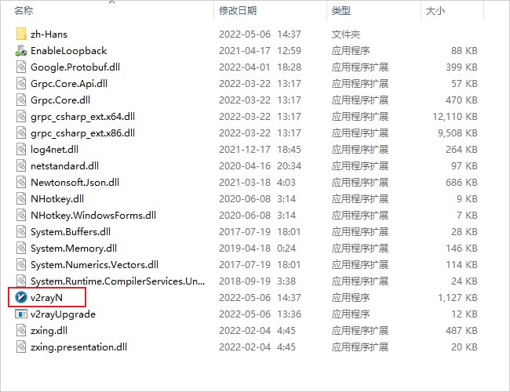

# 科学上网方法

在查询资料或下载文件的时候，我们经常会遇到下载速度很慢、甚至是无法连接的情况。    

这篇文章将介绍如何科学上网，来解决这些问题。  

本文包括**使用代理**和**设置开发镜像**部分。

## 1. 代理

本章节将介绍如何搭建代理、使用代理和让你的软件使用代理。  

  

### 1.1 自建代理

我们推荐使用 V2Ray 搭建代理。

#### 1.1.1 服务端配置

在 VPS 上使用一键脚本安装 V2Ray

```sh
bash <(curl -L https://raw.githubusercontent.com/v2fly/fhs-install-v2ray/master/install-release.sh)
```

安装完成之后，配置文件的位置位于 `/usr/local/etc/v2ray/config.json`。

以下是一个最简单的服务器配置，可以使用 nano 或 vim 来编辑配置文件。

```json
{
  "inbounds": [
    {
      "port": 16823, // 服务器监听端口
      "protocol": "vmess",    // 主传入协议
      "settings": {
        "clients": [
          {
            "id": "b831381d-6324-4d53-ad4f-8cda48b30811",  // 用户 ID，客户端与服务器必须相同
            "alterId": 64
          }
        ]
      }
    }
  ],
  "outbounds": [
    {
      "protocol": "freedom",  // 主传出协议
      "settings": {}
    }
  ]
}
```

客户端和服务端的 id 必须相同，可以使用命令`uuidgen`或`cat /proc/sys/kernel/random/uuid`来随机生成uuid。

修改完成后要重启 V2Ray 才会使修改的配置生效。

重启 V2Ray 服务：

```sh
systemctl restart v2ray.service
```

也可以使用 [V2ray 配置在线生成器](https://intmainreturn0.com/v2ray-config-gen/)来生成较为复杂的配置。

#### 1.1.2 客户端配置

##### 1.1.2.1 Linux

安装步骤与服务器相同，以下为配置文件。

```json
{
    "inbounds": [
        {
            "port": 1080, // SOCKS 代理端口，在浏览器中需配置代理并指向这个端口
            "listen": "127.0.0.1",
            "protocol": "socks",
            "settings": {
                "udp": true
            }
        }
    ],
    "outbounds": [
        {
            "protocol": "vmess",
            "settings": {
                "vnext": [
                    {
                        "address": "server", // 服务器地址，请修改为你自己的服务器 ip 或域名
                        "port": 10086, // 服务器端口
                        "users": [
                            {
                                "id": "b831381d-6324-4d53-ad4f-8cda48b30811"
                            }
                        ]
                    }
                ]
            }
        },
        {
            "protocol": "freedom",
            "tag": "direct"
        }
    ],
    "routing": {
        "domainStrategy": "IPOnDemand",
        "rules": [
            {
                "type": "field",
                "ip": [
                    "geoip:private"
                ],
                "outboundTag": "direct"
            }
        ]
    }
}
```

Linux 下也有支持图形界面的代理工具，如 [V2RayA](https://v2raya.org/)、[V2RayL](https://github.com/jiangxufeng/v2rayL) 和 [QV2Ray](https://github.com/Qv2ray/Qv2ray)。

##### 1.1.2.2 Windows

本章节中，我们介绍 v2rayN 的使用方法。

其他软件(如 Clash 等)的使用教程，请自行搜索。

下载地址: https://github.com/2dust/v2rayN/releases

下载完成后，找到合适的目录，推荐安装在非系统盘，解压压缩包，解压后的目录如下图所示。

[](https://v2rayn.org/wp-content/uploads/2022/06/1656267589-v2rayN-setup-folder.jpg)安装目录

单击鼠标右键以管理员身份运行 `v2rayN.exe` 即可开始使用，程序启动后会最小化到任务右小角的托盘，鼠标双击蓝色的 `V` 字小图标，即可打开软件的主界面。

**图标说明**

不同状态下软件的图标颜色是不一样的，参考下表图标颜色说明。

| 图标                                                         | 软件状态         | 说明                                                         |
| ------------------------------------------------------------ | ---------------- | ------------------------------------------------------------ |
|  | 清除系统代理     | 每次启动/重启服务的时候，强制把windows系统(IE)的代理清除掉。 |
|  | 自动配置系统代理 | 每次启动/重启服务的时候，强制设定windows系统(IE)的代理。     |
|  | 不改变系统代理   | 每次启动/重启服务的时候，什么都不做。作用就是保留其他软件设定的代理。 |

**添加服务器**

获取节点服务器信息后，就可以开始添加服务器了，点击软件主界面的服务器，根据不同的节点添加不同的节点服务器。

[](https://v2rayn.org/wp-content/uploads/2022/06/1656267592-v2rayN-main.jpg)服务器设置

**订阅设置教程**

一些代理机场往往会提供一个订阅地址，就可以使用订阅方式导入节点信息，点击软件主界面的`订阅`，`订阅设置`，在`地址（url）部分`粘贴订阅地址，点击添加，然后点击确定。

[](https://v2rayn.org/wp-content/uploads/2022/06/1656267574-v2rayN-add-subscription.jpg)订阅设置

添加完成后，点击软件主界面的`订阅`，更新订阅即可成功使用订阅地址添加节点信息。

**剪贴板导入教程**

首先复制节点服务器的连接地址，不同协议的地址如下所示。

- VMESS 服务器即 v2Ray 节点地址：`vmess://`
- VLESS 服务器即 Xray 节点地址：`vless://`
- Shadowsock 服务器节点地址：`ss://`
- Socks 服务器节点地址：`socks5://`
- Trojan 服务器节点地址：`trojan://`

[](https://v2rayn.org/wp-content/uploads/2022/06/1656422590-v2rayN-add-server-from-clipboard.jpg)从剪贴板导入批量URL

然后点击软件主界面的`服务器`，选择**从剪贴板导入批量URL**即可导入节点信息，如上图所示。

**手动配置 V2Ray 节点**

点击软件主界面的`服务器`，选择 `添加[VMess]服务器`，如下图所示。

[](https://v2rayn.org/wp-content/uploads/2022/06/1656267585-v2rayN-add-VMess-server.jpg)添加 V2Ray 节点

在添加窗口输入V2Ray节点信息，即可配置V2Ray服务器信息，然后点击确定保存，如下图所示。

[](https://v2rayn.org/wp-content/uploads/2022/06/1656267586-v2rayN-add-VMess-server-config.jpg)配置V2Ray节点信息

在添加完节点信息后，开启系统代理并选择路由模式，即可开始使用代理服务器上网了。

### 1.2 机场的选择和使用

#### 1.2.1 什么是机场

机场指的是代理服务的提供商。常用的 SS/SSR 的图标都是小飞机，所以代理服务的提供商被成为机场。

#### 1.2.2 如何寻找机场
若无法翻墙，可以在代理工具的推广(如 V2RayN)上寻找。


若可以翻墙，可以在 Telegram 上的机场测速频道寻找。

常见的一些机场测速频道：

```
@PinYunPs
@DuyaoSS
@jichangtj
@gebaopiCloud
@BGP2022
@speedcentre
```


### 1.3 浏览器插件

Proxy SwitchyOmega 是一款非常优秀的浏览器插件，适用于Chrome 和 Firefox，可以轻松快捷地管理和切换代理。

可以从 [Github Release](https://github.com/FelisCatus/SwitchyOmega/releases) 下载，也可以在浏览器的应用商店搜索 Proxy SwitchyOmega 安装。

## 2. 其他

### 2.1 Github反向代理

在没有代理的情况下可以使用 Github 反向代理加速 clone 和文件下载

常见的一些Github反代：

```
https://gitclone.com/
https://ghproxy.com/
https://doc.fastgit.org/
https://github.com.cnpmjs.org/
```

### 2.2 proxychains

proxychains 是 Linux 下的代理工具。它可以使大部份程序通过代理上网，允许 TCP 和 DNS 通过代理隧道，支持 HTTP SOCKS4 和 SOCKS5 类型的代理服务器，并且可配置多个代理。需要注意，使用go语言编写的程序一般无法使用 proxychains 走代理，可以使用 [graftcp](https://github.com/hmgle/graftcp) 。

安装

```shell
apt install proxychains
```

安装完成之后配置文件一般位于 `/etc/proxychains.conf`。

若代理工具在本地的1080端口开了一个 socks5 ，在配置文件末尾插入 `socks5 127.0.0.1 1080` 即可完成配置。

在需要运行的命令之前加上 `proxychains` 即可让程序走代理。

### 2.3 SSH代理

```shell
ssh user@server -D 1080
```

即可在本机1080端口获得一个 socks5 代理，临时使用较为方便，但不建议长期使用，容易被墙。

