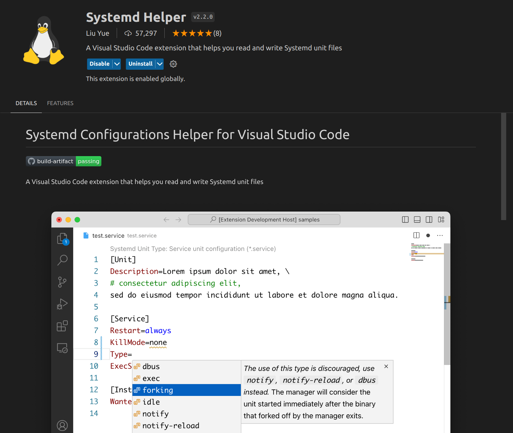

# 设置ROS2开机自启

## Systemd 概述[^1]

`systemd` 是一个专用于 Linux 操作系统的系统与服务管理器。 当作为启动进程(PID=1)运行时， 它将作为初始化系统运行， 也就是启动并维护各种用户空间的服务。

当作为系统实例运行时， systemd 将会按照 `system.conf` 配置文件 以及 `system.conf.d` 配置目录中的指令工作； 当作为用户实例运行时，systemd 将会按照 `user.conf` 配置文件 以及 `user.conf.d` 配置目录中的指令工作。

Systemd架构图：


## 自启动模板

在vscode中编辑时推荐安装 **Systemd Helper** 扩展

更多通用模板:[↻](https://www.jinbuguo.com/systemd/systemd.service.html#%E4%BE%8B%E5%AD%90)

```ini
[Unit]
Description=ROS2 Launch 服务描述
Before= ...设置服务启动先后顺序
After= ...设置服务启动先后顺序

[Service]
Environment="ROS_HOME=<你的工作空间路径>"
Type=simple（最简单的类型）
User=进程在执行时使用的用户
ExecStart=开启服务后需要执行的命令
ExecStop=关闭服务后需要执行的命令，例如 /bin/kill -s INT $MAINPID
KillSignal=设置杀死进程时使用什么信号
RestartSec=服务重启间隔时间
Restart=服务是否重启

[Install]
WantedBy=multi-user.target
```

注：service需要在`/etc/systemd/system/`目录下创建（当使用`systemctl enable ...`的时候systemd会在`/etc/systemd/system`中建立名为xxx.service的软链接，链接到这个目录的xxx.service，这样才会开机自启这个服务）
``

脚本写法举例如下，可能还需要设置一些环境变量，见[↻](http://wiki.ros.org/action/fullsearch/ROS/EnvironmentVariables)

```bash
#! /bin/bash

source /opt/ros/humble/setup.bash
source <你的工作空间中/install/setup.bash的路径>

然后下面就写启动各个节点需要的命令
如果有些命令需要sudo，可以通过管道的方式预先留好密码并输入：echo "密码" | sudo -S <命令>。
例如 echo "a" | sudo -S chmod 777 /dev/ttyUSB0
```

## 示例[^2]

某机器人需要运行多个ros2程序，这些程序有些是拿.sh启动，有些是拿.py启动，启动时还会调用.launch来启动，关闭时使用SIGTERM又很难关掉，并且因为频繁修改调试，需要快捷地安装进系统，这些文件内容如下：

- **others.service**

```ini
[Unit]
Description=others
Before=navigation.service deep.service

[Service]
Environment="ROS_HOME=/home/sentry/Sentry2023"
Type=simple
User=sentry
ExecStart=/usr/bin/python3 /home/sentry/Sentry2023/start_others.py
ExecStop=/bin/kill -s INT $MAINPID
ExecReload=/bin/kill -s INT $MAINPID && /usr/bin/python3 /home/sentry/Sentry2023/start_others.py
KillSignal = SIGKILL
RestartSec=2
Restart=always
StartLimitInterval=0

[Install]
WantedBy=multi-user.target
```

- **deep.service**

```ini
[Unit]
Description=deep detector
After=others.service

[Service]
Environment="ROS_HOME=/home/sentry/Sentry2023"
Type=simple
User=sentry
ExecStart=/home/sentry/Sentry2023/start_deep.sh
ExecStop=/bin/kill -s INT $MAINPID
ExecReload=/bin/kill -s INT $MAINPID && /home/sentry/Sentry2023/start_deep.sh
KillSignal=SIGKILL
RestartSec=2
Restart=always

[Install]
WantedBy=multi-user.target

```

- **navigation.service**

```ini
[Unit]
Description=navigation
After=others.service

[Service]
Environment="ROS_HOME=/home/sentry/Sentry2023"
Type=simple
User=sentry
ExecStart=/home/sentry/Sentry2023/start_navigation.sh
ExecStop=/bin/kill -s INT $MAINPID
ExecReload=/bin/kill -s INT $MAINPID && /home/sentry/Sentry2023/start_navigation.sh
KillSignal = SIGKILL
RestartSec=2
Restart=always

[Install]
WantedBy=multi-user.target
```

- **record_topic.service**

```ini
[Unit]
Description=record topic
After=navigation.service

[Service]
Environment="ROS_HOME=/home/dino/Sentry2023"
Type=simple
User=dino
ExecStart=/home/dino/Sentry2023/start_record_topic.sh
KillSignal=SIGINT
RestartSec=2
Restart=always

[Install]
WantedBy=multi-user.target
```

- **start_others.py**

```python
    import os
import subprocess as sp
from time import sleep

source_cmd = ". install/setup.sh"
start_control_cmd = "ros2 launch control control.launch.py"
start_scan_cmd = "ros2 run scan scan"
start_behaviortree_cmd = "ros2 run behavior_tree behaviortree"
andand=" && "

current_path = "/home/sentry/Sentry2023"

# 链接U转can
ip_link_cmd = "echo 'a' | sudo -S ip link set can0 down && sudo ip link set can0 type can bitrate 1000000 && sudo ip link set can0 up"
result = sp.Popen(ip_link_cmd, shell=True, stdout=sp.PIPE, stderr=sp.PIPE)
out, err= result.communicate()
for line in err.splitlines():
    if("Cannot find device" in str(line)):
        print("无法打开U转can, error=\n  " + str(line)[2:-1])
        exit()

# 打开节点
control = sp.Popen(args=source_cmd + andand + start_control_cmd, cwd=current_path, shell=True)
scan = sp.Popen(args=source_cmd + andand + start_scan_cmd, cwd=current_path, shell=True)
behaviortree = sp.Popen(args=source_cmd + andand + start_behaviortree_cmd, cwd=current_path, shell=True)

while True:
    sleep(10)
```

- **start_deep.sh**

```zsh
#!/bin/zsh

cd /home/sentry/Sentry2023
. install/setup.zsh
ros2 launch deepdetector deepdetector.launch.py
```

- **start_navigation.sh**

```zsh
#!/bin/zsh

cd /home/sentry/Sentry2023
. install/setup.zsh
ros2 launch navigation start_navigation.launch.py
#if [ -c /dev/ttyUSB0 ];then
#    echo 'a' | sudo -S chmod 777 /dev/ttyUSB0
#    . install/setup.zsh
#    ros2 launch navigation start_navigation.launch.py
#else
#    while true
#    do
#        echo "no device /dev/ttyUSB0"
#        sleep 1s
#    done
#fi
```

- **start_record.sh**

```zsh
#!/bin/zsh

cd /home/sentry/Sentry2023
. install/setup.zsh
current_time=`date +'%F_%H:%M:%S'`
ros2 bag record -o ${current_time} /Game /scan /ShootSome /SetGimbalAngle /SetGimbal_YawSpeed_PitchAngle /GetGimbalSpeed /BT_top /BT_navigation /ScanCtrlInfo /BT_shooter /Armors /tf /local_costmap/costmap /path /map
```

- **installservice.sh**

```zsh
#!/bin/zsh

if [ ! -d /usr/lib/systemd/system ];then
    mkdir /usr/lib/systemd/system
fi

echo 'a' | sudo -S cp src/bring_up/scripts/*.service /usr/lib/systemd/system

echo 'a' | sudo -S systemctl daemon-reload

echo 'a' | sudo -S systemctl disable navigation.service
echo 'a' | sudo -S systemctl disable others.service
echo 'a' | sudo -S systemctl disable deep.service
echo 'a' | sudo -S systemctl disable record_topic.service

echo 'a' | sudo -S systemctl enable navigation.service
echo 'a' | sudo -S systemctl enable others.service
echo 'a' | sudo -S systemctl enable deep.service
# echo 'a' | sudo -S systemctl enable record_topic.service
```

参数解释详见脚注。[^3] [^4] [^5] [^6] [^7]

[^1]: [systemd 中文手册（金步国）](https://www.jinbuguo.com/systemd/systemd.html#)
[^2]: [使用Systemd设置ROS 2节点开机自启](https://blog.csdn.net/qq_35395195/article/details/129973797)
[^3]: [Systemd 入门教程：命令篇（ 阮一峰）](http://www.ruanyifeng.com/blog/2016/03/systemd-tutorial-commands.html)
[^4]:[Systemd 入门教程：实战篇（ 阮一峰）](http://www.ruanyifeng.com/blog/2016/03/systemd-tutorial-part-two.html)
[^5]: [journalctl 中文手册（金步国）](http://www.jinbuguo.com/systemd/journalctl.html#)
[^6]: [Systemd 入门教程：实战篇 七、[Install] 区块](http://www.ruanyifeng.com/blog/2016/03/systemd-tutorial-part-two.html)
[^7]: [Systemd 入门教程：实战篇 八、Target 的配置文件](http://www.ruanyifeng.com/blog/2016/03/systemd-tutorial-part-two.html)
