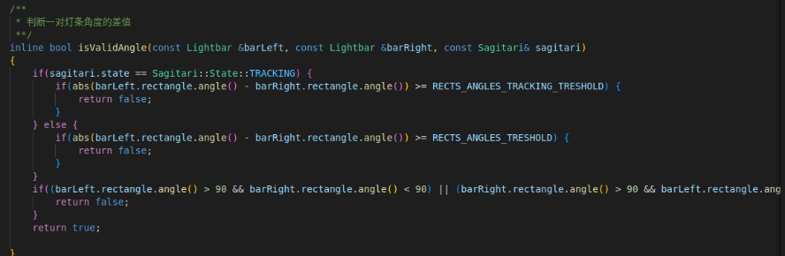

# 调车守则
## 1.开机启动
按 NUC 的圆形按钮开机，当 NUC 亮蓝灯时 NUC 正常开机

---

## 2. 启动 NUC 可视化界面
### 2.1 使用外接显示器的方法
正常启动后，将 HDMI 线连接接到 HDMI 口上即可


---

### 2.2 通过 VNCviewer 连接 NUC  
#### 2.2.1. NUC 端需要的环境配置
```
sudo apt install openssh-server
sudo apt install xvfb
sudo apt install xfce4   #进入安装页面时，选择 g 开的目录
sudo apt install x11vnc
```
#### 2.2.2. 通过 ssh 无线连接到 NUC 终端

``ssh nuc@192.168.0.175``  
在本段代码中, **nuc** 为 NUC 端的用户名。  
也就是大家自己 ubuntu 系统下 ``"/home/xxxx"`` 的 ``xxxx``  
**192.168.0.175** 是 NUC 的**静态IP**  
**只有用户名和 静态IP 都正确才能顺利完成 SSH 连接**  

---
**需要注意的是：**  
在使用 ``ssh`` 连接时 ``主机端和 NUC 端`` 都需要接到同一个局域网  
**即不能接校园网，然后试图用 ``ssh`` 连接 ``NUC端``**
---  

#### 2.2.3. 通过设置主机端和 NUC 端相同IP连接
首先你需要知道每一辆车的``静态IP``  
你可以通过访问 网关 查看 NUC 端的静态IP   

也可以在 NUC 端口中执行 ``ifconfig`` 查看 **ens1** 的IP地址，也就是 NUC 端的IP地址  
也可以执行 ``sudo gedit /etc/netplan`` 修改 NUC 端的静态IP

在完成了 ssh 连接后可以在 VNC 客户端中输入静态IP进入 NUC 界面
  
输入IP后，即可点击 continue 连接密码为 ``qwq``

---

## 3. 自瞄程序调试过程
### 3.1. 配置相机驱动程序
#### 3.1.1. 大华相机（MVviewer）
在视觉组U盘中找到 **MVviewer_Ver2.2.5_Linux_x86_Build20200910.run** 文件
```
sudo chmod +x MVviewer_Ver2.2.5_Linux_x86_Build20200910.run
# 更改 MVviewer 权限
sudo ./MVviewer_Ver2.2.5_Linux_x86_Build20200910.run
# 执行安装程序
sudo ln -s /opt/DahuaTech/MVViewer opt/DahuaTech/MVviewer
# 建立软链接 注意左边的是 MVViewer 右边的是 MVviewer
ls -il
# 查看软连接是否成功
./opt/DahuaTech/Mvview/bin/MVviewer
# 执行相机驱动程序
```  
### 3.2.  色域分割参数调整
#### 3.2.1.  没识别到灯条 或 灯条识别闪烁 
检查输出图像 **BinImage** 观察右边 HSV 分割图像是否存在   
该图像由 **RGBFliter** 和 **HSVFilter** 组成  
调整在 **findLightBlobs.cpp** 文件下 HSVFilter 的参数  
  
**tips: 尽量让 HSVFilter 出现的白色饱满，不要空心**
[HSV相关知识](https://baike.baidu.com/item/HSV/547122?fr=aladdin)

#### 3.2.2. 识别到灯条 但 没识别到装甲板
一般可能是灯条长度比，灯条角度差值的问题  
调整在 **findArmorBox.cpp** 文件下 **灯条长度比** **灯条角度差值** 的参数  
  


---
## 4. 常见错误
### 4.1. SSH常见连接报错  

#### 4.1.2. SSH 连接提示 Connect failed: Host is unreachable  
这个问题的原因是可能是网线没有插到设备上，或者wifi不在同一个网络内。   
检查是不是``输错了 IP`` ``NUC 未接电源`` ``没插好网线`` ``wifi是校园网``  
tips: 网线插槽有灯亮代表连接成功

#### 4.1.2. SSH 连接提示 Connection refuse  
这个问题的原因一般是目标设备没有开启 ssh 服务  
检查 ``openssh-server`` 是不是装了，``NUC 未开机`` 也有可能导致这个问题

### 4.2. VNCviewer 常见报错

#### 4.2.1. VNC 断线后重新连接，提示本地主机关闭了一个链接  
这个问题的原因一般是 VNC 有 bug，你需要把 x11vnc 进程关掉，然后重新启动 x11vnc  
可以执行 ``killall x11vnc`` 关闭 x11vnc 进程   
然后执行 ``bash ~/noscr.sh`` 启动 x11vnc 进程

### 4.3. 自瞄程序常见报错
#### 4.3.1. 开启自瞄时出现红色的 uart_process_2 died 或 dahua_camera died  
``uart_process_2 died`` **串口节点不通或者串口程序占用**  
检查云台板和 NUC 之间的 **串口线是否插好**，是否开启了 **第二套自瞄程序**  
``dahua_camera died`` **Dahua_camera 的则是相机节点错误**  
一般是因为有 **程序占用相机**，或者就是 **相机没插好**