# 单目测距算法报告 

## 问题发现

数据输入正常，但在中距离（3~6m）误差过大 

## 相关参数
* 输入的4点坐标
* 相机的畸变矩阵和平移矩阵
* 识别物体的3D坐标
* solvePNP的解算方式
## 解决方案：

* 保证标准角度下的准确性
* 使用控制变量法来进一步检验不同角度下的测距精准度

## 具体实施:  
### 标定方法
* ros_noetic自带的标定方法

### 代码调整
* 调整输入的长宽数据
* 调整输入灯条矩形的角点
* 调整距离的计算方法（直接tvec[2]或者勾股定理）
* 绕Pitch轴旋转角度至（±30°） 观察测距变化
* 在保证（3~6m）的精准的情况下尝试新的解算方法
**在正常角度下调整代码，以获得最佳正面测距效果**

### 误差来源
* 内参矩阵差了一半
* 代码传入的数据点顺序不匹配
* 目标检测不稳定
* 旋转基本稳定

### 算法测试

**Tips : **这份报告的结论由 ``上车实测`` 和 ``算法测试``两部分构成，但由于上车实测图片缺失，此处仅附上结论

#### 近距离表现 ( 0 ~ 1.5m）

**IPPE : **

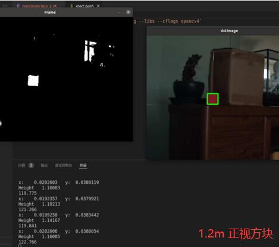

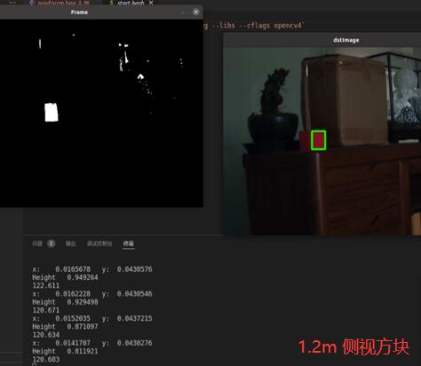

**EPNP : **

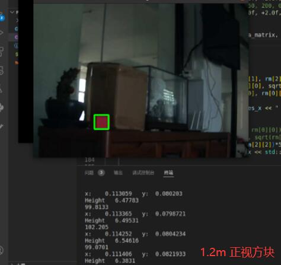

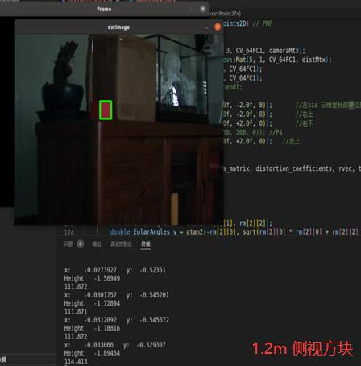

#### 中距离表现 ( 1.5 ~ 3m )

**IPPE : **

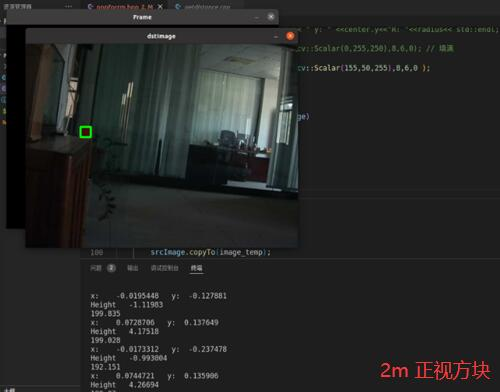

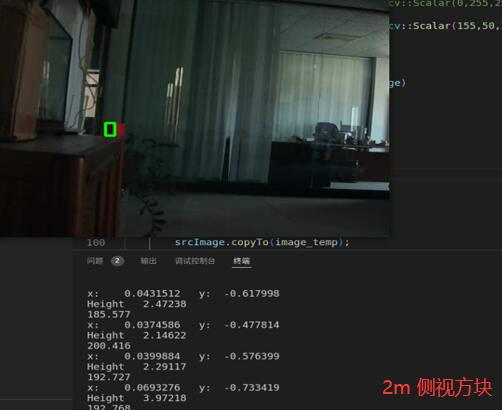

**EPNP :**

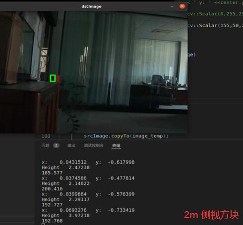

#### 远距离表现 ( 3 ~ 5m)

**IPPE : **

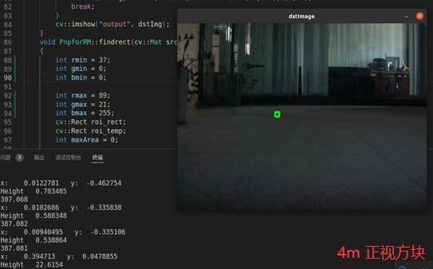

**EPNP : **

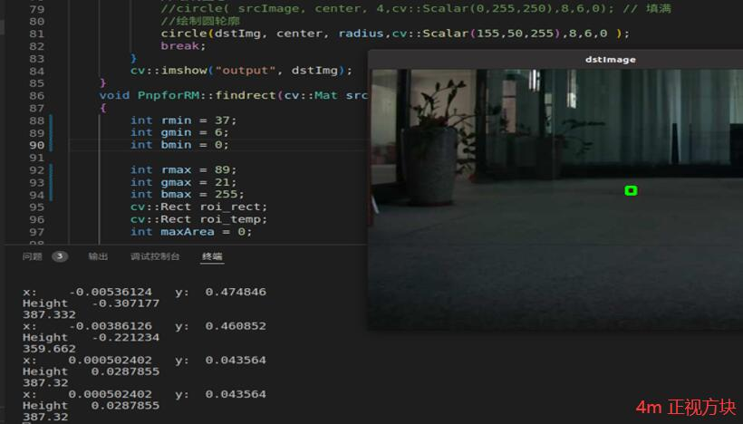

* 3~6m下测距误差 < 10cm
* 大于m:可以测出误差 < 30cm 但不稳定
* 极限距离820cm下测距

## 实验结果

**IPPE不知道为什么误差超级大，不论远近所以还是采用 `EPNP`算法**

* 中距离下测距稳定且误差控制在 0.3m 内

* 中距离绕Pitch轴+30°误差变化不明显 < 0.05m 

  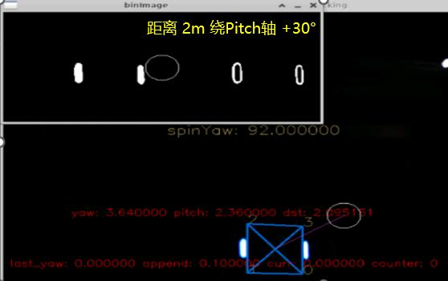

* 中距离绕Pitch轴-30°比较明显

  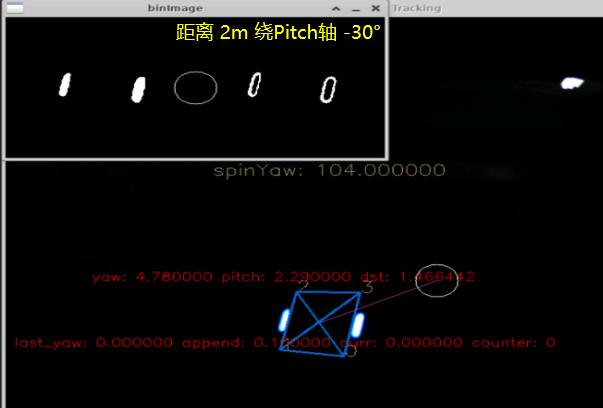

* 6~9m由于噪点的存在导致测距不稳定、但误差仍控制在0.4m内

  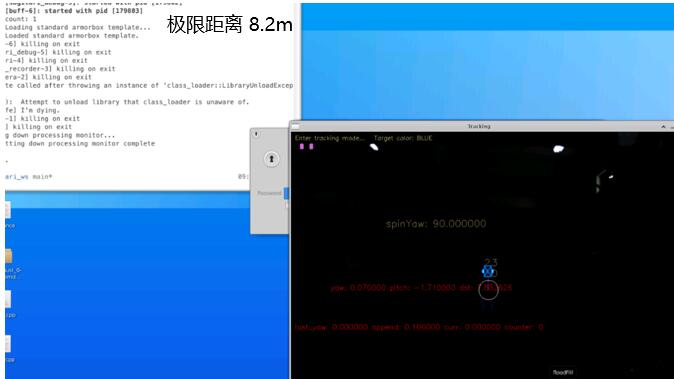

* **由于IPPE误差不可控 仍采用EPNP算法**

**此处缺失一部分上车测试的图片，会在后期重测数据修改**

## 改进方向

- 验证过程中可以输出 ``tvec``的 x 和 y 信息辅助验证结果
- 框选的特征点可以继续滤波优化

## 参考文献

[单目相机标定原理](http://wiki.ros.org/camera_calibration/Tutorials/MonocularCalibration)

[ SolvePNP 算法简介](https://docs.opencv.org/4.x/d5/d1f/calib3d_solvePnP.html)