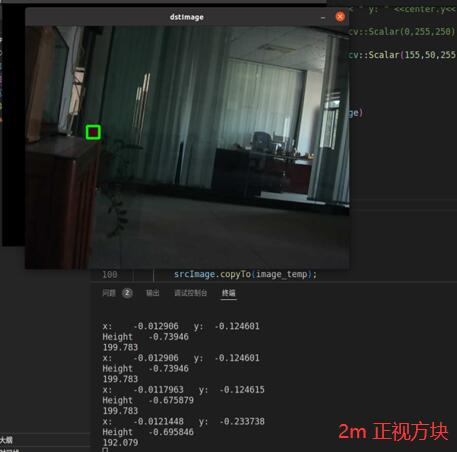

# 单目测距算法报告 

## 算法流程：
### 框选识别目标
需要通过图像处理筛选出合适的选框，并传出四点数据。
### 输入实际坐标
在实际物体上测量物体的长宽。
### 使用函数解算
使用合适的 OpenCV 算法解算。

## 相关参数：
* 输入的四点坐标
* 相机的畸变矩阵和平移矩阵
* 识别物体的3D坐标
* solvePNP 的解算方式

## 目标方向：
* 保证标准角度（即按比赛规则放置的装甲板）下的准确性
* 在比较远的位置（比赛场地半场 8.5m 左右）能够测出距离

## 具体实施:  
### 选择标定方法
* ROS 系统中封装的 calibration 功能包

### 确定优化方向
* 优化输入的长宽数据，核对 2D 点和 3D 点是否对应
* 优化输入灯条矩形的角点，获得更准确的角点数据
* 比较 OpenCV 中不同结算方法的测距结果，选出更加稳定适宜的
* 在绕Pitch轴旋转角度至（±30°），思考如何减少旋转带来的影响

### 分析误差来源
* 传入的 2D 点和 3D 点顺序不匹配
* 目标检测不稳定，导致测距结果发生变化
* 由于旋转等问题导致 2D 点数据变化

## 结果呈现：

| IPPE 算法解算效果图                      | EPNP 算法解算效果图                       | 测试条件       |
|-----------------------------------|------------------------------------|------------|
|  |   | 1.2m 下正视方块 | 
|  |   | 1.2m 下侧视方块 | 
|  |   | 2m 下正视方块   | 
|  |   | 2m 下侧视方块   | 
|  |  | 4m 下正视方块   |                        | 

**这份报告的结论由 ``上车实测`` 和 ``算法测试``两部分构成，但由于上车实测图片缺失，此处仅附上结论** 

**IPPE在实际上车调试中出现了不稳定的情况，且在输入实际坐标正确时误差很大。**

**因此不论远近所以还是采用 `EPNP`算法**

| EPNP 算法在旋转步兵后的识别效果图                 | 测试环境                   | 结论               |
|-------------------------------------|------------------------|------------------|
|  | 绕 Pitch 轴 +30° 距离 2m   | 误差变化不明显 < 0.05m  | 
|  | 绕 Pitch 轴 -30° 距离 2m   | 误差变化明显 < 0.2m    | 
|  | 绕 Pitch 轴 0° 半场距离 8.2m | 测距不稳定，误差控制在0.4m内 |

* 3~6m下测距误差 < 0.1m
* 大于6m:可以测出误差 < 0.3m 但不稳定
* 极限距离820cm下测距不稳定，误差控制在0.4m内

**此处缺失一部分上车测试的图片，会在后期重测数据修改**

## 测试细节：

- 验证过程中可以输出 ``tvec``的 x 和 y 信息辅助验证结果
- 框选的特征点可以继续滤波优化

## 参考文献：

[单目相机标定原理](http://wiki.ros.org/camera_calibration/Tutorials/MonocularCalibration)

[ SolvePNP 算法简介](https://docs.opencv.org/4.x/d5/d1f/calib3d_solvePnP.html)

[畸变矩阵等数学概念](https://blog.csdn.net/qq_43742590/article/details/104109103)