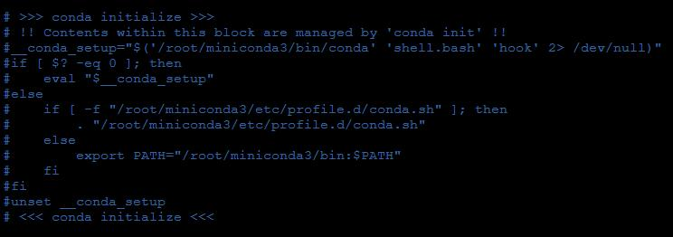
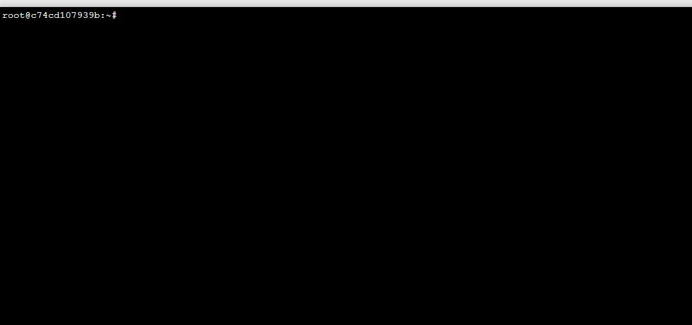
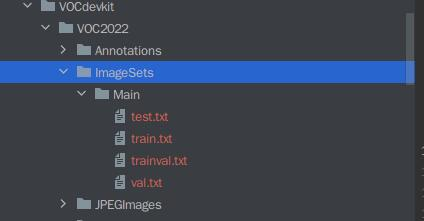

# DarkNet训练流程

## 环境配置

- Nvidia 显卡驱动 
- CUDA 和 CUDNN 环境
- OpenCV环境

[GPU环境相关配置](https://blog.csdn.net/m0_38101947/article/details/126499811)

## 编译源码

```shell
cd ~/darknet
sudo vim Makeflie #修改 Makefile 文件中的 GPU = 1 || OpenCV = 1
make -j12 # -j12 取决于 CPU 核心数
```

**需要注意的是**：在 `Anaconda 环境`下在编译中会出现 `OpenCV库` 缺失的问题 

这需要你修改  `.bashrc` 文件注释掉 Anaconda 的启动

```shell
sudo vim ~/.bashrc
source ~/.bashrc 
```

注释如图所示



注释完成后启动终端 `（base）root@` 消失



## 训练过程

### 准备VOC数据集 

格式如图所示



[VOC数据集简介](https://blog.csdn.net/qq_21386397/article/details/123656072)

### 分割验证集

```shell
cd ~/VOCdevkit/VOC2022
mkdir ImageSets/Main -p 
python3 spilt.py
```

### 添加标签信息

```shell
# 先修改voc_label.py 的 classes 信息，使之与数据集标签对应
# 在修改 cfg/ 目录下的 laji.data 文件，使 cls 的种类数量与数据集标签种类数量对应
# 修改 data/ 目录下的 laji.name 文件，使之与数据集标签对应
cd ~/darknet
python3 voc_label.py
```


**完成此事项后，应该检查一下VOC2022目录下是否出现 Label 文件夹 并且 txt 文件有数据**

### 启动训练

```shell
cd ~/darknet
./darknet detector train cfg/laji.data yolov2-tiny.cfg 
```

** 在 `loss` 指标越小的时候模型更好** 

## 获取权重

**将 backup/ 目录下的 权重文件保存即可** 
## 验证权重 
`` ./darknet detect yolov2_tiny.cfg backup/yolo2_tiny.weights /img.jpg``


## Refenrnce
[DarkNet_YOLO](https://pjreddie.com/darknet/yolo/) 

[DarkNet_YOLO_GitHub](https://github.com/pjreddie/darknet/tree/master/cfg) 

